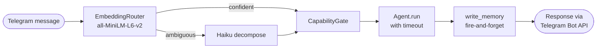

# Ze — Personal AI Assistant

A single-user, self-hosted AI assistant accessed via Telegram. Incoming messages are
routed to specialised agents (research, companion, calendar, email, workflow) through a
LangGraph orchestration layer. All LLM inference goes through OpenRouter.

## Stack

| Layer | Technology |
|---|---|
| Backend | Python 3.12 · FastAPI · LangGraph |
| Bot interface | Telegram (aiogram 3.x) |
| LLM gateway | OpenRouter (all models) |
| Embeddings | `all-MiniLM-L6-v2` (local, no API cost) |
| Graph persistence | LangGraph `AsyncPostgresSaver` → Postgres |
| Database | PostgreSQL 16 + pgvector |
| Migrations | Alembic (raw SQL, no ORM) |
| Deployment | Fly.io |

## Prerequisites

- Python 3.12+
- [uv](https://github.com/astral-sh/uv) — `pip install uv`
- Docker (for Postgres)
- A Telegram bot token from [@BotFather](https://t.me/BotFather)

## Quick start

```bash
# 1. Clone
git clone <repo-url> ze && cd ze

# 2. Install dependencies
make install

# 3. Configure secrets
cp .env.example .env
# Edit .env — fill in all required variables (see docs/configuration.md)

# 4. Start Postgres and apply migrations
make db-up
make migrate

# 5. Start the bot in polling mode
make dev-poll
```

Open Telegram, send a message to your bot — it responds from your local machine.

## Local development

Ze uses **long-polling** locally and **webhooks** in production. No public URL or
ngrok is needed.

```
make dev-poll   ← interact with the bot via Telegram (primary dev mode)
make dev        ← start uvicorn on :8000 for REST endpoint testing
```

`make dev-poll` starts `ze/dev_poll.py`, which calls `bot.delete_webhook()` to steal
delivery from any running webhook (including Fly.io), then enters a `getUpdates` loop
using the same `ZeBot` handlers as production. Stop with Ctrl-C — Telegram resumes
sending to the registered webhook URL within seconds.

## Development commands

```bash
make help           # full target list

make test           # unit tests (fast — skips embedding model load)
make test-all       # all tests including slow embedding tests

make lint           # ruff
make migrate        # apply pending DB migrations
make migrate-down   # roll back one step
make db-reset       # drop + recreate the database
```

## Environment variables

Copy `.env.example` to `.env`:

| Variable | Required | Description |
|---|---|---|
| `OPENROUTER_API_KEY` | Yes | OpenRouter API key |
| `TAVILY_API_KEY` | Yes | Tavily search API key (research agent) |
| `ZE_API_KEY` | Yes | Static bearer token for REST endpoints |
| `DATABASE_URL` | No | asyncpg Postgres URL (default: `postgresql://ze:ze@localhost:5432/ze`) |
| `DATABASE_URL_SYNC` | No | psycopg2 URL for Alembic CLI |
| `TELEGRAM_BOT_TOKEN` | Yes | Token from @BotFather |
| `TELEGRAM_WEBHOOK_SECRET` | Prod | Secret used to verify Telegram POSTs |
| `TELEGRAM_ALLOWED_CHAT_ID` | Yes | Your personal Telegram chat ID (int) |
| `PUBLIC_URL` | Prod | HTTPS base URL (e.g. `https://ze.fly.dev`). Leave empty locally. |
| `CONFIRM_TIMEOUT_SECONDS` | No | Confirmation timeout in seconds (default: `900`) |
| `LOG_LEVEL` | No | `DEBUG` / `INFO` / `WARNING` (default: `INFO`) |

See [docs/configuration.md](docs/configuration.md) for the full reference including
YAML config files and per-agent settings.

## Project structure

```
ze/
├── ze/                        # Python package
│   ├── api/                   # FastAPI app, Telegram webhook handler, REST routes
│   ├── agents/                # BaseAgent ABC, registry, all agent implementations
│   │   ├── research/          # Web search via Tavily + synthesis
│   │   ├── companion/         # Conversational reasoning, memory injection
│   │   ├── calendar/          # Google Calendar read/write
│   │   ├── email/             # Gmail read/draft/send
│   │   └── workflow/          # Multi-step task planning and execution
│   ├── capability/            # CapabilityGate — permission enforcement
│   ├── google/                # Google OAuth2 token management
│   ├── memory/                # UserFact + episodic memory (pgvector)
│   ├── openrouter/            # OpenRouterClient (complete + stream)
│   ├── orchestration/         # LangGraph state machine (nodes, edges, graph, state)
│   ├── proactive/             # Scheduled pushes — morning briefing, reminders, alerts
│   ├── routing/               # EmbeddingRouter + Haiku fallback
│   ├── telegram/              # ZeBot, handlers, keyboards, session store
│   ├── telemetry/             # CostTracker — per-call token usage + cost attribution
│   ├── tools/                 # Shared tool utilities
│   ├── workflow/              # APScheduler-based workflow scheduler + Postgres persistence
│   ├── container.py           # Dependency wiring
│   ├── db.py                  # asyncpg pool factory
│   ├── embeddings.py          # SentenceTransformer singleton
│   ├── errors.py              # Ze exception hierarchy
│   ├── logging.py             # structlog JSON config
│   └── settings.py            # Pydantic BaseSettings
├── config/
│   ├── agents/                # One YAML per agent (model, tools, timeout, description)
│   ├── capabilities.yaml      # Permission modes per agent.intent
│   ├── config.yaml            # Routing thresholds, persona, memory, proactive settings
│   └── models.yaml            # Model assignments
├── migrations/versions/       # Alembic raw-SQL migrations
├── tests/                     # Mirrors ze/ structure
├── specs/                     # 20 design specs (read before modifying a module)
├── docs/                      # Architecture, configuration, and deployment guides
├── Dockerfile
├── docker-compose.yml
├── fly.toml
├── pyproject.toml
└── Makefile
```

## Agents

| Agent | Description | Status |
|---|---|---|
| `research` | Web search (Tavily) + OpenRouter synthesis | ✅ Done |
| `companion` | Conversational reasoning, thinking partner, memory injection | ✅ Done |
| `calendar` | Google Calendar read/create/update/delete | ✅ Done |
| `email` | Gmail read/draft/send | ✅ Done |
| `workflow` | Multi-step task planning, APScheduler execution | ✅ Done |

## Routing

Incoming messages are embedded locally (no API call) and scored by cosine similarity
against each agent's description. A confident, unambiguous match routes directly.
Otherwise Haiku decomposes the request into subtasks — one per agent.



## Capability gate

Each `agent.intent` pair has a permission mode in `config/capabilities.yaml`:

| Mode | Behaviour |
|---|---|
| `autonomous` | Executes immediately |
| `confirm` | Sends inline keyboard (Yes / No / Edit); 15-min timeout |
| `draft_only` | Generates draft, never executes without a config change |
| `disabled` | Always blocked |

Config hot-reloads on `SIGHUP` — no restart needed.

## Phases

| Phase | Scope | Status |
|---|---|---|
| 1 | Routing, research + companion agents, orchestration, API, Telegram bot | ✅ Done |
| 2 | Memory (pgvector), capability gate, confirmation + draft flows | ✅ Done |
| 3 | Calendar + email agents, Google OAuth2, compound task decomposition | ✅ Done |
| 4 | Workflow agent, multi-step planning, Postgres-persisted scheduler | ✅ Done |
| 5 | Memory consolidation — dedup facts, expire stale, summarise episodes | ✅ Done |
| 6 | User profile — synthesise facts + episodes into a structured portrait | ✅ Done |
| 7 | Proactive Ze — morning briefing, workflow failure alerts, calendar reminders | ✅ Done |
| 8 | Insight engine — weekly synthesis of facts + episodes into actionable insights | ✅ Done |
| 9 | Cost telemetry — per-flow/agent token tracking, automatic cost reconciliation | ✅ Done |
| 10 | Multimodal input — voice transcription + image/vision support | 🔲 Planned |

## Docker

```bash
make docker-up      # start all services (Postgres + backend)
make docker-down    # stop all services
make docker-build   # rebuild images
```

## Deployment

See [docs/deployment.md](docs/deployment.md) for the full Fly.io setup guide.

```bash
fly deploy   # or let GitHub Actions deploy on push to main
```

Set all env vars as Fly secrets:
```bash
fly secrets set OPENROUTER_API_KEY=... TELEGRAM_BOT_TOKEN=... TELEGRAM_WEBHOOK_SECRET=...
```

## CI/CD (GitHub Actions)

On every push and pull request to `main`:

- `ruff check`
- fast `pytest` (embedding-model tests excluded)

Merges to `main` that change application code trigger deployment to Fly.io.

## Further reading

- [docs/architecture.md](docs/architecture.md) — system design, graph flow, module map
- [docs/scheduled-jobs.md](docs/scheduled-jobs.md) — daily/weekly jobs, memory lifecycle, proactive messages
- [docs/workflows.md](docs/workflows.md) — workflow modes, execution loop, scheduling
- [docs/configuration.md](docs/configuration.md) — full config reference
- [docs/deployment.md](docs/deployment.md) — Fly.io setup and operations
- [docs/adding-an-agent.md](docs/adding-an-agent.md) — guide for authoring a new agent
- [specs/](specs/) — design specs for every module (source of truth for implementation decisions)
