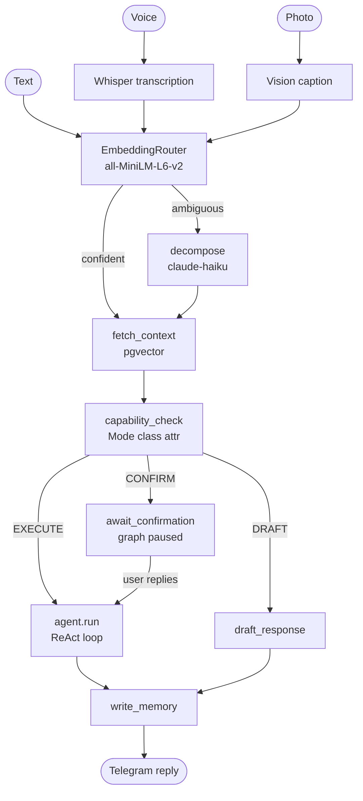

# Ze

**A self-hosted personal AI assistant, accessible via Telegram.**

Ze routes every message through a LangGraph orchestration layer to specialised agents — research, calendar, email, workflows, long-running goals, and more. It remembers context across conversations, asks before taking risky actions, and pushes proactive updates without being prompted. All inference goes through [OpenRouter](https://openrouter.ai); you bring your own API keys and run it yourself.

<p align="center">
  <a href="https://github.com/joaoajmatos/ze/actions/workflows/ci.yml"></a>
  
  
  
  
</p>

---

## What it is

Ze is a single-user personal assistant built around the idea that an AI should work like a capable, trustworthy human assistant — not a chatbot. A few things that reflect that:

- **It asks before acting.** Every agent action has an explicit permission mode. Deleting a calendar event or sending an email always pauses for confirmation unless you've explicitly opted out.
- **It remembers things across conversations.** Facts are semantically stored, deduped nightly, and injected into every system prompt. Ze builds a synthesised portrait of you over time.
- **It works autonomously on long-running goals.** You give it an objective, it decomposes it into milestones, executes them in the background, and checks in at verification gates rather than after every step.
- **It pushes, not just pulls.** Morning briefings, calendar reminders, weekly insights — Ze reaches out when there's something worth saying.
- **Your data stays yours.** Self-hosted on Fly.io with Postgres. No SaaS backend, no shared model, no telemetry.

Ze is designed for **one user** — a single allowed Telegram chat ID.

---

## Features

- **Multi-agent routing** — local `all-MiniLM-L6-v2` embeddings pick the right agent; ambiguous requests are decomposed by a small LLM fallback. No LLM call until an agent actually needs to act.
- **Capability gate** — per-intent modes (`autonomous` / `confirm` / `draft_only` / `disabled`) with inline Yes / No / Edit Telegram keyboards and configurable timeouts.
- **Persistent memory** — pgvector semantic retrieval over facts and episodes, nightly consolidation (dedup, expiry, archival), and a synthesised user profile injected into every prompt.
- **Google Calendar & Gmail** — read, create, update, and draft/send with OAuth2.
- **Workflows** — named recurring or on-demand multi-step tasks, Postgres-persisted via APScheduler.
- **Reminders** — natural-language time parsing, proactive Telegram push when they fire.
- **Goals** — multi-week autonomous objectives with milestones, verification gates, and pause/redirect/abandon flows.
- **Proactive pushes** — morning briefings, workflow failure alerts, calendar reminders, and weekly insight summaries.
- **Multimodal input** — voice notes (Whisper via OpenRouter) and image understanding.
- **Persona profiles** — named profiles with TARS-style numeric dials (`humor`, `directness`, `formality`, `depth`) switchable live via `/persona`.
- **Contacts** — person tracking extracted from email, calendar, and conversation; confirmation flow before storing.
- **Cost telemetry** — per-flow/agent token tracking and nightly reconciliation against OpenRouter billing. `/costs` shows a breakdown.
- **Prospecting** — autonomous target research via a Playwright browser sidecar, contact enrichment, and outreach draft generation.
- **Extensible** — `ZePlugin` ABC lets domain packages contribute agents, graph nodes, scheduled jobs, and state extensions without touching the core.

---

## How it works



Graph state is checkpointed in Postgres via LangGraph `AsyncPostgresSaver`, so confirmation flows and in-progress goals survive restarts.

---

## Quick start

**Prerequisites:** Python 3.12+, [uv](https://docs.astral.sh/uv/), Docker, an [OpenRouter](https://openrouter.ai) API key, a Telegram bot token from [@BotFather](https://t.me/BotFather).

```bash
git clone https://github.com/joaoajmatos/ze.git
cd ze

make install

cp packages/ze/.env.example packages/ze/.env
# Edit packages/ze/.env — fill in OPENROUTER_API_KEY, ZE_API_KEY,
# TELEGRAM_BOT_TOKEN, and TELEGRAM_ALLOWED_CHAT_ID at minimum.

make db-up
make migrate

make dev-poll   # Telegram long-polling — send a message to your bot
```

`make dev-poll` runs without a public URL and is the normal local dev mode. `make dev` starts only the REST API on `:8000`. Production uses webhooks — see [docs/deployment.md](docs/deployment.md).

**Optional — Google Calendar + Gmail:**

```bash
make google-auth
```

---

## Configuration

| Layer | File | What |
|---|---|---|
| Secrets | `packages/ze/.env` | API keys, DB URL, Telegram token and chat ID |
| Structure | `packages/ze/config/config.yaml` | Models, routing, memory, proactive schedules |
| Persona | `packages/ze/config/persona.yaml` | Named profiles, default dials |

Minimum required env vars:

| Variable | Description |
|---|---|
| `OPENROUTER_API_KEY` | All LLM calls and web search |
| `ZE_API_KEY` | Bearer token for REST endpoints (`make generate-ze-api-key`) |
| `TELEGRAM_BOT_TOKEN` | From @BotFather |
| `TELEGRAM_ALLOWED_CHAT_ID` | Your personal chat ID |
| `DATABASE_URL` | asyncpg URL — `postgresql://ze:ze@localhost:5432/ze` for local Docker |
| `PUBLIC_URL` | HTTPS base URL in production |

Full reference: [docs/configuration.md](docs/configuration.md).

---

## Agents

| Agent | What it does |
|---|---|
| `research` | Web search via OpenRouter + synthesis |
| `companion` | Reasoning, writing help, brainstorming |
| `calendar` | Google Calendar CRUD and availability checks |
| `email` | Gmail read, draft, send, archive |
| `workflow` | Named recurring or on-demand multi-step tasks |
| `reminders` | One-off NL-time reminders with proactive push |
| `prospecting` | Target research, browser enrichment, outreach drafting |
| `goals` | Multi-week autonomous objectives with milestones |

Agent config (`model`, `capabilities`, `intent_map`, `tools`, `timeout`) lives as class attributes on the `@agent` class — no YAML. To add your own: [docs/adding-an-agent.md](docs/adding-an-agent.md).

---

## Telegram commands

| Command | Description |
|---|---|
| `/new` | Start a fresh conversation thread |
| `/costs` | Token usage and cost breakdown |
| `/memory` | Inspect stored facts, episodes, and profile |
| `/persona` | Switch profile or tune dials live |
| `/contacts` | Browse and search tracked contacts |

Normal messages are routed automatically — no command needed.

---

## Development

```bash
make help           # full target list

make test           # fast tests (skips embedding model load)
make test-all       # includes slow embedding tests
make lint           # ruff

make migrate        # apply pending migrations
make db-reset       # drop and recreate database
```

**Conventions:** dataclasses for domain types (no Pydantic outside `ze/api/`), constructor injection throughout, structlog for logging, typed errors from `ze_core.errors`, async everywhere. Tests live in each package's `tests/` and mock DB/LLM boundaries. See [CLAUDE.md](CLAUDE.md) for the full contributor guide.

---

## Project structure

Ze is a monorepo with four packages and a strict one-way dependency graph:

```
ze/
├── packages/
│   ├── ze-core/        # Pure infrastructure — routing, memory, orchestration, telemetry
│   ├── ze-personal/    # Domain layer — goals, workflows, persona, contacts
│   ├── ze/             # Application — Telegram, Google, agents, API, jobs
│   └── ze-browser/     # Playwright browser sidecar client
├── specs/
│   ├── phases/         # Feature/phase specs
│   ├── core/           # ze-core module specs
│   └── arch/           # Architecture decision records
├── docs/               # Guides and architecture reference
└── Makefile
```

`ze-core` and `ze-browser` have no ze deps. `ze-personal` depends on `ze-core`. `ze` depends on all three. See [docs/package-architecture.md](docs/package-architecture.md).

---

## Deployment

Runs on [Fly.io](https://fly.io) with an attached Postgres database. GitHub Actions handles CI on every push.

```bash
fly deploy
fly secrets set OPENROUTER_API_KEY=sk-or-... TELEGRAM_BOT_TOKEN=... TELEGRAM_WEBHOOK_SECRET=...
```

Step-by-step: [docs/deployment.md](docs/deployment.md).

---

## Security

Ze is **single-user by design**. Before exposing it to the internet:

1. Set `TELEGRAM_ALLOWED_CHAT_ID` to your chat ID — all other senders are silently ignored.
2. Generate a strong `ZE_API_KEY` with `make generate-ze-api-key`.
3. Keep `.env` out of version control; use `fly secrets` in production.
4. Review agent `capabilities` — prefer `confirm` or `draft_only` for write operations.

Do not deploy Ze as a shared service without substantial hardening. There is no multi-user isolation.

---

## Documentation

| Doc | Topic |
|---|---|
| [architecture.md](docs/architecture.md) | System design, graph flow, all modules |
| [package-architecture.md](docs/package-architecture.md) | Monorepo split, ZePlugin extension point |
| [memory.md](docs/memory.md) | Facts, episodes, profile synthesis, inspection |
| [scheduled-jobs.md](docs/scheduled-jobs.md) | Background job schedule and memory lifecycle |
| [goals.md](docs/goals.md) | Goal Engine — milestones, verification gates |
| [workflows.md](docs/workflows.md) | Workflow modes and scheduling |
| [adding-an-agent.md](docs/adding-an-agent.md) | Authoring a new agent |
| [channels.md](docs/channels.md) | Adding an outbound communication channel |
| [configuration.md](docs/configuration.md) | Full env var and YAML reference |
| [deployment.md](docs/deployment.md) | Fly.io setup and CI |
| [eval.md](docs/eval.md) | MCP eval server for agent testing |

Design specs (one per module, spec-first development): [`specs/`](specs/)

---

## Stack

| Layer | Technology |
|---|---|
| Runtime | Python 3.12 · FastAPI · uvicorn |
| Orchestration | LangGraph · AsyncPostgresSaver |
| Bot | aiogram 3.x |
| LLM gateway | OpenRouter |
| Embeddings | `all-MiniLM-L6-v2` (local, no API cost) |
| Database | PostgreSQL 16 + pgvector |
| Scheduler | APScheduler 3.x (Postgres job store) |
| Migrations | Alembic (raw SQL) |
| Packaging | uv workspaces |
| Deploy | Fly.io · Docker |

---

## License

[The Unlicense](LICENSE) — public domain.
