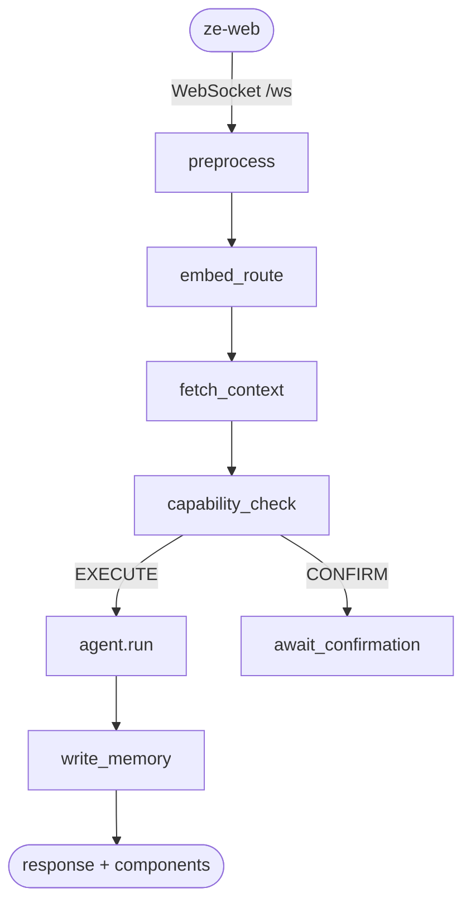

<div align="center">

# Ze

**Jarvis. Make no mistakes.**

A self-hosted personal AI that runs for weeks without being asked, remembers only what you approve, and asks before it acts. Built as an extensible platform — not a chatbot with plugins bolted on.

<p>
  <a href="https://github.com/joaoajmatos/ze/actions/workflows/ci.yml"></a>
  
  
  
  
</p>

</div>

---

## The vision

> I want to make Jarvis, make no mistakes.

That's the whole brief. Everything else is engineering.

Ze is opinionated about trust: standing authority, explicit permissions, memory you approve, confirmations before irreversible actions. It's also opinionated about structure — 20+ packages, spec-first development, a strict dependency graph, and a plugin SDK so domains (calendar, email, news, prospecting, finance, legal…) extend the platform without forking the engine.

Single-user. Self-hosted. Yours entirely. No SaaS backend, no shared tenancy, no telemetry leaving your box.

---

## Not a chatbot

Most AI assistants are stateless text boxes. Ze is built on the opposite premise: **someone you trust with standing authority**.

| | Chatbots | Ze |
|---|---|---|
| Memory | Session window | Facts (approved by you), episodes, nightly profile synthesis, plugins can contribute signals, correlation engine |
| Work | One turn at a time | Multi-week goals with milestones, verification gates, replanning |
| Reach | Waits for you | Morning briefings, reminders, insights, correlation nudges |
| Action | Suggests | Executes — with capability modes from `autonomous` to `confirm` |
| Shape | Monolith | Platform — agents, plugins, channels, signals, server-driven UI |

It doesn't wait to be asked. It researches, plans, executes in the background, and checks in only when it matters.

---

## The platform

Ze is a **structured runtime** for a personal assistant. Domain logic lives in plugins; the engine knows how to route, orchestrate, remember, correlate, and deliver — not what your calendar means.

```
┌─────────────────────────────────────────────────────────────────┐
│  apps/          ze-api (wires everything)  ·  ze-web (React)    │
├─────────────────────────────────────────────────────────────────┤
│  plugins/       personal · email · calendar · news · prospecting│
│                 finance* · legal*          (* in progress)      │
├─────────────────────────────────────────────────────────────────┤
│  core/          ze-core · ze-agents · ze-plugin · ze-sdk         │
│                 ze-memory · ze-correlation · ze-proactive · …   │
├─────────────────────────────────────────────────────────────────┤
│  integrations/  ze-google · (your broker, your CRM, …)          │
└─────────────────────────────────────────────────────────────────┘
         strict one-way deps: plugins → ze-sdk → core
```

### Extension points

| Mechanism | What it lets you add |
|---|---|
| **`ZePlugin`** | Agents, graph nodes, proactive jobs, memory policies, REST stores, migrations |
| **`@agent` / `@tool`** | New capabilities with local embedding routing — no config file ceremony |
| **`Channel`** | Outbound comms (Gmail today; LinkedIn, WhatsApp tomorrow) |
| **`SignalSource`** | Domain events that feed cross-plugin correlation (news, calendar…) |
| **`ZeIntegration`** | Third-party credentials (`from_settings`, injected once at bootstrap) |
| **Server-driven UI** | Component descriptors rendered by the web client without a frontend deploy |

Plugins discover themselves via entry points. The bootstrapper topologically sorts dependencies, merges graph contributions, and collects signal sources — no manual registration in the engine.

See [docs/package-architecture.md](docs/package-architecture.md) and [docs/extending-ze.md](docs/extending-ze.md).

### Signal pipeline

Plugins emit structured signals; the memory graph ingests them; the correlation engine finds connections you'd miss:

```
plugins (SignalSource)  →  ze-api (collect + dedupe)  →  ze-memory (admission + ingest)
                                                              ↓
                                                         ze-correlation (hypotheses → push)
```

---

## What it does

### Agents

Local `paraphrase-multilingual-MiniLM-L12-v2` embeddings route to the right agent before any LLM call. Compound requests decompose; simple ones downgrade to cheaper models automatically.

| Agent | Domain | Posture |
|---|---|---|
| `research` | Web search + synthesis, delegation | Autonomous |
| `companion` | Reasoning, writing, conversation | Autonomous |
| `calendar` | Google Calendar CRUD + availability | Read auto · writes **confirm** |
| `email` | Gmail list / read / draft / send | Read auto · writes **draft-first** |
| `reminders` | NL time parsing + proactive push | Autonomous |
| `workflow` | Recurring multi-step tasks | Read auto · manage **confirm** |
| `goals` | Multi-week autonomous objectives | Read auto · writes **confirm** |
| `prospecting` | Browser-sidecar research + outreach | Autonomous |
| `news` | Personalised RSS headlines + search | Autonomous |

### Goal engine

Hand Ze an objective; it decomposes into milestones, executes on a schedule, pauses at verification gates with a progress narrative, replans on failure, and pushes a real retrospective on completion. Steer mid-flight by just talking — no commands.

### Memory & correlation

- **Facts** — proposed after each turn; ground truth only after you approve
- **Episodes** — every turn embedded and retrievable
- **Profile** — nightly synthesis injected into every system prompt
- **Graph + signals** — cross-domain hypotheses ("this article relates to your Rust goal") with proactive push when salience is high

### Everything else

Multimodal input · persona dials · contact extraction · cost telemetry · agent harness with tool caps and delegation · ntfy push when the web app is closed · eval suite with MCP server · spec-first phases in [`specs/`](specs/)

---

## How a message flows

Every turn runs through a LangGraph checkpointed in Postgres. Routing uses local embeddings — **zero LLM calls until an agent actually needs to act**.



Two approval layers: **capability gate** (per risky tool call) and **verification gate** (per goal milestone batch). Full diagram: [docs/architecture.md](docs/architecture.md).

---

## Quick start

**Prerequisites:** Python 3.12+, [uv](https://docs.astral.sh/uv/), Docker, an [OpenRouter](https://openrouter.ai) key, ntfy (or [ntfy.sh](https://ntfy.sh)) for push.

```bash
git clone https://github.com/joaoajmatos/ze.git && cd ze
make install

cp apps/ze-api/.env.example apps/ze-api/.env
# OPENROUTER_API_KEY, ZE_API_KEY, DATABASE_URL at minimum

make db-up && make migrate
make dev-full    # backend :8000 + web :5173
```

Optional Google Calendar + Gmail: `make google-auth`

Configuration: [docs/configuration.md](docs/configuration.md) · WebSocket protocol: [docs/native-interface.md](docs/native-interface.md)

---

## Development

```bash
make help              # all targets
make test              # ze-api (fast)
make test-<name>       # any package — see docs/testing.md
make test-all          # full suite including slow embedding tests
make lint
make eval              # agent eval suite (requires make dev-eval)
```

Every package has a README and a `make test-*` target. Conventions: [CONTRIBUTING.md](CONTRIBUTING.md).

---

## Monorepo map

| Directory | Role |
|---|---|
| [`core/`](core/) | Engine, SDK, memory, correlation, eval — no domain knowledge |
| [`plugins/`](plugins/) | Domain extensions via `ZePlugin` |
| [`integrations/`](integrations/) | Third-party wrappers (Google today) |
| [`apps/`](apps/) | `ze-api` (runtime) + `ze-web` (React client) |
| [`specs/`](specs/) | Spec-first design — one doc per module/phase |
| [`docs/`](docs/) | Guides for extending, configuring, deploying |

| Layer | Tech |
|---|---|
| Runtime | Python 3.12 · FastAPI · LangGraph · AsyncPostgresSaver |
| Client | React · Vite · TypeScript · Tailwind · shadcn/ui |
| LLM | OpenRouter · local embeddings (multilingual MiniLM) |
| Data | PostgreSQL 16 + pgvector · Alembic raw SQL |
| Push | ntfy · WebSocket `/ws` |
| Packaging | uv workspaces |

Deploy: [docs/deployment.md](docs/deployment.md) (Fly.io + GitHub Actions CI)

---

## Documentation

| Doc | Topic |
|---|---|
| [architecture.md](docs/architecture.md) | System design, graph flow, all modules |
| [package-architecture.md](docs/package-architecture.md) | Monorepo split, `ZePlugin`, dependency rules |
| [extending-ze.md](docs/extending-ze.md) | Adding agents, plugins, jobs, channels |
| [sdk.md](docs/sdk.md) | `ze_sdk` reference |
| [testing.md](docs/testing.md) | Per-package `make test-*` targets |
| [goals.md](docs/goals.md) | Goal engine — milestones, gates, steering |
| [memory.md](docs/memory.md) | Facts, episodes, graph, consolidation |
| [native-interface.md](docs/native-interface.md) | WebSocket protocol, confirmations, push |
| [eval.md](docs/eval.md) | MCP eval server |
| [VISION.md](VISION.md) | The whole point in one sentence |

---

## Security

Single-user by design — no multi-tenant isolation. Generate a strong `ZE_API_KEY` (`make generate-ze-api-key`), keep secrets out of git, prefer `confirm` for write actions, use a non-guessable ntfy topic. Do not expose Ze as a shared service without hardening.

---

## License

[The Unlicense](UNLICENSE) — public domain. Take it, fork it, sell it, ignore it.

Ze is built to be obsessively controlled. The license is the opposite — zero control retained, zero conditions, dedicated to the public domain *"to the detriment of our heirs and successors."*

Make whatever you want with the code.
