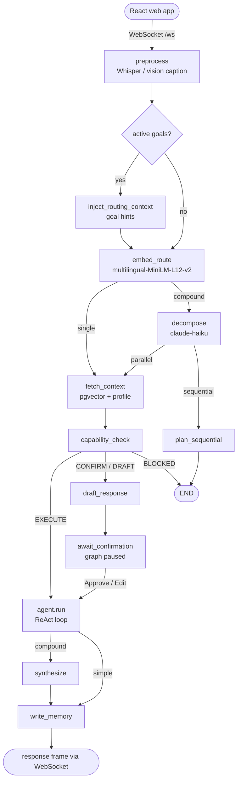

<div align="center">

# Ze

**Not a chatbot.**

Ze doesn't wait to be asked. It knows you, acts on your behalf, and operates in the background for days or weeks at a time — researching, planning, executing, and checking in only when it matters. Self-hosted, single-user, yours entirely.

<p>
  <a href="https://github.com/joaoajmatos/ze/actions/workflows/ci.yml"></a>
  
  
  
  
  
</p>

</div>

---

## The idea

Most AI assistants are stateless text boxes. Ze is built on the opposite premise: a good assistant is **someone you trust with standing authority**. That shapes every design decision.

- **It asks before acting.** Every agent action carries an explicit permission mode. Sending an email or deleting a calendar event pauses for a confirmation — unless you've deliberately granted autonomy for that action.
- **It remembers, and it earns that memory.** Facts are stored semantically and only become ground truth once *you* approve them. Episodes accrue automatically. Every night Ze dedupes, expires, and re-synthesises a portrait of you that gets injected into every prompt.
- **It works in the background for weeks.** Hand it an objective and it decomposes the goal into milestones, executes them on a schedule, and checks in at verification gates — not after every keystroke. You can steer it mid-flight just by talking.
- **It reaches out first.** Morning briefings, calendar reminders, weekly insights, workflow-failure alerts, and even *proactive goal suggestions* grounded in what it's learned about you.
- **It's yours.** Self-hosted on Fly.io with your own Postgres. No SaaS backend, no shared model, no telemetry leaving your box.

Ze is deliberately **single-user** — locked to one authenticated client.

---

## How a message flows

Every message runs through a [LangGraph](https://langchain-ai.github.io/langgraph/) graph checkpointed in Postgres, so confirmations and in-progress goals survive restarts. The happy path makes **zero LLM calls until an agent actually needs to act** — routing is done with local embeddings.



Proactive notifications (briefings, reminders, alerts) are pushed via **ntfy** when the app is in the background.

Two independent approval systems sit on top of this:

| System | Granularity | Trigger | Actions |
|---|---|---|---|
| **Capability gate** | Per agent action | A risky tool call in a normal turn | `Approve / Deny / Edit` |
| **Verification gate** | Per milestone batch | A long-running goal reaches a checkpoint | `Approve / Stop / Redirect` |

---

## What it can do

### Agents

Routing is handled by local `paraphrase-multilingual-MiniLM-L12-v2` embeddings over each agent's description; ambiguous or compound requests fall back to a small Haiku decomposer. Cost-aware routing downgrades simple requests to a cheaper model with no extra LLM call.

| Agent | Does | Default posture |
|---|---|---|
| `research` | Web search via OpenRouter + synthesis; can delegate to other agents | Autonomous |
| `companion` | Reasoning, writing, brainstorming, conversation | Autonomous |
| `calendar` | Google Calendar read / create / update / delete + availability | Read auto · writes **confirm** |
| `email` | Gmail list / read / draft / send / archive | Read auto · writes **draft-first** |
| `reminders` | One-off natural-language reminders with proactive push | Autonomous |
| `workflow` | Named recurring or on-demand multi-step tasks (APScheduler) | Read auto · manage **confirm** |
| `goals` | Conversational lifecycle for multi-week autonomous objectives | Read auto · writes **confirm** |
| `prospecting` | Target research via a Playwright browser sidecar + outreach drafting | Autonomous |
| `news` | Headlines and topic search from curated RSS sources, personalised to your interests | Autonomous |

`goals` and `workflow` ship from `ze-personal`; `email` from `ze-email`; `calendar` and `reminders` from `ze-calendar`; `prospecting` from `ze-prospecting`; `news` from `ze-news`; `research` and `companion` from `ze-personal`.

### The Goal Engine

This is the part the word "assistant" usually doesn't earn. You give Ze an objective; it does the rest over days or weeks.

- **Decomposition** into ordered milestones, each dispatched to an existing agent.
- **Milestone context injection** — each milestone runs with the objective, prior outputs, and accumulated learnings prepended.
- **Execution traces** — every tool call during a milestone is persisted and inspectable.
- **Verification gates** — Ze pauses at checkpoints with an LLM-written 2–4 sentence narrative of progress, and waits for `Approve / Stop / Redirect`.
- **Adaptive replanning** — repeated milestone failures trigger an automatic replan of the remaining work; persistent failure pauses the goal instead of spinning.
- **Conversational steering** — just tell Ze "focus more on X" and the change is queued and applied at the next milestone boundary. No commands.
- **Retrospective** — on completion, Ze pushes a real synthesis of what happened, not a one-liner.
- **Goal-aware routing** — while goals are active, their context is injected into the router so ordinary messages are understood in light of what Ze is working on.
- **Proactive suggestions** — once a week Ze mines your facts, episodes, and past retrospectives and, *only if the signal is strong enough*, proposes a new goal you can accept, dismiss, or ask to expand.

A background sweep advances active goals every 15 minutes.

### Memory

Two layers in Postgres + pgvector, plus a derived portrait.

- **Facts** (`user_facts`) — proposed after each turn, but only ground truth once **you approve them**. Never silently merged or expired.
- **Episodes** — every turn's prompt + response, embedded automatically, no approval needed.
- **Profile** — a structured portrait (preferences, habits, topics, relationships, goals) synthesised nightly and injected into every system prompt.
- **Nightly consolidation** (≈2 AM UTC) — dedup near-identical facts, expire contradicted/stale ones, archive old episodes, re-synthesise the profile.
- **Weekly insights** (Sun 7 AM UTC) — 1–3 observations categorised as pattern / trend / goal / tension.

### Everything else

- **Multimodal input** — voice notes transcribed via OpenRouter, photos captioned for routing and understanding.
- **Persona dials** — named profiles (`default`, `stoic`, `playful`) with TARS-style numeric dials (`humor`, `directness`, `formality`, `depth`), tunable live and persisted across restarts.
- **Contacts** — people extracted from email, calendar, and conversation; nightly consolidation and a morning review nudge; nothing stored without confirmation.
- **Cost telemetry** — per-flow and per-agent token tracking, reconciled against OpenRouter billing every 15 minutes.
- **Agent harness** — a ReAct tool loop with a per-turn tool-call cap, cross-agent delegation, and mid-run abort.
- **REST API** — memory, costs, capabilities, workflows, and routing log, all behind `ZE_API_KEY`.
- **Server-driven UI** — agents emit component descriptors consumed by the React web client; the server controls layout without app updates.
- **News** — curated RSS sources fetched on a schedule, ranked by your interest profile, surfaced via the news agent.

---

## Proactive schedule

Ze runs a fleet of background jobs (all configurable in `config.yaml`):

| Job | When (UTC) |
|---|---|
| Morning briefing | `0 8 * * *` |
| Calendar sync | `45 7 * * *` |
| Contacts consolidation | `0 3 * * *` |
| Contact review nudge | `30 8 * * *` |
| Weekly insights | `0 7 * * 0` |
| Goal weekly narrative | `0 18 * * 0` |
| Goal suggestions | `0 19 * * 0` |
| News fetch | configurable |
| Goal advance sweep | every 15 min |
| Cost reconciliation | every 15 min |
| Workflow failure alerts | on failure |

---

## Quick start

**Prerequisites:** Python 3.12+, [uv](https://docs.astral.sh/uv/), Docker, an [OpenRouter](https://openrouter.ai) API key, and a running ntfy instance (or ntfy.sh topic) for push notifications.

```bash
git clone https://github.com/joaoajmatos/ze.git
cd ze

make install

cp apps/ze-api/.env.example apps/ze-api/.env
# Fill in OPENROUTER_API_KEY, ZE_API_KEY, DATABASE_URL at minimum.

make db-up
make migrate

make dev        # REST API + WebSocket on :8000
make web-install  # React web app deps (Bun)
make web        # React web app on :5173
# or: make dev-full   # backend + web app together
```

The React web app (`apps/ze-web`) connects to the WebSocket at `ws://<host>:8000/ws?token=<ZE_API_KEY>`.

**Optional — Google Calendar + Gmail:**

```bash
make google-auth
```

---

## Configuration

| Layer | File | What |
|---|---|---|
| Secrets | `apps/ze-api/.env` | API keys, DB URLs |
| Structure | `apps/ze-api/config/config.yaml` | Models, routing, memory, proactive schedules |
| Persona | `apps/ze-api/config/persona.yaml` | Named profiles and default dials |

Minimum required environment variables:

| Variable | Description |
|---|---|
| `OPENROUTER_API_KEY` | All LLM calls, web search, and transcription |
| `ZE_API_KEY` | Bearer token for REST and WebSocket (`make generate-ze-api-key`) |
| `DATABASE_URL` | asyncpg URL — `postgresql://ze:ze@localhost:5432/ze` for local Docker |
| `DATABASE_URL_SYNC` | psycopg2 URL used by Alembic for migrations |
| `NTFY_BASE_URL` | ntfy server URL (e.g. `https://ntfy.sh`) |
| `NTFY_TOPIC` | ntfy topic for push delivery |
| `NTFY_TOKEN` | Bearer token (required for ntfy.sh) |

`PUBLIC_URL` is required only for production deployments. Agent config (`model`, `capabilities`, `tools`, `timeout`) lives as class attributes on each `@agent`, not in YAML. `config.yaml` is hot-reloaded on `SIGHUP`. Full reference: [docs/configuration.md](docs/configuration.md).

---

## Development

```bash
make help            # full target list

make dev-full        # backend + React web app
make web-test        # React web app tests (vitest) — alias for test-web

make test            # fast ze-api tests (skips embedding model load)
make test-<name>     # any package — see docs/testing.md
make test-all        # everything, including slow embedding tests
make test-web        # React web app tests (vitest)
make lint            # ruff

make migrate         # apply pending migrations
make db-reset        # drop and recreate the database

make eval            # run the agent eval suite
make eval-server     # MCP eval server for Cursor / Claude Code (see docs/eval.md)
```

**Conventions:** dataclasses for domain types (no Pydantic outside `ze_api/api/`), constructor injection throughout, structlog for logging, typed errors from `ze_core.errors`, async everywhere. Tests mock the DB and LLM boundaries. See [CONTRIBUTING.md](CONTRIBUTING.md) for the full contributor guide.

---

## Architecture

Ze is a uv-workspace monorepo with a strict one-way dependency graph:

```
ze/
├── core/
│   ├── ze-agents/        # Developer API — BaseAgent, @agent, @tool, ZePlugin
│   ├── ze-proactive/     # Job scheduling framework
│   ├── ze-sdk/           # Public SDK surface for plugin authors
│   ├── ze-core/          # Engine — routing, orchestration, telemetry, DI container
│   ├── ze-memory/        # Memory — facts, episodes, graph, retrieval
│   ├── ze-onboarding/    # Plugin-extensible onboarding coordinator
│   ├── ze-google/        # Google OAuth2 credentials (no Ze deps)
│   ├── ze-browser/       # Playwright browser sidecar client
│   ├── ze-notifications/ # Push notification abstraction (ntfy)
│   └── ze-components/    # Server-driven UI component descriptors
├── plugins/
│   ├── ze-personal/      # Domain layer — goals, workflows, persona, contacts, research + companion agents
│   ├── ze-email/         # Gmail channel + email agent
│   ├── ze-calendar/      # Calendar, reminders, timezone domain
│   ├── ze-prospecting/   # Prospecting agent, campaign store, browser sidecar usage
│   └── ze-news/          # News fetching, RSS sources, news agent
├── apps/
│   ├── ze-api/           # Deployment unit — FastAPI, WebSocket, REST, jobs
│   └── ze-web/           # React web client (Vite + TypeScript + Tailwind)
├── specs/                # Spec-first design docs (phases, core modules, ADRs)
├── docs/                 # Guides and architecture reference
└── Makefile
```



```mermaid
graph TD
    browser[ze-browser]
    core[ze-core]
    notif[ze-notifications]
    comp[ze-components]
    google[ze-google]
    personal[ze-personal]
    email[ze-email]
    calendar[ze-calendar]
    prospecting[ze-prospecting]
    news[ze-news]
    api[ze-api]
    app[ze-web<br/><i>React</i>]

    personal --> core
    email --> core
    email --> google
    email --> personal
    calendar --> core
    calendar --> google
    calendar --> personal
    prospecting --> core
    prospecting --> browser
    prospecting --> personal
    news --> core
    api --> core
    api --> personal
    api --> email
    api --> calendar
    api --> prospecting
    api --> google
    api --> browser
    api --> news
    api --> notif
    api --> comp
    app -->|WebSocket| api
```

`ze-core` knows nothing about the personal-assistant domain; `ze-personal`, `ze-calendar`, and `ze-news` contribute agents, graph nodes, and scheduled jobs through the `ZePlugin` ABC without the core ever depending on them. See [docs/package-architecture.md](docs/package-architecture.md).

---

## Stack

| Layer | Technology |
|---|---|
| Runtime | Python 3.12 · FastAPI · uvicorn |
| Orchestration | LangGraph · AsyncPostgresSaver |
| Client | React web app (Vite + TypeScript + Tailwind + shadcn/ui) |
| Transport | WebSocket (`/ws`) + ntfy push notifications |
| LLM gateway | OpenRouter (Sonnet / Haiku) |
| Embeddings | `paraphrase-multilingual-MiniLM-L12-v2` (local, 384-dim, multilingual, no API cost) |
| Database | PostgreSQL 16 + pgvector |
| Scheduler | APScheduler 3.x (Postgres job store) |
| Migrations | Alembic (raw SQL, no ORM) |
| Packaging | uv workspaces |
| Deploy | Fly.io · Docker |

---

## Deployment

Runs on [Fly.io](https://fly.io) with an attached Postgres database; GitHub Actions handles CI on every push.

```bash
fly deploy
fly secrets set OPENROUTER_API_KEY=sk-or-... NTFY_TOKEN=... ZE_API_KEY=...
```

Step-by-step: [docs/deployment.md](docs/deployment.md).

---

## Security

Ze is **single-user by design** — there is no multi-user isolation. Before exposing it:

1. Generate a strong `ZE_API_KEY` (`make generate-ze-api-key`) — this gates both REST and WebSocket.
2. Keep `.env` out of version control; use `fly secrets` in production.
3. Review agent `capabilities` — prefer `confirm` or `draft_only` for write actions.
4. Use a non-guessable ntfy topic; set a token for ntfy.sh topics.

Do not deploy Ze as a shared service without substantial hardening.

---

## Documentation

| Doc | Topic |
|---|---|
| [architecture.md](docs/architecture.md) | System design, graph flow, all modules |
| [package-architecture.md](docs/package-architecture.md) | Monorepo split, the `ZePlugin` extension point |
| [native-interface.md](docs/native-interface.md) | WebSocket protocol, confirmations, ntfy push |
| [memory.md](docs/memory.md) | Facts, episodes, profile synthesis, inspection |
| [goals.md](docs/goals.md) | Goal Engine — milestones, gates, steering, suggestions |
| [scheduled-jobs.md](docs/scheduled-jobs.md) | Background job schedule and memory lifecycle |
| [workflows.md](docs/workflows.md) | Workflow modes and scheduling |
| [adding-an-agent.md](docs/adding-an-agent.md) | Authoring a new agent |
| [channels.md](docs/channels.md) | Adding an outbound communication channel |
| [configuration.md](docs/configuration.md) | Full env var and YAML reference |
| [deployment.md](docs/deployment.md) | Fly.io setup and CI |
| [eval.md](docs/eval.md) | MCP eval server for agent testing |

Design specs (one per module, spec-first development) live in [`specs/`](specs/).

---

## License

[The Unlicense](UNLICENSE) — public domain.
