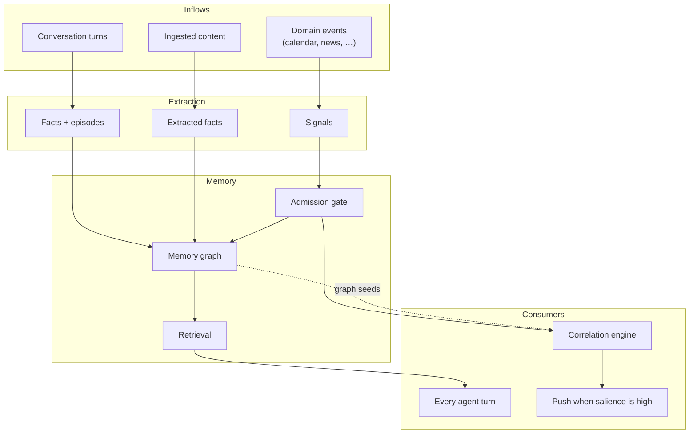

<div align="center">

# Ze

**Jarvis. Make no mistakes.**

A self-hosted personal AI assistant. Single-user, spec-first, somewhere in the middle of becoming something genuinely useful.

<p>
  <a href="https://github.com/joaoajmatos/ze/actions/workflows/ci.yml"></a>
  
  
  
  
</p>

</div>

---

## What this is

An honest attempt at building a personal AI that does more than answer questions.

The objective: an assistant that holds context across weeks, works in the background, and connects things that happen in separate parts of your life — calendar, email, news, long-running projects. Not a chat window that resets. Something closer to Jarvis. That's the whole brief.

It isn't there yet. But 100+ shipped phases in, the infrastructure is real and it's getting closer.

---

## Where it is now

Python/FastAPI backend, LangGraph orchestration, React web client, plugin-per-domain architecture. Routing uses local embeddings — zero LLM calls until an agent actually needs to act. All LLM traffic goes through OpenRouter. Graph state is checkpointed in Postgres and survives restarts.

- **ze-web** — React SPA (Feature-Sliced Design); REST types and client generated from OpenAPI via `@ze/client`.

### Goal engine

The center of gravity. Hand Ze an objective and it decomposes into milestones, dispatches them to specialist agents on a schedule, pauses at verification gates with a progress narrative, replans on failure, and writes a retrospective when it finishes. Steer mid-flight by talking — no slash commands. Background sweep runs every 15 minutes regardless of whether you're online.

This is the bet. Everything else compounds on top of it.

### Memory

Facts and episodes extracted after each turn, consolidated nightly, profile synthesised weekly. Goal learnings promoted to long-term memory on completion. `pgvector` for retrieval.

### Dreaming

Every night Ze runs an offline memory improvement loop — sleep pass then dream pass. The sleep pass replays high-priority episodes, compresses old sessions, deduplicates facts, and identifies schema and policy clusters using only structural analysis (no LLM calls). The dream pass then synthesises those clusters into insights, procedures, and plan stress-tests using a haiku-class generator.

Nothing synthetic goes straight to memory. Every artifact passes three cheap pre-gates (NLI groundedness, embedding novelty, retrievability) and two adversarial LLM critic calls at sonnet-class before reaching a morning integration step that enforces session-diversity and temporal-spread requirements. Promoted facts carry full lineage for per-run rollback. Borderline cases surface in the morning briefing for review. Synthetic facts that go uncorroborated for 90 days are automatically expired.

The design is drawn from neuroscience (NREM/REM ordering, targeted memory reactivation) and ML (PER, Constitutional AI-style critic filtering, generative replay safety). It's the first layer of Ze becoming genuinely self-improving rather than just accumulating facts.

### How Ze gets sharper

Memory isn't a single inflow. Everything feeds the same substrate:



Conversations write what Ze learns from talking. Ingestion (`ze-ingestion`) feeds knowledge from any URL, PDF, YouTube video, or file — extracted facts land in the same store. Domain plugins emit `SignalSource` events that are scored for relevance, written to the memory graph, and fed into the correlation engine. Goals promote learnings on completion. Every inflow compounds.

The design intent is that Ze gets sharper without being explicitly fed. Drop a PDF in. Share a video. The facts join everything else Ze already knows.

Every domain plugin also declares a `DataDomain` — an export, import, and delete contract. The portability service honours it. You own the data at every layer.

### Proactive surface

Ze doesn't wait to be asked. Morning briefings, calendar reminders, weekly insights, goal suggestions, stuck-goal alerts, news fetch — all background jobs, configurable in `config.yaml`. Offline push goes through ntfy; the in-app notification center (REST + WebSocket) surfaces the same events while you're in ze-web.

### Agents

Research, companion, calendar, messenger, reminders, workflow, goals, prospecting, news, ingestion. Each runs in a ReAct loop via `BaseAgent`; tool access is gated per-agent.

<details>
<summary>Agent reference</summary>

| Agent | Domain | Default posture |
|---|---|---|
| `research` | Web search + synthesis, delegation | Autonomous |
| `companion` | Reasoning, writing, conversation | Autonomous |
| `calendar` | Google Calendar CRUD + availability | Read auto · writes confirm |
| `messenger` | Cross-channel messaging (Gmail) | Read auto · draft-first |
| `reminders` | NL reminders + proactive push | Autonomous |
| `workflow` | Recurring multi-step tasks | Read auto · manage confirm |
| `goals` | Multi-week autonomous objectives | Read auto · writes confirm |
| `prospecting` | Browser-sidecar research + outreach | Autonomous |
| `news` | Personalised RSS headlines + search | Autonomous |
| `ingestion` | URL / PDF / video / audio / text → memory | Autonomous |

</details>

### Plugin extension surface

`ZePlugin` is the seam. A domain package hooks in by declaring what it contributes:

| Hook | What it provides |
|---|---|
| `agents()` | Agents registered into the routing graph |
| `ingestion_extractors()` | Domain-specific extractors (e.g. `TransactionExtractor` for PDFs) |
| `ingestion_fetchers()` | Custom content fetchers (e.g. Notion, proprietary APIs) |
| `signal_sources()` | Domain events fed into the correlation pipeline |
| `data_domains()` | Export / import / delete contract for every table the plugin owns |
| `memory_policies()` | Per-agent retrieval strategy from the memory graph |
| `channels()` | Outbound communication channels (email, etc.) |
| `ui_contributions()` | Nav items, settings sections, plugin pages in ze-web |
| `rest_routes()` | Plugin-owned REST routers under `/api/v0/` |

The hooks compose. A finance plugin registers a `TransactionExtractor` so that ingesting a bank statement produces structured transaction facts — which land in memory, which surface in retrieval, which the correlation engine can cross with calendar and news. That chain is the whole point.

---

## Where it's going

The goal engine needs to carry a full personal project across weeks with minimal intervention — research, plan, execute, verify, iterate, report. That's the target.

Near-term: finance and legal plugins, richer correlation reasoning, deeper signal coverage.

---

## How a message flows

Every turn runs through a LangGraph graph checkpointed in Postgres.


See [docs/architecture.md](docs/architecture.md) for the full flow and node-by-node detail.

---

## Monorepo

```
apps/           ze-api · ze-web
plugins/        personal · messenger · calendar · news · prospecting · finance* · legal*
core/           ze-core · ze-agents · ze-automation · ze-communication · ze-plugin · ze-sdk
                ze-memory · ze-proactive · ze-seed · ze-correlation · ze-data · ze-ingestion
                ze-browser · ze-notifications · ze-components · ze-logging · …
integrations/   ze-google (GmailChannel) · ze-yt · …
specs/          one spec per phase, written before the code
```

| Layer | Tech |
|---|---|
| Runtime | Python 3.12 · FastAPI · LangGraph · AsyncPostgresSaver |
| Client | React · Vite · TypeScript · Tailwind |
| LLM | OpenRouter · local embeddings (multilingual MiniLM) |
| Data | PostgreSQL 16 + pgvector |
| Push | ntfy (offline) · in-app notification center · WebSocket `/ws` |

---

## Quick start

**Prerequisites:** Python 3.12+, [uv](https://docs.astral.sh/uv/), [bun](https://bun.sh), Docker, [OpenRouter](https://openrouter.ai) key, ntfy for push.

```bash
git clone https://github.com/joaoajmatos/ze.git && cd ze
make install && make web-install

cp apps/ze-api/.env.example apps/ze-api/.env
make db-up && make migrate
make dev-full    # backend :8000 + web :5173
```

Google Calendar + Gmail: `make google-auth` · Config: [docs/configuration.md](docs/configuration.md)

---

## Development

```bash
make test              # ze-api (fast)
make test-<name>       # any package — docs/testing.md
make test-all          # full suite
make eval              # agent evals (make dev-eval first)
```

Every package has a README. Conventions: [CONTRIBUTING.md](CONTRIBUTING.md)

---

## Documentation

Full index: [docs/README.md](docs/README.md)

| Doc | Topic |
|---|---|
| [architecture.md](docs/architecture.md) | System design, graph flow |
| [package-architecture.md](docs/package-architecture.md) | Monorepo, `ZePlugin`, dependency rules |
| [frontend.md](docs/frontend.md) | ze-web — FSD layout, `@ze/client`, plugin UI |
| [native-interface.md](docs/native-interface.md) | WebSocket protocol, frames, ntfy push |
| [extending-ze.md](docs/extending-ze.md) | Agents, plugins, jobs, channels |
| [channels.md](docs/channels.md) | Outbound communication channels |
| [ingestion.md](docs/ingestion.md) | Ingestion pipeline — fetchers, processors, extractors, plugin hooks |
| [memory.md](docs/memory.md) | Facts, episodes, graph, retrieval policies |
| [dreaming.md](docs/dreaming.md) | Offline sleep/dream memory improvement loop |
| [goals.md](docs/goals.md) | Goal engine |
| [sdk.md](docs/sdk.md) | `ze_sdk` reference |
| [testing.md](docs/testing.md) | Running tests across Python packages and ze-web |
| [data-portability.md](docs/data-portability.md) | Export, import, and deletion — `DataDomain` contract |
| [specs/](specs/) | Design specs — where Ze is going next |

Deploy: [docs/deployment.md](docs/deployment.md)

---

## Security

Single-user by design. Strong `ZE_API_KEY`, secrets out of git, non-guessable ntfy topic. Don't expose as a shared service without hardening.

---

## License

[The Unlicense](UNLICENSE) — public domain. Take it anywhere, zero conditions.
