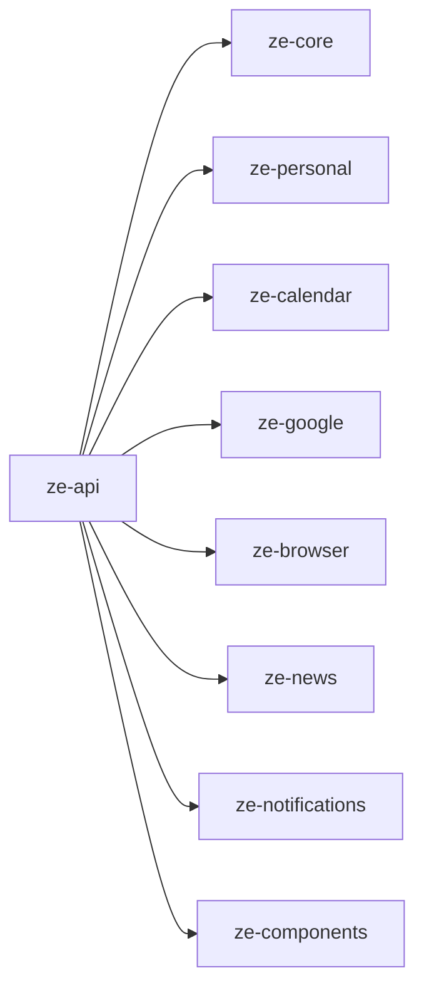

# ze-api

Deployment unit for Ze. Wires all packages together, exposes the WebSocket chat endpoint and REST management API, runs background jobs, and handles Google integrations.

## Responsibilities

| Module | What it provides |
|---|---|
| `api/` | FastAPI app, WebSocket (`/ws`), REST routes, schemas |
| `agents/` | `EmailAgent`, `CompanionAgent`, `ResearchAgent`, `ProspectingAgent` + bootstrap |
| `interface/native.py` | `NativeAppInterface` — WebSocket + ntfy delivery |
| `google/` | `GmailChannel` (imports `GoogleCredentials` from `ze-google`) |
| `jobs/` | Proactive cron jobs: briefing, insights, contacts, goal narrative, goal suggestions, stuck goals |
| `hooks/` | Agent harness hooks |
| `container.py` | `ZeContainer` — DI wiring, registers `PersonalPlugin`, `CalendarPlugin`, `NewsPlugin` |
| `settings.py` | `Settings` (Pydantic BaseSettings + YAML) |
| `config/config.yaml` | Models, contacts, proactive schedules |
| `config/persona.yaml` | Persona profiles and dials |
| `migrations/` | Alembic SQL migrations |

## Dependencies



## Running

```bash
make dev          # uvicorn --reload on :8000
make dev-eval     # REST API without background jobs (for running evals)
```

## WebSocket protocol

Connect at `ws://<host>:8000/ws` with `Authorization: Bearer <ZE_API_KEY>` header or `?token=<ZE_API_KEY>` query param.

**Send** (user turn):
```json
{"type": "invoke", "content": "What's on my calendar today?", "thread_id": "<uuid>"}
```

**Receive** (assistant response):
```json
{"type": "message", "message": {"role": "assistant", "content": "...", "components": [...]}}
```

**Receive** (confirmation request):
```json
{"type": "confirmation", "id": "<uuid>", "prompt": "...", "options": ["approve", "deny"]}
```

**Send** (confirmation reply):
```json
{"type": "confirm", "id": "<uuid>", "choice": "approve"}
```

## REST endpoints

| Route | Description |
|---|---|
| `GET /api/messages` | Load message history since a timestamp |
| `GET /capabilities` | List capability overrides |
| `PATCH /capabilities/{agent}/{action}` | Update a capability mode |
| `GET /memory/facts` | Inspect stored facts |
| `GET /memory/profile` | Get current user profile |
| `GET /routing/log` | Routing decision log |
| `GET /costs` | Token usage and cost breakdown |
| `GET /workflows` | List workflows |

All routes require `Authorization: Bearer <ZE_API_KEY>`.

## Configuration

See the root [README](../../README.md#configuration) for all environment variables.

## Testing

```bash
make test
# or
uv run pytest apps/ze-api/tests -q
```
