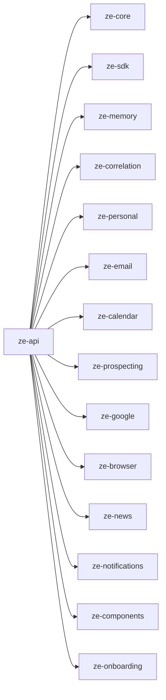

# ze-api

Deployment unit for Ze. Wires all packages together, exposes the WebSocket chat endpoint and REST management API, runs background jobs, and handles Google integrations.

## Role in Ze

`ze-api` is the only runnable backend. It is where every package meets: the LangGraph is built, plugins are discovered and started, Postgres migrations run, background jobs fire, and the WebSocket/REST interface serves `ze-web` and ntfy push clients.

### Key features

- WebSocket chat at `/ws` — primary user interface, with confirmation flow and message replay
- REST management API — memory inspection, costs, capabilities, workflows, contacts
- `ZeContainer` — DI wiring for all plugins, integrations, and shared services
- Alembic meta-migrator — discovers and runs migrations from all owning packages
- Agent harness hooks — tool-call caps (`ze_agents`), component collection (`ze_components`); configured in `ze_core/bootstrap.py`
- NativeAppInterface — WebSocket delivery when connected, ntfy push when not

### Integration

Depends on every core package and all enabled plugins. Instantiates `ZeContainer`, runs `bootstrap.py` for agent registration and plugin startup, builds the graph, and serves via uvicorn. Nothing in `core/` or `plugins/` runs standalone — `ze-api` is always the entry point.

Collects plugin signal sources via `collect_plugin_signal_sources()` in `container.py` — deduplicates by `source_key` and registers them with the correlation engine. Current emitters: `NewsSignalSource`, `CalendarSignalSource`.

## Responsibilities

| Module | What it provides |
|---|---|
| `api/` | FastAPI app, WebSocket (`/ws`), REST routes, schemas |
| `interface/native.py` | `NativeAppInterface` — WebSocket + ntfy delivery |
| `onboarding/` | Postgres-backed onboarding store, persistence, and reset |
| `container.py` | `ZeContainer` — DI wiring, plugin signal source collection |
| `settings.py` | `ZeApiSettings` (Pydantic BaseSettings + YAML) |
| `migrate.py` | Alembic meta-migrator — discovers all package migration chains |
| `migrations/env.py` | Alembic runner harness (no owned tables) |

Agents and proactive jobs live in plugin packages (`ze-personal`, `ze-email`, `ze-calendar`, etc.) — not in `ze-api`. Core package jobs (automation, memory, correlation) are registered via package bootstrap modules — see [specs/phases/76-ze-api-shell-cleanup.md](../../specs/phases/76-ze-api-shell-cleanup.md).

## Dependencies



## Running

```bash
make dev          # uvicorn --reload on :8000
make dev-eval     # REST API without background jobs (for running evals)
make dev-full     # backend + React web app together
```

## WebSocket protocol

Connect at `ws://<host>:8000/ws` with `Authorization: Bearer <ZE_API_KEY>` header or `?token=<ZE_API_KEY>` query param.

**Send** (user turn):
```json
{"type": "message", "text": "What's on my calendar today?", "thread_id": "<uuid>"}
```

**Receive** (assistant response):
```json
{"type": "message", "message": {"role": "assistant", "text": "...", "components": [...]}}
```

**Receive** (confirmation request):
```json
{"type": "confirm_request", "id": "<uuid>", "prompt": "...", "actions": [{"label": "Approve", "payload": "yes"}]}
```

**Send** (confirmation reply — same as a regular message on the original thread):
```json
{"type": "message", "text": "yes", "thread_id": "<original-thread-id>"}
```

Full protocol reference: [docs/native-interface.md](../../docs/native-interface.md).

## REST endpoints

| Route | Description |
|---|---|
| `GET /api/v0/messages` | Unread message list (WebSocket replay fallback) |
| `GET /api/v0/capabilities` | List capability overrides |
| `PUT /api/v0/capabilities/{agent}/{intent}` | Update a capability mode |
| `GET /api/v0/memory/facts` | Inspect stored facts |
| `GET /api/v0/memory/profile` | Get current user profile |
| `GET /api/v0/routing/log` | Routing decision log |
| `GET /api/v0/costs/summary` | Token usage and cost breakdown |
| `GET /api/v0/workflows` | List workflows |

All routes require `Authorization: Bearer <ZE_API_KEY>`.

## Configuration

See the root [README](../../README.md#configuration) for all environment variables.

## Testing

From the repo root:

```bash
make test        # alias for test-api
make test-api
```

See [docs/testing.md](../../docs/testing.md).
