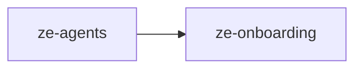

# ze-agents

Developer API for Ze — agent execution primitives, shared types, and harness hooks. Plugin authors reach this package through `ze-sdk`, not by importing `ze_agents` directly.

## Role in Ze

`ze-agents` defines how agents are authored and executed. Every agent in Ze subclasses `BaseAgent` and runs an LLM-driven ReAct tool loop. The `@agent` and `@tool` decorators register agents and tools into a shared registry that the orchestration graph resolves at runtime.

### Key features

- `BaseAgent` with the agentic tool loop, timeout handling, and progress reporting
- `@agent` / `@tool` decorators and the agent registry
- Harness hooks — step-level interception, tool-call caps, and multi-agent handoffs
- Shared protocols (`LLMClient`, `DBPool`) and the typed `ZeError` hierarchy
- `AppInterface` ABC — the outbound delivery contract implemented by `ze-api`

### Integration

Imported by `ze-plugin`, `ze-core`, and `ze-onboarding`. Re-exported to plugin authors via `ze-sdk`. At startup, `ze-api` bootstrap imports each plugin's `agent_module_paths()` to fire decorator registration before the graph is built.

## Responsibilities

| Module | What it provides |
|---|---|
| `base_agent.py` | `BaseAgent` ABC with the agentic ReAct loop |
| `registry.py` | `@agent` decorator and `AgentRegistry` |
| `tool.py` | `@tool` decorator and `ToolAccess` |
| `client.py` | `LLMClient` Protocol |
| `db.py` | `DBPool` Protocol |
| `settings.py` | `Settings` dataclass |
| `errors.py` | Full `ZeError` hierarchy |
| `hooks.py` | `HarnessHook` ABC for agentic-loop interception |
| `interface/` | `AppInterface` ABC, `InputPreprocessor`, validation, types |
| `progress/` | `ProgressReporter`, locale-key translations |
| `delegate.py` | Multi-agent handoff helpers |
| `tasks.py` | Background task utilities |
| `types.py` | Shared domain types (`Mode`, etc.) |

## Dependencies



No other Ze package dependencies. Third-party: `structlog`, `pyyaml`, `typing_extensions`.

## Usage

Consumed by `ze-plugin`, `ze-core`, and re-exported via `ze-sdk`. Engine and plugin bootstrap code import directly:

```python
from ze_agents.registry import agent
from ze_agents.base_agent import BaseAgent
from ze_agents.tool import tool
```

## Testing

From the repo root:

```bash
make test-agents
```

See [docs/testing.md](../../docs/testing.md).
