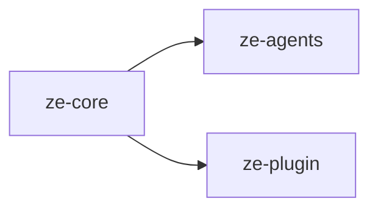

# ze-core

LangGraph orchestration engine for Ze. Pure infrastructure — routing, graph execution, capability gate, OpenRouter client, telemetry, and DI container. Contains no personal-assistant domain logic.

## Responsibilities

| Module | What it provides |
|---|---|
| `orchestration/` | `graph_builder`, `AgentState`, graph nodes and edges |
| `routing/` | `EmbeddingRouter`, `ComplexityEstimator`, `PostgresRoutingStore`, fallback |
| `capability/` | `CapabilityGate`, `PostgresCapabilityOverrideStore`, permission modes |
| `openrouter/` | `OpenRouterClient`, streaming, transcription |
| `telemetry/` | `CostTracker`, `CostReconciler`, `PostgresCostStore`, context var |
| `messages/` | `MessageStore`, message types |
| `conversation.py` | `invoke_raw_turn`, `resume_turn` entry points |
| `container.py` | Base `Container` with DI wiring |
| `embeddings.py` | Shared `paraphrase-multilingual-MiniLM-L12-v2` singleton |
| `checkpoint_serde.py` | LangGraph checkpoint serialisation for plugin types |

Agent execution (`BaseAgent`, `@agent`, `@tool`), plugin framework (`ZePlugin`, channels), and memory live in sibling packages — `ze-agents`, `ze-plugin`, and `ze-memory`.

## Dependencies



Third-party: `langgraph`, `openrouter`, `numpy`, `structlog`.

## Usage

Consumed by `ze-api` and never imported directly from plugin packages:

```python
from ze_core.orchestration.graph import graph_builder
from ze_core.container import Container
from ze_core.routing.router import EmbeddingRouter
```

## Testing

From the repo root:

```bash
make test-core
```

Pass `SLOW=1` to include embedding model tests. See [docs/testing.md](../../docs/testing.md).
