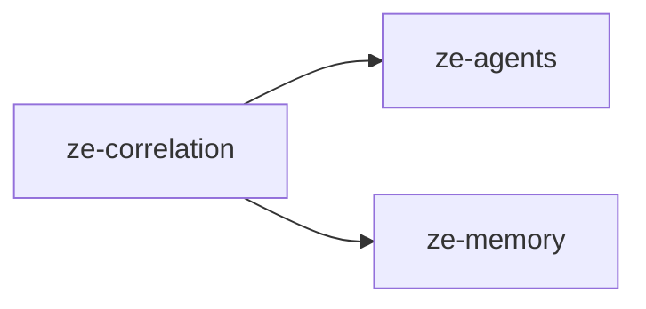

# ze-correlation

Correlation engine for Ze — cross-domain hypothesis formation from the memory graph, with neighbourhood expansion and signal pinning.

## Responsibilities

| Module | What it provides |
|---|---|
| `engine.py` | `CorrelationEngine` — forms hypotheses from graph signals |
| `store.py` | `PostgresHypothesisStore` — hypothesis persistence |
| `job.py` | `CorrelationJob` — scheduled correlation runs |
| `push.py` | `CorrelationPushConsumer` — delivers correlation insights via push |
| `prompts.py` | LLM prompt templates for hypothesis generation |
| `types.py` | `Hypothesis`, `EvidenceRef` |

## Dependencies



Third-party: `asyncpg`.

## Usage

Wired into the orchestration graph by `ze-core` (`orchestration/nodes/correlation.py`) and started as a proactive job from `ze-api`:

```python
from ze_correlation import CorrelationEngine, PostgresHypothesisStore
```

## Testing

From the repo root:

```bash
make test-correlation
```

See [docs/testing.md](../../docs/testing.md).
