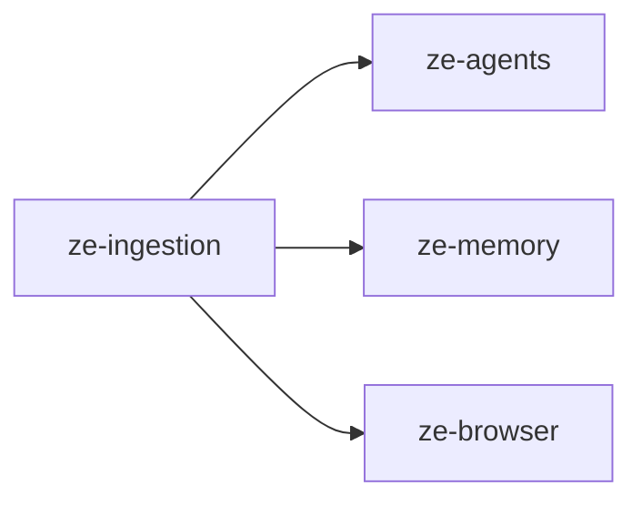

# ze-ingestion

Content ingestion pipeline — fetch, process, extract, and archive any external content into Ze's memory.

## Role in Ze

`ze-ingestion` is the pipeline that turns arbitrary external content — a URL, an uploaded file, raw text — into structured knowledge stored in Ze's memory. It classifies the content type, fetches it (via HTTP or browser sidecar), converts it to plain text, runs all registered extractors in parallel to pull out facts and entities, archives the result, and pushes facts to `ze-memory`.

The pipeline is intentionally generic. Domain plugins extend it by registering `Extractor` implementations via `ZePlugin.ingestion_extractors()`. A finance plugin can register a `TransactionExtractor` for PDF bank statements; `ze-ingestion` ships a default `LLMExtractor` that handles everything else. When multiple extractors match, all run in parallel and their results are merged — no extractor has veto power over another.

### Key features

- `ContentClassifier` — classifies content by URL pattern, MIME hint, or magic-byte sniff
- Built-in fetchers: `WebFetcher` (httpx) and `BrowserFetcher` (ze-browser sidecar for JS-heavy pages)
- Built-in processors: HTML, PDF, audio (Whisper via OpenRouter), image (vision LLM), plain text
- Default `LLMExtractor` — produces summary, facts, entities, and tags via LLM
- Parallel multi-extractor execution with result merging and partial-failure tolerance
- `IngestionStore` — archives processed text and extraction results in `ingested_content`
- `MemorySink` — pushes extracted facts to `ze-memory` tagged with `source=ingestion:<id>`
- `IngestionAgent` — routes "save this link / learn from this PDF" intents
- `POST /api/ingest` REST endpoint for direct ingestion from the web client or CLI

### Integration

`IngestionPipeline` is built in `ze-api`'s container and injected into `IngestionAgent`'s tools at startup. Plugin-contributed fetchers and extractors are collected via `ZePlugin.ingestion_fetchers()` and `ZePlugin.ingestion_extractors()` — the same collection pattern used by `data_domains()` and `signal_sources()`.

`ze-yt` (in `integrations/`) provides `YtDlpFetcher`, which is registered in the container alongside plugin-contributed fetchers when installed. The pipeline's fetcher priority order is: yt-dlp matchers → plugin fetchers → browser → web fallback.

The `IngestionAgent` is bootstrapped via `ze_ingestion.agent` in `ze-api`'s `_DEFAULT_AGENT_MODULE_PATHS`. The migration `zi001` (branch `ze_ingestion`) creates the `ingested_content` table and is discovered automatically by `ze_api/migrate.py`.

## Responsibilities

| Module | What it provides |
|---|---|
| `types.py` | `ContentType`, `IngestionRequest`, `RawContent`, `ProcessedContent`, `ExtractionResult`, `IngestionResult` |
| `errors.py` | `FetchError`, `ProcessError`, `UnsupportedContentError` |
| `classifier.py` | `ContentClassifier` — URL patterns, MIME map, magic-byte sniff |
| `fetchers/` | `Fetcher` protocol, `WebFetcher` (httpx), `BrowserFetcher` (ze-browser) |
| `processors/` | `Processor` protocol, `HtmlProcessor`, `PdfProcessor`, `AudioProcessor`, `ImageProcessor`, `TextProcessor` |
| `extractors/` | `Extractor` protocol, `LLMExtractor` (default — JSON summary/facts/entities/tags) |
| `pipeline.py` | `IngestionPipeline` — orchestrates classify → fetch → process → extract → store → sink |
| `store.py` | `IngestionStore` — writes to `ingested_content` table |
| `sink.py` | `MemorySink` — proposes extracted facts to `ze-memory` |
| `agent.py` | `IngestionAgent` + `ingest_url` and `ingest_text` tools |
| `locales/en.yaml` | Progress message translations (per-stage keys) |
| `migrations/versions/zi001_ingested_content.py` | `ingested_content` table + indexes |

## Dependencies



Third-party: `httpx`, `beautifulsoup4`, `pypdf`.

## Usage

### Adding a custom extractor from a plugin

```python
from ze_ingestion.extractors import Extractor
from ze_ingestion.types import ContentType, ExtractionResult, ProcessedContent


class TransactionExtractor:
    content_types = [ContentType.PDF]

    async def extract(self, content: ProcessedContent) -> ExtractionResult:
        # parse bank transactions from content.text
        ...
        return ExtractionResult(summary=..., facts=[...], entities=[...], tags=[...])


# in your plugin:
def ingestion_extractors(self) -> list:
    return [TransactionExtractor()]
```

### Adding a custom fetcher from a plugin

```python
from ze_ingestion.fetchers import Fetcher
from ze_ingestion.types import ContentType, RawContent


class MyApiFetcher:
    url_patterns = [r"myapi\.example\.com/"]

    async def fetch(self, url: str) -> RawContent:
        ...
        return RawContent(content_type=ContentType.PLAIN_TEXT, source_url=url, data=b"...", mime_type="text/plain")


# in your plugin:
def ingestion_fetchers(self) -> list:
    return [MyApiFetcher()]
```

### REST endpoint

```
POST /api/ingest
Content-Type: multipart/form-data
  url:   (optional) URL to ingest
  file:  (optional) uploaded file
  label: (optional) user-supplied title
```

Exactly one of `url` or `file` must be present; 422 otherwise.

## Testing

From the repo root:

```bash
make test-ingestion
```

See [docs/testing.md](../../docs/testing.md).
