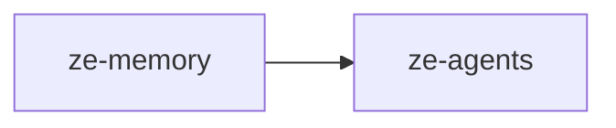

# ze-memory

Memory persistence and retrieval for Ze — facts, episodes, semantic search, graph traversal, and consolidation.

## Responsibilities

| Module | What it provides |
|---|---|
| `store.py` | `PostgresMemoryStore` — fact and episode CRUD |
| `retriever.py` | Semantic retrieval with embedding similarity |
| `extractor.py` | LLM-driven fact extraction from conversations |
| `consolidator.py` | Dedup, expiry, and episode summarisation |
| `consolidation_store.py` | Consolidation run persistence |
| `policies.py` | `MemoryRetrievalPolicy` implementations per agent domain |
| `graph/` | Memory graph store, traversal, predicates, projection |
| `surfacing.py` | Context surfacing for agent prompts |
| `synthesizer.py` | User profile synthesis from facts and episodes |
| `types.py` | Memory domain types |

## Dependencies



Third-party: `asyncpg`, `numpy`.

## Usage

Wired into the orchestration graph by `ze-core` and extended by plugins via `memory_policies()`:

```python
from ze_memory.store import PostgresMemoryStore
from ze_memory.policies import MemoryRetrievalPolicy
```

Plugin authors import policy types from `ze_sdk.memory`.

## Testing

From the repo root:

```bash
make test-memory
```

See [docs/testing.md](../../docs/testing.md).
