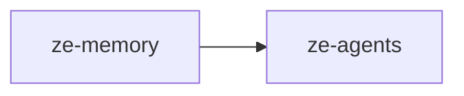

# ze-memory

Memory persistence and retrieval for Ze — facts, episodes, semantic search, graph traversal, and consolidation.

## Role in Ze

Memory is how Ze remembers the user across conversations. Facts and episodes are extracted after each turn, stored in Postgres with pgvector embeddings, and retrieved semantically before agent execution. A memory graph connects entities and supports the correlation engine's cross-domain reasoning.

### Key features

- Fact and episode storage with semantic retrieval (local embedding model, no API cost)
- LLM-driven extraction and session-grouped episode consolidation
- Per-agent retrieval policies — plugins register domain-specific memory access rules
- Memory graph — entity linking, traversal, and neighbourhood expansion for correlation
- **Signal substrate** — `Signal` storage, relevance-scored admission gate, and graph ingestion for cross-domain correlation
- User profile synthesis from accumulated facts and episodes

### Integration

`PostgresMemoryStore` is constructed in `ze-api`'s container and injected into plugins and graph nodes. The `fetch_context` and `write_memory` graph nodes in `ze-core` call into `ze-memory`. Plugins extend retrieval via `ZePlugin.memory_policies()`.

Plugins emit candidate signals via `SignalSource` (defined in `ze-plugin`, type in `ze_memory.types`). The admission gate scores each signal for relevance; admitted signals are written to the memory graph and become seeds for `ze-correlation`.

## Responsibilities

| Module | What it provides |
|---|---|
| `store.py` | `PostgresMemoryStore` — fact and episode CRUD |
| `retriever.py` | Semantic retrieval with embedding similarity; signal ingest and pinning |
| `extractor.py` | LLM-driven fact extraction from conversations |
| `consolidator.py` | Dedup, expiry, and episode summarisation |
| `consolidation_store.py` | Consolidation run persistence |
| `admission.py` | `AdmissionGate` — relevance-scored signal admit/watch/drop |
| `relevance.py` | `RelevanceModel` — cheap scoring for signal admission |
| `policies.py` | `MemoryRetrievalPolicy` implementations per agent domain |
| `graph/` | Memory graph store, traversal, predicates, projection |
| `surfacing.py` | Context surfacing for agent prompts |
| `synthesizer.py` | User profile synthesis from facts and episodes |
| `types.py` | Memory domain types (`Fact`, `Episode`, `Signal`, …) |

## Dependencies



Third-party: `asyncpg`, `numpy`.

## Usage

Wired into the orchestration graph by `ze-core` and extended by plugins via `memory_policies()`:

```python
from ze_memory.store import PostgresMemoryStore
from ze_memory.policies import MemoryRetrievalPolicy
```

Plugin authors import policy types from `ze_sdk.memory`.

## Testing

From the repo root:

```bash
make test-memory
```

See [docs/testing.md](../../docs/testing.md).
