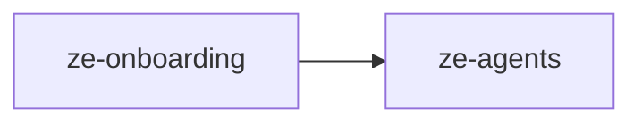

# ze-onboarding

Plugin-extensible onboarding coordinator — setup flow contracts, step/seed types, and reset domain types.

## Role in Ze

New users (or fresh installs) go through a multi-step onboarding flow before Ze is fully configured. `ze-onboarding` coordinates steps contributed by multiple plugins — persona setup, news source selection, Google auth prompts — and persists progress so the flow can resume across sessions.

### Key features

- `OnboardingCoordinator` — drives the multi-plugin setup sequence
- `OnboardingProvider` protocol — plugins declare steps and seed data
- Session persistence and step-level progress tracking
- Reset domain types — scoped data deletion for "start over" flows

### Integration

Plugins return an `OnboardingProvider` from `ZePlugin.onboarding()`. `ze-api` owns the Postgres onboarding store and exposes REST/WebSocket endpoints consumed by `ze-web`'s onboarding flow.

## Responsibilities

| Module | What it provides |
|---|---|
| `coordinator.py` | `OnboardingCoordinator` — orchestrates multi-plugin setup flows |
| `providers.py` | `CoreOnboardingProvider`, `OnboardingProvider` protocol |
| `types.py` | Steps, seeds, sessions, reset scope, persistence contracts |

## Dependencies



## Usage

Plugins contribute onboarding steps via `ZePlugin.onboarding()`. The coordinator in `ze-api` drives the setup flow and persists progress:

```python
from ze_onboarding import OnboardingCoordinator, OnboardingProvider
from ze_sdk.onboarding import OnboardingStep, OnboardingSeed
```

## Testing

From the repo root:

```bash
make test-onboarding
```

See [docs/testing.md](../../docs/testing.md).
