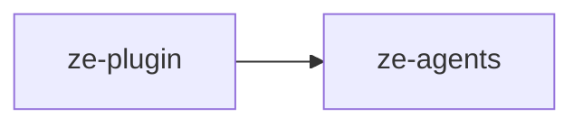

# ze-plugin

Plugin extension framework for Ze — `ZePlugin` ABC, channel abstraction, signal sources, and integration protocol. Used by the engine and SDK; plugin code imports through `ze-sdk`.

## Role in Ze

`ze-plugin` is the extension seam between the engine and domain packages. Every plugin package implements `ZePlugin` and declares an entry point; `ze-api` discovers, topologically sorts, and instantiates them. Plugins contribute agents, jobs, graph nodes, memory policies, channels, and signal sources without modifying `ze-core` internals.

### Key features

- `ZePlugin` ABC — container-level hooks (agents, jobs, migrations) and graph-level hooks (nodes, edges, state extensions)
- `Channel` abstraction — unified send/receive across Gmail, contact handles, and future channels
- `SignalSource` protocol — cross-plugin signal collection for the correlation engine
- `DataDomain` — export/import/delete contracts for user data reset and portability
- `ZeIntegration` protocol — structural contract for third-party credential classes

### Integration

Plugins self-register via `[project.entry-points."ze.plugins"]`. `bootstrap.py` collects integration types, calls `from_settings`, wires DI, and merges graph contributions at build time. Plugin authors import `ZePlugin` and channel types from `ze-sdk`.

**Signal flow:** plugins implement `SignalSource` and register via `ZePlugin.signal_sources()` → `ze-api` collects and deduplicates by `source_key` → admission gate in `ze-memory` scores and ingests → `ze-correlation` uses admitted signals as graph seeds.

## Responsibilities

| Module | What it provides |
|---|---|
| `plugin.py` | `ZePlugin` ABC, `DataDomain` — container and graph extension seam |
| `registry.py` | Plugin class registry (`get_plugin_registry`) |
| `channels/` | `Channel` ABC, `ChannelRegistry`, handle and message types |
| `signals.py` | `SignalSource` protocol for cross-plugin signal collection |
| `integration.py` | `ZeIntegration` protocol for third-party credential classes |

## Dependencies



## Usage

Wired by `ze-api` bootstrap and `ze-core` graph builder. Plugin authors use the SDK re-exports:

```python
from ze_sdk import ZePlugin, DataDomain
from ze_sdk.channels import Channel, ChannelRegistry
```

Engine code may import directly:

```python
from ze_plugin.plugin import ZePlugin
from ze_plugin.registry import get_plugin_registry
```

## Testing

From the repo root:

```bash
make test-plugin
```

See [docs/testing.md](../../docs/testing.md).
