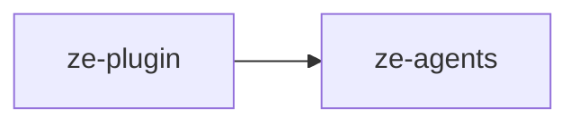

# ze-plugin

Plugin extension framework for Ze — `ZePlugin` ABC, channel abstraction, signal sources, and integration protocol. Used by the engine and SDK; plugin code imports through `ze-sdk`.

## Responsibilities

| Module | What it provides |
|---|---|
| `plugin.py` | `ZePlugin` ABC, `DataDomain` — container and graph extension seam |
| `registry.py` | Plugin class registry (`get_plugin_registry`) |
| `channels/` | `Channel` ABC, `ChannelRegistry`, handle and message types |
| `signals.py` | `SignalSource` protocol for cross-plugin signal collection |
| `integration.py` | `ZeIntegration` protocol for third-party credential classes |

## Dependencies



## Usage

Wired by `ze-api` bootstrap and `ze-core` graph builder. Plugin authors use the SDK re-exports:

```python
from ze_sdk import ZePlugin, DataDomain
from ze_sdk.channels import Channel, ChannelRegistry
```

Engine code may import directly:

```python
from ze_plugin.plugin import ZePlugin
from ze_plugin.registry import get_plugin_registry
```

## Testing

From the repo root:

```bash
make test-plugin
```

See [docs/testing.md](../../docs/testing.md).
