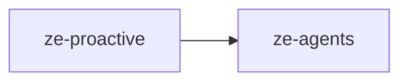

# ze-proactive

Job scheduling framework for Ze — background jobs, push delivery coordination, and APScheduler wiring.

## Role in Ze

Proactive Ze runs on a schedule — morning briefings, calendar reminders, news fetches, goal checks, and correlation runs. `ze-proactive` provides the scheduler, job registration, and push delivery coordination that make this work without blocking the main request path.

### Key features

- `ProactiveScheduler` — APScheduler wrapper started at `ze-api` lifespan
- `ProactiveJob` ABC with cron and interval registration
- `ProactiveNotifier` — delivers proactive messages via WebSocket or ntfy push
- `PushLogStore` — tracks delivery to avoid duplicate pushes

### Integration

Plugins register jobs in `ZePlugin.register_proactive_jobs()`. `ze-api` starts the scheduler after all plugins have started. Re-exported to plugin authors via `ze_sdk.proactive`.

## Responsibilities

| Module | What it provides |
|---|---|
| `scheduler.py` | `ProactiveScheduler` — thin wrapper around APScheduler |
| `job.py` | `ProactiveJob` ABC, `@proactive_job` registration |
| `notifier.py` | `ProactiveNotifier` — coordinates push delivery for proactive messages |
| `push_log_store.py` | `PushLogStore` — Postgres-backed push delivery log |

## Dependencies



Third-party: `asyncpg`.

## Usage

Re-exported via `ze-sdk` for plugin job registration:

```python
from ze_sdk.proactive import ProactiveScheduler, ProactiveJob, proactive_job
```

Plugins register jobs in `ZePlugin.register_proactive_jobs()`; `ze-api` starts the scheduler at startup.

## Testing

From the repo root:

```bash
make test-proactive
```

See [docs/testing.md](../../docs/testing.md).
