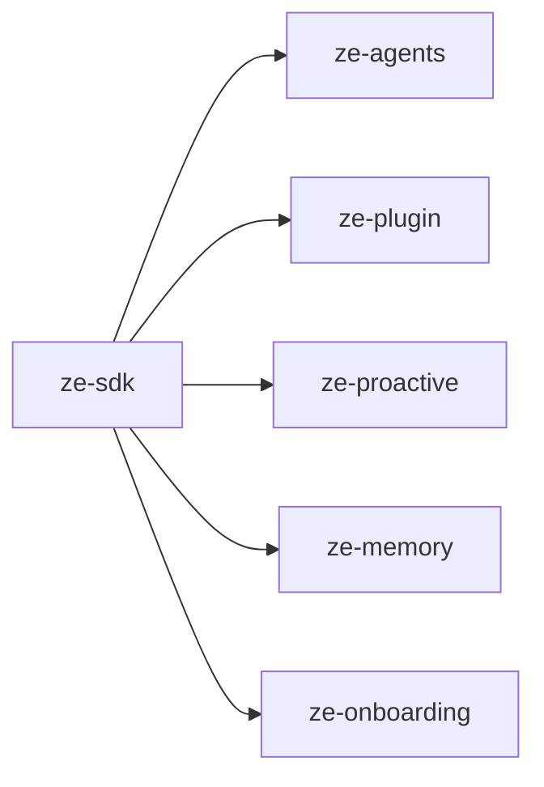

# ze-sdk

Public SDK surface for Ze plugin development. Flat re-export layer — plugin packages depend on this instead of importing `ze-core`, `ze-plugin`, or `ze-agents` directly.

## Role in Ze

`ze-sdk` is the only supported import path for plugin authors. It flattens the developer-facing API from `ze-agents`, `ze-plugin`, `ze-proactive`, `ze-memory`, and `ze-onboarding` into a single stable surface, so plugins never depend on engine internals directly.

### Key features

- Single import for agent authoring: `@agent`, `@tool`, `BaseAgent`, `get_logger`
- Plugin framework re-exports: `ZePlugin`, `DataDomain`, channel types
- Proactive job types: `ProactiveScheduler`, `ProactiveJob`, `@proactive_job`
- Memory, signal, and onboarding types for plugin hook implementations (`Signal`, `SignalSource`)

### Integration

Every plugin's `pyproject.toml` lists `ze-sdk` as its sole Ze dependency. The SDK has no runtime wiring of its own — it is a compile-time boundary that keeps the dependency graph one-directional: `plugins → ze-sdk → core packages`, never `plugins → ze-core`.

## Responsibilities

| Module | What it provides |
|---|---|
| `__init__.py` | `ZePlugin`, `DataDomain`, `@agent`, `@tool`, `BaseAgent`, `Settings`, `DBPool`, `get_logger` |
| `types.py` | Shared SDK types |
| `errors.py` | Plugin-facing error re-exports |
| `proactive.py` | `ProactiveJob`, `ProactiveScheduler`, `ProactiveNotifier`, `PushLogStore` |
| `memory.py` | Memory types, `PostgresMemoryStore`, `SignalSource` re-export |
| `channels.py` | Channel ABC and registry re-exports |
| `onboarding.py` | Onboarding provider types |

## Dependencies



## Usage

All plugin code should import from `ze_sdk`:

```python
from ze_sdk import ZePlugin, agent, tool, BaseAgent, get_logger
from ze_sdk.proactive import ProactiveScheduler, proactive_job
from ze_sdk.memory import PostgresMemoryStore, Signal, SignalSource
from ze_sdk.channels import Channel
```

Never import `ze_core.*` or `ze_plugin.*` from plugin packages.

## Testing

From the repo root:

```bash
make test-sdk
```

See [docs/testing.md](../../docs/testing.md).
