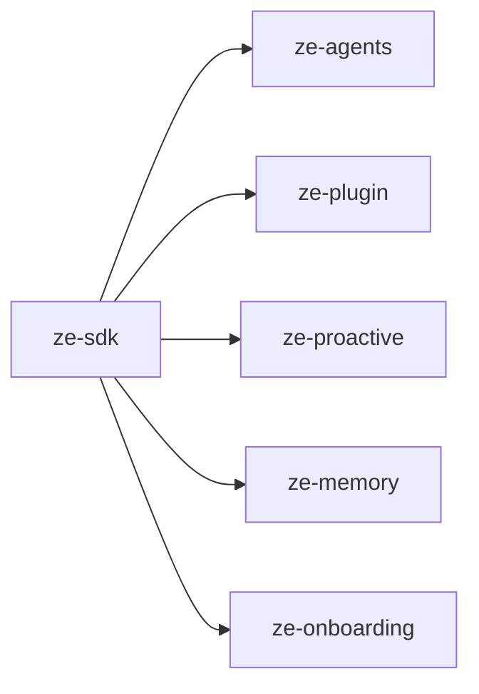

# ze-sdk

Public SDK surface for Ze plugin development. Flat re-export layer — plugin packages depend on this instead of importing `ze-core`, `ze-plugin`, or `ze-agents` directly.

## Responsibilities

| Module | What it provides |
|---|---|
| `__init__.py` | `ZePlugin`, `DataDomain`, `@agent`, `@tool`, `BaseAgent`, `Settings`, `DBPool`, `get_logger` |
| `types.py` | Shared SDK types |
| `errors.py` | Plugin-facing error re-exports |
| `proactive.py` | `ProactiveJob`, `ProactiveScheduler`, `ProactiveNotifier`, `PushLogStore` |
| `memory.py` | Memory policy and retrieval types |
| `channels.py` | Channel ABC and registry re-exports |
| `onboarding.py` | Onboarding provider types |

## Dependencies



## Usage

All plugin code should import from `ze_sdk`:

```python
from ze_sdk import ZePlugin, agent, tool, BaseAgent, get_logger
from ze_sdk.proactive import ProactiveScheduler, proactive_job
from ze_sdk.memory import MemoryRetrievalPolicy
from ze_sdk.channels import Channel
```

Never import `ze_core.*` or `ze_plugin.*` from plugin packages.

## Testing

From the repo root:

```bash
make test-sdk
```

See [docs/testing.md](../../docs/testing.md).
