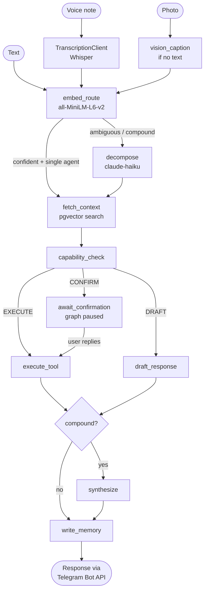
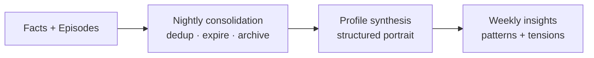
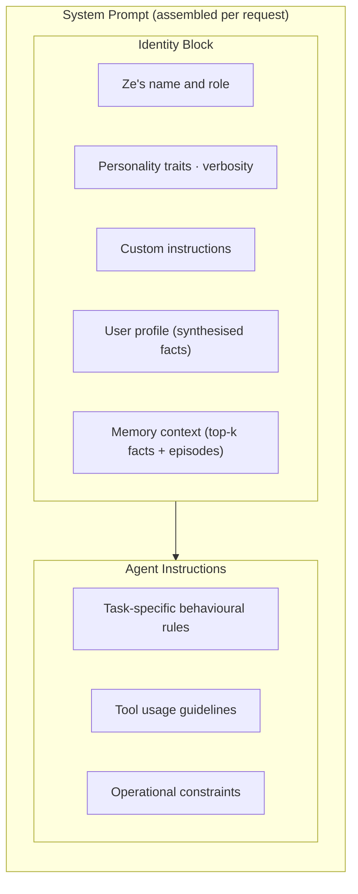

# Ze — Architecture

## Overview

Ze is a single-user, self-hosted AI assistant. The only interface is a Telegram bot.
Incoming messages enter a LangGraph state machine that routes, gates, executes, and
remembers — then sends one response back through Telegram.

All LLM calls go through OpenRouter. No direct Anthropic or OpenAI API calls are made.

---

## System Flow

---

## Routing

**Module:** `ze/routing/`

Routing runs on every message before any LLM is involved.

1. At startup, each enabled agent's description (from `config/agents/<name>.yaml`) is
   embedded using the shared `all-MiniLM-L6-v2` instance.
2. The incoming prompt is embedded at request time.
3. Cosine similarity scores are computed against all agent embeddings.
4. **Routing outcomes:**
   - Score above `confidence_threshold` and gap above `gap_threshold` → route directly.
   - Gap below `gap_threshold` (two agents nearly tied) → compound task, Haiku decomposes.
   - All scores below `confidence_threshold` → Haiku fallback for classification.
5. Every decision is written to the `routing_log` Postgres table.

**Cost-aware routing** (`ze/routing/complexity.py`): agents that configure a `model_simple`
tier in `config/config.yaml` automatically receive a cheaper model for requests the
complexity classifier scores as simple. The classifier is purely in-process (heuristic
signals: word count, question marks, conjunctions). No extra LLM call; no latency added.

---

## Orchestration Graph

**Module:** `ze/orchestration/`

The graph is compiled once at startup and stored on `app.state`. Each user message
is a separate `graph.ainvoke()` call, keyed by `thread_id = chat_id`.

### Nodes

| Node | Module | Responsibility |
|---|---|---|
| `embed_route` | `nodes/routing.py` | Embed prompt, score agents, choose path |
| `decompose` | `nodes/routing.py` | Haiku decomposes compound tasks into subtasks |
| `fetch_context` | `nodes/context.py` | pgvector semantic search over user facts + episodes |
| `capability_check` | `nodes/capability.py` | Evaluate permission mode for agent.intent |
| `execute_tool` | `nodes/execution.py` | Call `agent.run()`, enforce timeout |
| `draft_response` | `nodes/draft.py` | Generate response, do not execute |
| `await_confirmation` | `nodes/confirmation.py` | Pause graph, send inline keyboard |
| `synthesize` | `nodes/synthesis.py` | Merge subtask results into one response |
| `write_memory` | `nodes/memory.py` | Propose facts/episodes (fire-and-forget) |

### State

`AgentState` (`ze/orchestration/state.py`) is a `TypedDict` that flows through the graph.
It holds the prompt, routing envelope, memory context, gate decision, agent results,
conversation history, and workflow state. It must remain JSON-serialisable at all times
because `AsyncPostgresSaver` checkpoints it to Postgres on every pause.

### Human-in-the-loop

When `capability_check` resolves to `confirm`, the graph pauses at
`await_confirmation` (`interrupt_before`). The Telegram bot sends an inline keyboard.
When the user presses Yes/No/Edit, the bot calls `graph.ainvoke(None, config)` with
the same `thread_id` to resume from the checkpoint.

---

## Agents

**Module:** `ze/agents/`

All agents subclass `BaseAgent` and register via `@register`. Each agent owns:

- A system prompt (`_AGENT_INSTRUCTIONS` string at the top of `agent.py`).
- A tool list (`tools.py`).
- A YAML config (`config/agents/<name>.yaml`) specifying model, timeout, and description.

Agents cannot call each other directly. Compound coordination is handled by the
orchestration graph.

See [docs/adding-an-agent.md](adding-an-agent.md) for a full authoring guide.

### Agent roster

| Agent | Key tools | Default model tier |
|---|---|---|
| `research` | Tavily search, URL fetch, synthesis | Full |
| `companion` | None (pure reasoning + memory) | Full |
| `calendar` | Google Calendar API (CRUD) | Haiku |
| `email` | Gmail API (read, draft, send) | Haiku |
| `workflow` | APScheduler, file ops, external API calls | Full |

---

## Memory

**Module:** `ze/memory/`

Two memory layers, both backed by Postgres + pgvector:

- **User facts** — short declarative statements extracted from conversations
  (e.g. "user prefers morning meetings"). Agents propose; the user approves via
  Telegram before facts are stored.
- **Episodes** — summaries of conversation turns. Written automatically after each run.

At each graph invocation, `fetch_context` performs a pgvector semantic search over
both layers and injects the top-k results into `AgentContext` as `memory_context`.
The synthesised user profile (see below) is also injected into every system prompt.

Memory accumulates into progressively richer representations through a nightly
pipeline:

See [docs/scheduled-jobs.md](scheduled-jobs.md) for the full lifecycle, schedule,
and configuration of every background job.

---

## System prompt structure

Every agent's system prompt is assembled from two sections by `BaseAgent._build_system_prompt()`:

The identity block ensures Ze sounds like the same assistant regardless of which
agent handles the request. Agents only define `_AGENT_INSTRUCTIONS` — they never
set the identity or inject memory themselves.

**Configurable identity fields** (in `config/config.yaml` under `persona.profiles.<name>:`):

| Field | Description |
|---|---|
| `traits` | Adjective list rendered as natural language ("direct, warm, and concise") |
| `verbosity` | `concise` / `balanced` / `detailed` — response length guidance |
| `custom_instructions` | Free-form text appended after traits, before memory context |
| `dials` | Map of named continuous values `[0.0, 1.0]` — see below |

**Personality dials** translate numeric values into prose clauses appended to the traits
sentence. Only extreme values (below 0.2 or above 0.8) emit a clause; the neutral band
is silent. Four built-in dials: `humor`, `directness`, `formality`, `depth`.

**Runtime switching** — `PersonaStore` (`ze/persona/store.py`) reads the active profile
from the `persona_state` DB table and merges any per-session dial overrides. `fetch_context`
calls `await persona_store.get_active()` once per graph invocation and sets the resolved
profile on `AgentContext.persona`. All agents receive it through `_build_system_prompt`
without any per-agent changes.

The `/persona` Telegram command switches profiles and tunes dials live; changes persist
across restarts. YAML values serve as profile defaults; DB overrides take precedence.

**Memory injection** — `fetch_context` runs a pgvector semantic search before every
agent execution and injects the top-k relevant facts and episodes as text into the
identity block. The full user profile (synthesised nightly) is also included. Agents
always have contextual awareness of the user without needing to query memory themselves.

---

## Capability Gate

**Module:** `ze/capability/`

Every agent action has an explicit permission mode in `config/capabilities.yaml`,
keyed by `agent.intent`:

| Mode | Behaviour |
|---|---|
| `autonomous` | Execute immediately |
| `confirm` | Pause graph, send inline keyboard (Yes / No / Edit). 15-min timeout. |
| `draft_only` | Generate response, never execute without a config change |
| `disabled` | Block, return error message |

The config file hot-reloads on `SIGHUP` without restarting the process.

---

## Proactive Ze

**Module:** `ze/proactive/`

Ze pushes messages to Telegram on a schedule, without the user prompting anything:

| Job | When | Description |
|---|---|---|
| Weekly insights | Sunday 7 AM UTC | 1–3 observations from the past week's facts + episodes |
| Calendar sync | 7:45 AM UTC daily | Pull upcoming events, schedule reminder jobs |
| Morning briefing | 8 AM UTC daily | Digest: unreviewed facts, upcoming workflows, recent failures |
| Nightly consolidation | 2 AM UTC | Dedup facts, expire stale, archive episodes, re-synthesise profile |
| Workflow failure alerts | Immediate | Push when a scheduled step fails |
| Calendar reminders | When they fire | Event-specific reminders, interval assessed by Haiku |

All scheduled jobs use APScheduler with Postgres as the job store (survives restarts).
See [docs/scheduled-jobs.md](scheduled-jobs.md) for the full lifecycle and config.

---

## Multimodal input

**Module:** `ze/transcription/`

Ze accepts three input types from Telegram, all handled before the graph runs:

| Input | Handler | Processing |
|---|---|---|
| Text | Existing path | Passed directly as `prompt` |
| Voice note | `_handle_voice()` in `ZeBot` | Downloaded as OGG, transcribed to text by `TranscriptionClient` (Whisper via OpenRouter), result used as `prompt`. `input_modality = "voice"` |
| Photo | `_handle_photo()` in `ZeBot` | Downloaded as raw bytes, stored in `AgentState.image_data`. `input_modality = "image"` |

**Vision captioning** — when a photo arrives with no text caption, `embed_route` calls
a lightweight vision model (`models.vision_caption` in config, defaults to
`google/gemini-flash-1.5`) to generate a short description. That description is used
as the routing prompt so the embedding router has text to score.

**Vision-capable agents** — agents with `vision_capable: true` in their config receive
a `ChatContentImage` content block alongside the text prompt. Agents without the flag
receive only the routing caption as text — they are never sent raw image bytes.

**Conversation history** — only the text caption (not base64 image bytes) is written
to `AgentState.messages`, so conversation history replay doesn't bloat with binary data.

**`TranscriptionClient`** wraps `OpenRouterClient.complete()` with an `input_audio`
content block. It sets telemetry flow/agent context so transcription calls appear in
cost records attributed to `flow_type="transcription"`, `agent="whisper"`.

---

## Communication Channels

**Module:** `ze/channels/`

The channel abstraction decouples agents from transport details. Every outbound
message Ze sends to a real person goes through a `Channel` implementation —
agents never call Gmail (or any future transport) directly.

### Core types (`ze/channels/types.py`)

| Type | Purpose |
|---|---|
| `ChannelType` | Enum — `email`, `linkedin`, `whatsapp` |
| `ChannelHandle` | A contact's address on a channel (`handle`, `preferred`, `verified`) |
| `Message` | Outbound payload — `to`, `body`, optional `subject` and `thread_id` |
| `SentMessage` | Return value from `send()` — `message_id`, `thread_id`, `sent_at` |
| `Thread` / `ThreadMessage` | Full thread history, used by `get_thread()` and `poll_replies()` |

### `Channel` ABC (`ze/channels/base.py`)

Every channel must implement three methods:

| Method | Signature | Description |
|---|---|---|
| `send` | `(Message) → SentMessage` | Send a new message or reply to an existing thread |
| `get_thread` | `(thread_id: str) → Thread` | Fetch a full thread by ID |
| `poll_replies` | `(thread_ids, since) → list[ThreadMessage]` | Return inbound messages since a given datetime |

### `ChannelRegistry` (`ze/channels/registry.py`)

A dict-backed registry keyed by `ChannelType`. Built in `container.py` and
injected into agents. Raises `ChannelNotFoundError` for unregistered types.

### Contact channel handles (`ze/contacts/channel_store.py`)

`ContactChannelStore` stores per-contact channel handles in the `contact_channels`
table. Agents use the `get_contact_channels` and `set_contact_channel` tools
(in `ze/tools/contacts.py`) to read and write this data — they never query the
store directly.

### Currently implemented channels

| Channel | Class | Transport |
|---|---|---|
| `email` | `EmailChannel` (`ze/channels/email.py`) | Gmail API via `GoogleCredentials` |

See [docs/channels.md](channels.md) for the authoring guide for adding new channels.

---

## Cost Telemetry

**Module:** `ze/telemetry/`

`CostTracker` is injected into `OpenRouterClient`. On every completion call, it records:

- Agent name, flow type, model, input tokens, output tokens, estimated cost.
- Attribution context propagates through the async call chain via a Python `ContextVar`
  — set once at the flow entry point, read automatically inside the tracker.

`CostReconciler` runs nightly, pulling actual billed costs from the OpenRouter API and
reconciling them against estimated records. All data lives in the `llm_cost_log` table.

**REST API** — `GET /costs/summary` returns aggregated token usage and cost over a
configurable lookback window, grouped by any single dimension:

| Parameter | Default | Options |
|---|---|---|
| `days` | `30` | 1–365 |
| `group_by` | `flow_type` | `flow_type` · `agent` · `model` · `session_id` |

---

## Telegram Bot

**Module:** `ze/telegram/`

The bot uses aiogram 3.x in webhook mode (production) or long-polling (local dev).

- `ZeBot` owns the aiogram `Bot` instance and all send helpers.
- `handlers.py` registers message, callback, and edit-reply handlers.
- `ActiveSessionStore` tracks in-progress graph invocations (prevents double-sends).
- Long responses (> 4096 chars) are split at sentence boundaries before sending.
- `ForceReply` state is used for the Edit flow in confirmation dialogs.

Voice notes and photos are supported — see the Multimodal input section below.

---

## Cross-cutting modules

| Module | Purpose |
|---|---|
| `ze/settings.py` | Pydantic `BaseSettings` — single source for all config and secrets |
| `ze/errors.py` | Exception hierarchy — all modules raise typed subclasses of `ZeError` |
| `ze/logging.py` | structlog JSON logger — `chat_id` and agent bound at request time |
| `ze/embeddings.py` | Shared `SentenceTransformer` singleton — loaded once at startup |
| `ze/db.py` | asyncpg pool factory — lifespan-managed, injected via `Depends()` |
| `ze/container.py` | Dependency wiring — constructs and connects all shared resources |
| `ze/persona/` | `PersonaStore` — named profiles, dial overrides, DB persistence |
| `ze/google/` | Google OAuth2 token management (Calendar + Gmail) |

---

## Database schema

Migrations live in `migrations/versions/` as raw SQL Alembic files (no ORM).

| Table | Purpose |
|---|---|
| `routing_log` | Every routing decision with scores and outcome |
| `user_facts` | Approved user facts with pgvector embeddings |
| `episodes` | Episodic memory summaries with pgvector embeddings |
| `checkpoints` | LangGraph `AsyncPostgresSaver` graph state |
| `workflow_plans` | Persisted multi-step workflow definitions |
| `workflow_executions` | Per-run state for each workflow |
| `push_log` | Proactive push delivery log |
| `calendar_reminders` | Synced calendar events scheduled for reminders |
| `cost_records` | Per-call token usage and estimated cost |
| `persona_state` | Single-row table: active profile name + dial overrides (JSONB) |
| `contact_channels` | Per-contact channel handles (type, handle string, preferred flag, verified flag) |

---

## Design principles

- **Zero LLM calls in the routing happy path.** Local embeddings handle the common case.
- **Configurability over automation.** Every write-risk action requires an explicit
  permission mode. Nothing executes autonomously unless the user has opted in via YAML.
- **Memory as editorial problem.** Agents propose; the user approves. Ze never silently
  writes to long-term memory.
- **Modular agents.** Each agent is isolated — its own system prompt, tool registry,
  model config, and intent map.
- **Dependency injection throughout.** Every module accepts dependencies as constructor
  arguments. No module reads from globals or `os.environ` directly except `ze/settings.py`.
- **Spec-first development.** No module is implemented without a reviewed spec in `specs/`.
