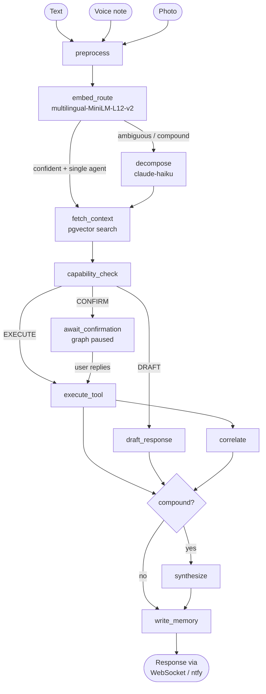
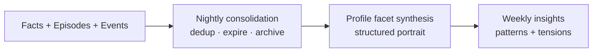
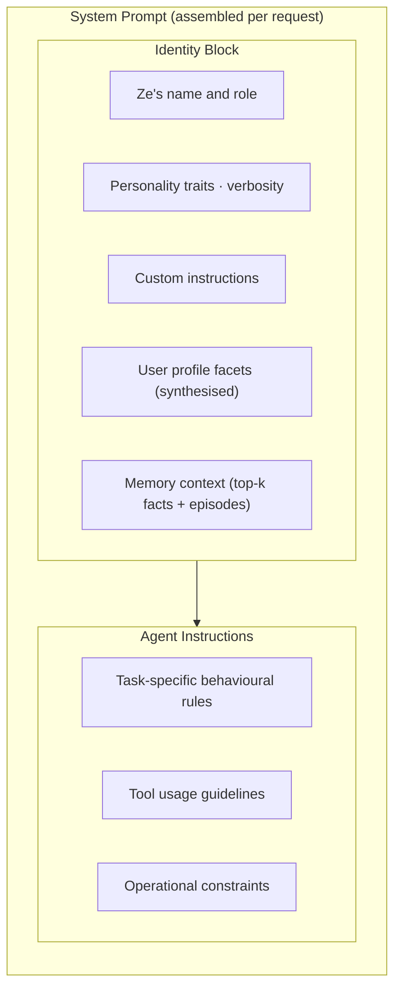

# Ze — Architecture

## Overview

Ze is a single-user, self-hosted AI assistant. The primary interface is a native
**React web app** (`ze-web`) that communicates over a persistent **WebSocket** to the
backend (`ze-api`). When the app is not connected, Ze delivers messages via
**ntfy push notifications**.

All LLM calls go through OpenRouter. No direct Anthropic or OpenAI API calls are made.

At a high level, the system is split into:

- `ze-web` for chat and operational pages.
- `ze-api` for transport, app wiring, and persistence.
- `ze-core` for routing, orchestration, telemetry, and OpenRouter access.
- `ze-plugin` for the extension seam shared by plugins and engine code.
- `ze-data` for data portability and export/import/delete contracts.
- `ze-memory` for retrieval and consolidation.
- `ze-automation` for goals, workflows, accountability, and their proactive jobs.
- `ze-personal` for the personal-assistant domain: identity, contacts, briefing/insights
  jobs, and the main general-purpose agents.
- `ze-email`, `ze-calendar`, `ze-news`, `ze-prospecting`, and `ze-finance` for
  domain-specific extensions.
- `ze-onboarding`, `ze-ingestion`, `ze-correlation`, `ze-browser`, and
  `ze-notifications` for shared support systems.
- `ze-components` and `@ze/client` for server-driven UI and typed API consumption.

---

## Plugin Framework

**Packages:** `ze-plugin` · `ze-data`

`ze-plugin` is the shared extension seam. It defines the plugin contract, channels,
signal sources, and integration protocol used by plugins and engine code. `ze-data`
owns the data portability contract (`DataDomain`) and the service that exports,
imports, and deletes plugin-owned data.

See [docs/package-architecture.md](package-architecture.md) for the dependency rules
and package split, and [docs/data-portability.md](data-portability.md) for the
export/import/delete workflow.

---

## System Flow



---

## Routing

**Module:** `ze_core.routing`

Routing proper runs on every message after preprocessing. The router itself uses local
embeddings and simple heuristics; `preprocess` may still call OpenRouter first for voice
transcription or image captioning.

1. At startup, each enabled agent's description (from `@agent` class attributes) is
   embedded using the shared `paraphrase-multilingual-MiniLM-L12-v2` instance.
2. The incoming prompt is embedded at request time.
3. Cosine similarity scores are computed against all agent embeddings.
4. **Routing outcomes:**
   - Score above `confidence_threshold` and gap above `gap_threshold` → route directly.
   - Gap below `gap_threshold` (two agents nearly tied) → compound task, Haiku decomposes.
   - All scores below `confidence_threshold` → Haiku fallback for classification.
5. Every decision is written to the `routing_log` Postgres table.

**Cost-aware routing** (`ze_core.routing.complexity`): agents with a `model_simple`
class attribute receive a cheaper model when the in-process complexity classifier scores
the request as simple (word count, question marks, conjunctions — no extra LLM call).

---

## Orchestration Graph

**Module:** `ze_core.orchestration`

The conversation graph is compiled once at startup in `ZeContainer` and bound to
`NativeAppInterface`. Each user message is a separate `graph.ainvoke()` call, keyed by
`thread_id`. Ze also compiles a separate `workflow_graph` for multi-step workflow
execution.

At the top level, the runtime graph now includes a preprocessing node for multimodal
input, a correlation node for inline connection surfacing, and a `plan_sequential`
branch for compound routing results. Plugin graph nodes and edges are layered in at
startup.

### Graph input factory

All conversation graph invocations build initial state via
`make_graph_input()` in `ze_core/conversation/turn.py`. `Container.invoke()` and
`invoke_raw_turn()` both route through this factory so new `AgentState` fields
are initialized in one place. Plugin-specific fields belong in plugin
`state_extensions()` TypedDicts — not in ad-hoc dict literals at call sites.

### Checkpoint serialization

LangGraph persists `AgentState` via `JsonPlusSerializer` + msgpack. Custom
dataclasses and enums must be registered so checkpoints can be deserialized safely.

Ze builds the allowlist automatically in `build_checkpoint_serde()` (`ze_core/checkpoint_serde.py`):

1. **Core modules** — `ze_core.routing.types`, `ze_agents.types`, `ze_memory.types`
   are scanned for dataclasses and enums on every startup.
2. **Plugin modules** — each `ZePlugin` may override `checkpoint_serde_modules()` to
   return its `types.py` module paths (e.g. `ze_automation.workflow.types`). Ze scans
   those modules the same way — no manual list in `ze_api/container.py`.
3. **Driver extras** — types like `asyncpg.pgproto.pgproto.UUID` that appear in
   payloads but live outside domain modules.

When adding a new plugin, declare checkpointed domain types in `types.py` and list
that module in `checkpoint_serde_modules()`. Register retrieval policies via
`memory_policies()` — keys must match agent registration names.

### Conversation identity

One conversation is identified by a single string that appears under different
names at different layers:

| Name | Layer | Usage |
|---|---|---|
| `thread_id` | LangGraph config, WebSocket protocol, `messages.thread_id`, `sessions.id` | Canonical ID for chat UI threads and graph checkpoints |
| `session_id` | `AgentState`, `memory_episodes.session_id`, routing log | Same string on main chat turns; retained in graph/memory code for historical reasons |

Special-purpose threads use prefixed IDs and may not have a `sessions` row:
`workflow:…`, `onboarding:…`, `eval-…`, `consolidator`, etc.

**Referential invariants (application-enforced unless noted):**

- `messages.thread_id` should match `sessions.id` for standard chat threads.
- LangGraph `checkpoints.thread_id` matches the conversation being resumed.
- `memory_episodes.session_id` groups episodes for the same conversation.
- `memory_facts.source_episode_id → memory_episodes.id` (FK, migration 011).
- `memory_episodes.session_id` has no FK to `sessions` — prefixes and legacy IDs
  must remain valid without a session row.

See [docs/native-interface.md](native-interface.md) for WebSocket thread handling.
Persistence for `messages`, `sessions`, and `pending_confirmations` lives in
`ze_core/conversation/` (migrations `zc015`–`zc018`).

### Nodes

| Node | Module | Responsibility |
|---|---|---|
| `preprocess` | `nodes/preprocessing.py` | Normalise audio/image input before routing |
| `embed_route` | `nodes/routing.py` | Embed prompt, score agents, choose path |
| `decompose` | `nodes/routing.py` | Haiku decomposes compound tasks into subtasks |
| `fetch_context` | `nodes/context.py` | pgvector semantic search over facts + episodes |
| `capability_check` | `nodes/capability.py` | Evaluate permission mode for agent.intent |
| `execute_tool` | `nodes/execution.py` | Call `agent.run()`, enforce timeout |
| `correlate` | `nodes/correlation.py` | Surface inline relationship hypotheses when relevant |
| `draft_response` | `nodes/draft.py` | Generate response, do not execute |
| `await_confirmation` | `nodes/confirmation.py` | Pause graph, emit confirm_request frame |
| `synthesize` | `nodes/synthesis.py` | Merge subtask results into one response |
| `write_memory` | `nodes/memory.py` | Propose facts/episodes (fire-and-forget) |
| `plan_sequential` | `nodes/routing.py` | Execute compound routing plans one step at a time |

### State

`AgentState` (`ze_core/orchestration/state.py`) is a `TypedDict` that flows through the graph.
It holds the prompt, routing envelope, memory context, gate decision, agent results,
conversation history, and workflow state. It must remain JSON-serialisable at all times
because `AsyncPostgresSaver` checkpoints it to Postgres on every pause.

### Human-in-the-loop

When `capability_check` resolves to `confirm`, the graph pauses at
`await_confirmation` (`interrupt_before`). The WS handler sends a `confirm_request`
frame to the web app. The app presents approve/cancel UI. The client's `confirm`
reply causes `graph.ainvoke(None, config)` with the same `thread_id` to resume from
the checkpoint.

See [docs/native-interface.md](native-interface.md) for the full WebSocket protocol.

---

## Agents

**Modules:** `ze_personal/agents/` (research, companion) · `ze_automation/agents/` (goals, workflow) · `ze_email/agents/` (email) · `ze_prospecting/agents/` (prospecting) · `ze_calendar/agents/` (calendar, reminders) · `ze_news/agents/` (news)

All agents subclass `BaseAgent` (`ze_agents.base_agent`) and register via `@agent` (`ze_agents.registry`). Plugin code imports these via `ze_sdk`. Each agent owns:

- A system prompt (`_AGENT_INSTRUCTIONS` string at the top of `agent.py`).
- Class attributes: `description`, `model`, `intents`, `tools`, `timeout`.
- Optionally a `tools.py` with Python `@tool` functions for local tool execution.

Agents cannot call each other directly. Compound coordination is handled by the
orchestration graph (or via the `delegate_to_agent` harness tool for explicit hand-offs).

See [docs/adding-an-agent.md](adding-an-agent.md) for a full authoring guide.

### Agent roster

| Agent | Key tools | Package | Default model tier |
|---|---|---|---|
| `research` | OpenRouter web search, synthesis | `ze-personal` | Full |
| `companion` | Pure reasoning + memory | `ze-personal` | Full |
| `calendar` | Google Calendar API (CRUD) | `ze-calendar` | Haiku |
| `email` | Gmail API (read, draft, send) | `ze-email` | Haiku |
| `reminders` | NL time parsing, APScheduler firing | `ze-calendar` | Haiku |
| `prospecting` | Browser extraction, outreach drafting | `ze-prospecting` | Full |
| `news` | `get_headlines` (personalised), `search_news` (semantic) | `ze-news` | Mini |
| `finance` | CSV/Trading212 ingestion, categorisation, recurring detection | `ze-finance` | Haiku |
| `workflow` | APScheduler, multi-step plan execution | `ze-automation` | Full |
| `goals` | Goal lifecycle (create, status, steer, pause, resume, abandon) | `ze-automation` | Full |

See [docs/goals.md](goals.md) for conversational usage and gate behaviour.

---

## Onboarding

**Package:** `ze-onboarding`

The onboarding system owns first-run setup, seed questions, review-before-save, and
reset scopes. `ze-api` adapts those protocols to WebSocket commands and persists the
state in Postgres.

See [docs/onboarding.md](onboarding.md) for the walkthrough and [docs/package-architecture.md](package-architecture.md) for the package boundary.

---

## Ingestion

**Package:** `ze-ingestion`

The ingestion pipeline normalises web pages, PDFs, audio, images, and text into a
common content model, extracts structured information, and sinks it into memory and
follow-up workflows.

See [docs/ingestion.md](ingestion.md) for the pipeline, extractors, and plugin hooks.

---

## Correlation

**Package:** `ze-correlation`

Correlation turns memory and external signals into hypotheses and surfaced
connections. It can run inline during chat turns and as a proactive background job.

See [specs/phases/57-correlation-engine.md](../specs/phases/57-correlation-engine.md)
and [specs/phases/58-inline-correlation.md](../specs/phases/58-inline-correlation.md)
for the deeper design notes.

---

## Browser and Notifications

**Packages:** `ze-browser` · `ze-notifications`

The browser client is a thin HTTP wrapper around a Playwright sidecar used for
extraction and browser-backed tools. Push delivery is abstracted behind
`ze-notifications`, with ntfy as the current implementation.

See [core/ze-browser/README.md](../core/ze-browser/README.md),
[sidecar/browser/README.md](../sidecar/browser/README.md), and
[core/ze-notifications/README.md](../core/ze-notifications/README.md).

---

## Finance

**Package:** `ze-finance`

Finance is a separate domain plugin for transaction ingestion, categorisation,
recurring detection, and snapshot jobs. It has its own privacy model and LLM routing
constraints.

See [docs/finance.md](finance.md) for the domain overview.

---

## Eval Harness

**Package:** `ze-eval`

The eval harness runs scripted scenarios against the graph and uses an LLM judge for
comparison. It is a separate operational surface, not part of the user-facing chat
loop.

See [docs/eval.md](eval.md) for scenarios, runners, and judge workflow.

---

## Memory

**Package:** `ze-memory` (`ze_memory`)

Five memory layers, all backed by Postgres + pgvector:

- **Facts** (`memory_facts`) — short declarative statements extracted from conversations
  (e.g. "user prefers morning meetings"). Written via `store.propose_facts()`. No
  user confirmation gate in the graph; the REST `POST /memory/facts/review` endpoint
  exposes the review flow for the native app.
- **Episodes** (`memory_episodes`) — summaries of conversation turns. Written automatically
  after each run.
- **Events** (`memory_events`) — discrete real-world events (meetings, calls) extracted
  from conversation or calendar. Can have entity participants.
- **Procedures** (`memory_procedures`) — reusable step lists (how to do X) captured when
  Ze executes a multi-step task successfully and surfaced back into the active goal
  while the goal is still running when a stable method emerges.
- **Profile facets** (`memory_profile_facets`) — a structured, key-value portrait of the
  user synthesised nightly from facts and episodes.

**Graph layer** (`ze_memory.graph`) — optional relationship layer (`memory_relationships`)
that connects entities, facts, episodes, and events via typed predicates. On retrieval,
`BoundedExpansionPolicy` expands from seed entity/fact IDs to enrich context.

**Policy-based retrieval** (`ze_memory.policies`) — `DefaultPolicyRegistry` maps
module names to retrieval policies. Each policy executes the right queries, applies
token budgets, and returns a `MemoryContext` object.

Memory accumulates into progressively richer representations through a nightly pipeline:



See [docs/memory.md](memory.md) for a deep-dive on types, tables, graph, retrieval
policies, and how to inspect memory. See [docs/scheduled-jobs.md](scheduled-jobs.md) for
the full lifecycle, schedule, and configuration of every background job.

---

## System prompt structure

Every agent's system prompt is assembled from two sections by `BaseAgent._build_system_prompt()`:



The identity block ensures Ze sounds like the same assistant regardless of which
agent handles the request. Agents only define `_AGENT_INSTRUCTIONS` — they never
set the identity or inject memory themselves.

**Configurable identity fields** (in `config/persona.yaml` under `profiles.<name>:`):

| Field | Description |
|---|---|
| `traits` | Adjective list rendered as natural language ("direct, warm, and concise") |
| `verbosity` | `concise` / `balanced` / `detailed` — response length guidance |
| `custom_instructions` | Free-form text appended after traits, before memory context |
| `dials` | Map of named continuous values `[0.0, 1.0]` — see below |

**Personality dials** translate numeric values into prose clauses appended to the traits
sentence. Only extreme values (below 0.2 or above 0.8) emit a clause; the neutral band
is silent. Four built-in dials: `humor`, `directness`, `formality`, `depth`.

**Runtime switching** — `PostgresPersonaStore` (`ze_personal/persona/postgres.py`) reads
the active profile from the `persona_state` DB table and merges any per-session dial
overrides. `fetch_context` calls `await persona_store.get_active()` once per graph
invocation. Profile switches can be driven conversationally or via the REST API.
YAML values serve as profile defaults; DB overrides take precedence.

**Memory injection** — `fetch_context` runs a pgvector semantic search before every
agent execution and injects the top-k relevant facts and episodes as text into the
identity block. The profile facets are also included. Agents always have contextual
awareness of the user without needing to query memory themselves.

---

## Capability Gate

**Module:** `ze_core.capability`

Every agent action has an explicit permission mode defined as a class attribute on the
`@agent` class, keyed by `agent.intent`:

| Mode | Behaviour |
|---|---|
| `autonomous` | Execute immediately |
| `confirm` | Pause graph, send `confirm_request` frame to app. 15-min timeout. |
| `draft_only` | Generate response, never execute without a config change |
| `disabled` | Block, return error message |

Modes can be overridden at runtime via `PUT /capabilities` (persisted in DB via
`PostgresCapabilityOverrideStore`). `config.yaml` hot-reloads on `SIGHUP`.

---

## Proactive Ze

**Modules:** `ze_proactive` (scheduler, notifier) · `ze_personal/jobs/` · `ze_automation/jobs/` · `ze_prospecting/jobs/` · `ze_calendar/jobs/` · `ze_news/jobs/`

Ze pushes messages via WebSocket or ntfy on a schedule, without the user prompting:

| Job | When | Description |
|---|---|---|
| Weekly insights | Sunday 7 AM UTC | 1–3 observations from the past week's facts + episodes |
| Calendar sync | 7:45 AM UTC daily | Pull upcoming events, schedule reminder jobs |
| Morning briefing | 8 AM UTC daily | Digest: unreviewed facts, upcoming workflows, recent failures |
| Nightly consolidation | 2 AM UTC | Dedup facts, expire stale, archive episodes, re-synthesise profile |
| Contacts consolidation | 3 AM UTC | Dedup and merge contact records |
| Contact review suggestions | 8:30 AM UTC daily | Push pending contact review nudges |
| Goal narrative | 6 PM UTC Sunday | One-paragraph weekly progress update per active goal |
| Goal suggestions | 7 PM UTC Sunday | Proactive new goal proposal based on memory + retrospectives |
| Stuck goal detection | 9 AM UTC Tuesday | Alert on idle milestones (48 h) or unresolved gates (72 h) |
| Weekly accountability narrative | 9 AM UTC Monday | Templated summary of goals, workflows, costs, and anomalies |
| Cost anomaly detection | Every 6 hours | Flag agent runs whose cost exceeds the rolling baseline |
| Goal advance sweep | Every 15 min | Advance all `ACTIVE` goals via `GoalExecutor` |
| Cost reconciliation | Every 15 min | Reconcile estimated costs vs. OpenRouter billing |
| Stale campaign recovery | Every 15 min | Fail-fast stuck prospecting campaigns |
| Workflow failure alerts | Immediate | Push when a scheduled step fails |
| Calendar reminders | When they fire | Event-specific reminders, interval assessed by Haiku |
| Goal milestone progress | After each milestone | Short completion line pushed via `ProactiveNotifier` |
| News fetch | Every 30 min | Ingest and embed new RSS articles |

See [docs/scheduled-jobs.md](scheduled-jobs.md) for the full lifecycle and config.

---

## Goal Engine

**Module:** `ze_automation.goals` · **Agent:** `ze_automation/agents/goals/`

Goals address multi-week objectives that neither workflows nor per-action capability
gates fit well: Ze works in the background and checks in at **verification gates**
(days apart), not on every write.

### Primitives

| Type | Role |
|---|---|
| `Goal` | Stated objective, success condition, time horizon |
| `Milestone` | Ordered unit of work executed by an existing agent |
| `VerificationGate` | Pause point — summarise done/planned work, wait for approval |
| `GoalLearning` | Insight captured at each milestone boundary |

### Components

| Component | Module | Responsibility |
|---|---|---|
| `GoalStore` | `ze_automation/goals/postgres.py` | Postgres CRUD for goals, milestones, gates, learnings, traces, suggestions |
| `GoalPlanner` | `ze_automation/goals/planner.py` | LLM decomposition, replanning, retrospective synthesis, learning promotion, procedure extraction/reuse, suggestion generation |
| `GoalExecutor` | `ze_automation/goals/executor.py` | `advance()` loop, gate firing, milestone dispatch, learning promotion on completion, procedure reuse during active goals |
| `GoalAgent` | `ze_automation/agents/goals/agent.py` | Conversational create / status / steer / pause / resume / abandon |

Goals sit **above** workflows: a goal spans weeks; a workflow execution is what can
happen inside a single milestone. `GoalExecutor` dispatches milestones through the same
agent registry as workflow steps — agents remain peers.

### Execution and scheduling

`GoalExecutor.advance(goal_id)` runs from:

- `goal_advance_sweep` — cron `*/15 * * * *`, registered in `ze_api/container.py`
- Gate approval / redirect flows in the WebSocket handler
- Plan approval after `GoalAgent` creates a goal

While status is `AWAITING_GATE`, the sweep no-ops until the user responds via the app
or conversationally.

### Two approval paths

| Path | When | Mechanism |
|---|---|---|
| Capability gate | Per high-risk agent action in the main graph | `await_confirmation` node → `confirm_request` WS frame |
| Verification gate | Between milestone batches on a goal | Rich checkpoint message + conversational or app-driven approve/stop/redirect |

See [docs/goals.md](goals.md) for usage including steering, proactive suggestions, stuck detection, cross-goal output reuse, and learning promotion.

---

## Multimodal input

**Module:** `ze_core.orchestration.nodes.preprocessing` · `ze_core.openrouter` (transcription client)

Ze accepts three input types from the web app. The preprocessing node normalises them
before routing:

| Input | Handler | Processing |
|---|---|---|
| Text | Existing path | Passed directly as `prompt` |
| Voice note | `preprocess` | Transcribed to text by OpenRouter Whisper, result used as `prompt`; `input_modality = "voice"` |
| Photo | `preprocess` | Stored in `AgentState.image_data`; if no caption is provided, a lightweight vision model generates routing text |

**Vision captioning** — when a photo arrives with no text caption, `preprocess`
calls a lightweight vision model (`models.vision_caption` in config, defaults to
`google/gemini-flash-1.5`) to generate a short description used for routing.

**Vision-capable agents** — agents with `vision_capable = True` receive a
`ChatContentImage` content block alongside the text prompt. Agents without the flag
receive only the routing caption as text.

---

## Server-Driven UI

**Package:** `ze-components`

Ze agents emit structured UI as **primitive trees**, not named component types. The
frontend renders a fixed vocabulary of primitives recursively — the switch in
`PrimitiveRenderer.tsx` covers the currently supported primitive set. New semantic UI
patterns are Python functions (builder helpers) that compose these primitives; most new
patterns do not require frontend changes.

### Primitive vocabulary

| Primitive | Kind | Description |
|---|---|---|
| `col` | Layout | Vertical stack; `variant` controls surface style (`default\|card\|section`) |
| `row` | Layout | Horizontal stack with configurable gap and alignment |
| `text` | Content | Styled string — `heading\|subheading\|body\|label\|caption\|code` |
| `badge` | Content | Small coloured label |
| `divider` | Content | Horizontal rule |
| `spacer` | Content | Blank gap |
| `button` | Interactive | Tappable action; emits `action` string back to backend as a message |
| `progress` | Content | Horizontal progress bar (0.0–1.0) |
| `table` | Structured | Header row + data rows (the one primitive that can't be cleanly composed) |
| `form` | Structured | Input form used by onboarding and guided collection flows |
| `connections` | Structured | Relationship summary with evidence, surfaced by correlation |

### How it works

1. An agent calls a named render tool (`render_table`, `render_metric`, `render_list`, …).
2. The render tool calls a **builder helper** in `ze_components/builders.py` that returns a `Primitive` tree.
3. The `@render_tool` decorator appends the tree (as `asdict()`) to a `ContextVar` side-channel.
4. `ComponentCollectionHook.on_loop_end` drains the side-channel into `AgentState.components`.
5. `NativeAppInterface.send_message(components=[...])` delivers the trees alongside the text response.
6. `PrimitiveRenderer` in `ze-web` renders each tree recursively.

### Adding a new component pattern

Add a builder function in `ze_components/builders.py` that returns a `Primitive` tree.
Add a named render tool in `ze_components/tools.py` if the LLM should call it directly.
No React changes required.

See [specs/phases/66-primitive-ui.md](../specs/phases/66-primitive-ui.md) for the full design.

---

## Communication Channels

**Module:** `ze_agents/channels/`

The channel abstraction decouples agents from transport details. Every outbound
message Ze sends to a real person goes through a `Channel` implementation —
agents never call Gmail (or any future transport) directly.

### Core types (`ze_agents/channels/types.py`)

| Type | Purpose |
|---|---|
| `ChannelType` | Enum — `email`, `linkedin`, `whatsapp` |
| `ChannelHandle` | A contact's address on a channel (`handle`, `preferred`, `verified`) |
| `Message` | Outbound payload — `to`, `body`, optional `subject` and `thread_id` |
| `SentMessage` | Return value from `send()` — `message_id`, `thread_id`, `sent_at` |
| `Thread` / `ThreadMessage` | Full thread history, used by `get_thread()` and `poll_replies()` |

### `Channel` ABC (`ze_agents/channels/base.py`)

Every channel must implement three methods:

| Method | Signature | Description |
|---|---|---|
| `send` | `(Message) → SentMessage` | Send a new message or reply to an existing thread |
| `get_thread` | `(thread_id: str) → Thread` | Fetch a full thread by ID |
| `poll_replies` | `(thread_ids, since) → list[ThreadMessage]` | Return inbound messages since a given datetime |

### Currently implemented channels

| Channel | Class | Transport |
|---|---|---|
| `email` | `GmailChannel` (`ze_email/channel/gmail.py`) | Gmail API via `GoogleCredentials` (from `ze-google`) |

See [docs/channels.md](channels.md) for the authoring guide for adding new channels.

---

## Cost Telemetry

**Module:** `ze_core.telemetry`

`CostTracker` is injected into `OpenRouterClient`. On every completion call, it records:

- Agent name, flow type, model, input tokens, output tokens, estimated cost.
- Attribution context propagates through the async call chain via a Python `ContextVar`
  — set once at the flow entry point, read automatically inside the tracker.

`CostReconciler` runs every 15 minutes, pulling actual billed costs from the OpenRouter
API and reconciling them against estimated records. All data lives in the `llm_cost_log`
table.

**REST API** — `GET /api/v0/costs/summary` returns aggregated token usage and cost over a
configurable lookback window, grouped by any single dimension:

| Parameter | Default | Options |
|---|---|---|
| `days` | `30` | 1–365 |
| `group_by` | `flow_type` | `flow_type` · `agent` · `model` · `session_id` |

---

---

## REST API

**Prefix:** `/api/v0/` · **Auth:** `Authorization: Bearer <ZE_API_KEY>` on all routes
except `/api/v0/health` and `/api/v0/version` (public).

All routes declare an explicit camelCase `operation_id` which drives named method
generation in `@ze/client`. The OpenAPI spec is self-contained (no running server
needed for codegen — extracted at Python import time by `scripts/codegen.ts`).

### Public routes

| Method | Path | Description |
|---|---|---|
| `GET` | `/api/v0/version` | API and client version |
| `GET` | `/api/v0/health` | Health check |

### Core

| Method | Path | operationId |
|---|---|---|
| `GET` | `/api/v0/messages` | `listMessages` |
| `GET` | `/api/v0/sessions` | `listSessions` |
| `POST` | `/api/v0/sessions` | `createSession` |
| `GET` | `/api/v0/ws-schema` | `getWsSchema` |

### Personal data

| Method | Path | operationId |
|---|---|---|
| `GET` | `/api/v0/contacts` | `listContacts` |
| `GET` | `/api/v0/goals` | `listGoals` |
| `GET` | `/api/v0/reminders` | `listReminders` |
| `GET` | `/api/v0/news` | `listNews` |
| `GET` | `/api/v0/costs/summary` | `getCostSummary` |
| `GET` | `/api/v0/costs/detail` | `getCostDetail` |

### Memory

| Method | Path | operationId |
|---|---|---|
| `GET` | `/api/v0/memory/facts` | `listFacts` |
| `POST` | `/api/v0/memory/facts/review` | `reviewFacts` |
| `GET` | `/api/v0/memory/digest` | `getMemoryDigest` |
| `POST` | `/api/v0/memory/consolidate` | `consolidateMemory` |
| `GET` | `/api/v0/memory/profile` | `getProfile` |

### Capabilities / Workflows / Data / Ingestion

| Method | Path | operationId |
|---|---|---|
| `GET` | `/api/v0/capabilities` | `listCapabilities` |
| `PUT` | `/api/v0/capabilities/{agent}/{intent}` | `updateCapability` |
| `GET` | `/api/v0/workflows` | `listWorkflows` |
| `GET` | `/api/v0/routing/log` | `getRoutingLog` |
| `POST` | `/api/v0/ingest` | `ingest` |
| `GET` | `/api/v0/data/export` | `exportData` |
| `POST` | `/api/v0/data/import` | `importData` |
| `POST` | `/api/v0/data/delete-intent` | `createDeleteIntent` |
| `DELETE` | `/api/v0/data` | `deleteData` |

### Internal tooling

| Method | Path | Description |
|---|---|---|
| `POST` | `/eval/chat` | Internal evaluation chat entry point |

---

## `@ze/client` — Typed Frontend SDK

`packages/ze-client` is a local npm workspace package generated from the FastAPI
OpenAPI spec. `ze-web` imports from it — never raw route strings.

```typescript
import { configure, listContacts, listGoals } from "@ze/client";

// Once at startup (main.tsx)
configure({ serverUrl: "http://localhost:8000", apiKey: "..." });

// Then call named methods anywhere, no { client } arg needed
const { data: contacts } = await listContacts();
```

**Regenerate after backend changes:**

```bash
bun run scripts/codegen.ts   # extracts spec from Python, writes packages/ze-client/src/generated/
```

Generated files are committed. `@ze/client` also exports WS frame types (from
`json-schema-to-typescript`), blob helpers (`downloadExport`, `importArchive`,
`healthCheck`), and `ApiError`.

See [specs/phases/72-api-client-codegen.md](../specs/phases/72-api-client-codegen.md) for
the full codegen design and [specs/phases/73-api-surface.md](../specs/phases/73-api-surface.md)
for the versioned API surface spec.

---

See [docs/package-architecture.md](package-architecture.md) for a full breakdown of the
monorepo split, what belongs in each package, and how the ZePlugin extension point works.

---

## Cross-cutting modules

| Module | Purpose |
|---|---|
| `ze_api/settings.py` | Pydantic `BaseSettings` — Ze secrets + `to_core_settings()` bridge |
| `ze_agents/errors.py` | Exception hierarchy — typed `ZeError` subclasses (re-exported via `ze_sdk.errors`) |
| `ze_api/logging.py` | structlog JSON logger — bound at request time |
| `ze_core/embeddings.py` | Shared `paraphrase-multilingual-MiniLM-L12-v2` singleton — loaded once at startup |
| `ze_api/db.py` | asyncpg pool factory — lifespan-managed |
| `ze_api/bootstrap.py` | `bootstrap_agents()` — resolves agent DI from plugin `agent_module_paths()` |
| `ze_api/container.py` | `ZeContainer` — subclasses `ze_core.Container`, wires all ZePlugins |
| `ze_personal/persona/` | `PostgresPersonaStore` — named profiles, dial overrides, DB persistence |
| `ze_email/channel/` | `GmailChannel` — Gmail API channel (imports creds from `ze-google`) |
| `ze_api/interface/native.py` | `NativeAppInterface` — WebSocket frame delivery + ntfy fallback |

---

## Database schema

Migrations live in `apps/ze-api/migrations/versions/` as raw SQL Alembic files (no ORM).

| Table | Purpose |
|---|---|
| `routing_log` | Every routing decision with scores and outcome |
| `memory_facts` | Facts with pgvector embeddings, review status, expiry |
| `memory_episodes` | Episodic memory summaries with pgvector embeddings |
| `memory_entities` | Named entities with canonical names, aliases, and attributes |
| `memory_relationships` | Typed edges between entities, facts, episodes, events |
| `memory_events` | Real-world events with participants and outcomes |
| `memory_procedures` | Reusable step lists captured from successful task executions |
| `memory_task_state` | Goal/workflow task progress checkpoints |
| `memory_profile_facets` | Structured user portrait — key/value facets with stability and confidence |
| `checkpoints` | LangGraph `AsyncPostgresSaver` graph state |
| `workflow_plans` | Persisted multi-step workflow definitions |
| `workflow_executions` | Per-run state for each workflow |
| `push_log` | Proactive push delivery log |
| `calendar_reminders` | Synced calendar events scheduled for reminders |
| `llm_cost_log` | Per-call token usage and estimated cost |
| `persona_state` | Single-row table: active profile name + dial overrides (JSONB) |
| `contact_channels` | Per-contact channel handles (type, handle string, preferred flag) |
| `goals` | Long-running objectives (status, type, time horizon, retrospective, learnings) |
| `goal_milestones` | Ordered milestones per goal with execution output and `reuse_hint` |
| `goal_gates` | Verification gates between milestone sequences |
| `goal_learnings` | Per-milestone insights appended during execution |
| `goal_execution_traces` | Tool call trace per milestone (name, args, result, duration) |
| `goal_suggestions` | Proactive goal proposals with accept/dismiss lifecycle |
| `accountability_anomalies` | Cost outliers flagged by `CostAnomalyJob` |
| `messages` | Conversation messages for unread-replay on WebSocket connect |

---

## Design principles

- **Zero LLM calls in the routing happy path.** Local embeddings handle the common case.
- **Configurability over automation.** Every write-risk action requires an explicit
  permission mode. Nothing executes autonomously unless the user has opted in via YAML.
- **Memory as editorial problem.** Agents propose; the user can review. Ze never silently
  accumulates writes to long-term memory without opportunity for correction.
- **Modular agents.** Each agent is isolated — its own system prompt, tool registry,
  model config, and intent map.
- **Dependency injection throughout.** Every module accepts dependencies as constructor
  arguments. No module reads from globals or `os.environ` directly except `ze_api/settings.py`.
- **Spec-first development.** No module is implemented without a reviewed spec in `specs/phases/`.
