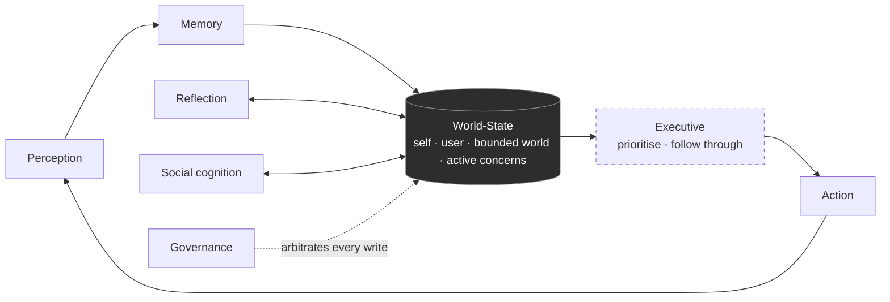

# Ze — Cognitive Architecture

> **Companion to** `specs/arch/ze-doctrine.md` (the constitutional layer).
> This document is a **lens, not a rewrite.** The package/plugin split in
> `docs/package-architecture.md` stays exactly as it is. What this adds is a second way to
> read the same packages: by the *enduring cognitive function* they serve, so that gaps in
> Ze's "mind" are visible even when no single package is missing.

---

## Why a second taxonomy

Ze is organised by **domain** (calendar, news, finance, memory, automation…). That is the
right axis for ownership, dependencies, and migrations. But domains are not the axis along
which a *mind* is complete or incomplete. A system can have excellent domain packages and
still be missing an entire cognitive function — and you will not see it, because no package
is "missing"; a *capability* is.

So we overlay a functional taxonomy. A subsystem is not primarily "the news plugin"; it is
**perception that happens to be sourced from news**. Reading Ze this way makes one thing
immediately obvious: Ze perceives, remembers, reflects, and acts well — and its **executive
function is under-built**. That is the hole the doctrine's "active concerns" spine is meant
to fill.

The seven functions below are from the external architecture review and are adopted verbatim
as the functional vocabulary.

---

## The seven functions, mapped to what exists

Legend: 🟢 substantial · 🟡 partial · 🔴 gap.

### 1. Perception — turning the outside world into signals

> *calendar, email, web, documents, finance, news, sensors*

| Maturity | Where it lives today |
|---|---|
| 🟢 | `ze-calendar`, `ze-email`/`ze-messenger`, `ze-news`, `ze-finance`, `ze-browser`, `ze-ingestion` (web/PDF/audio/image → common content model), `ze-communication` (inbound channels), signal admission (Phase 55/56). |

**State:** strong and broad. The admission gate (`relevance_to_user + intrinsic_magnitude`)
is the right discipline — perception is already relevance-filtered rather than firehose.
**Gap:** "sensors" (location, device, ambient) is unbuilt; not urgent.

### 2. Memory — retaining and structuring experience

> *episodic, semantic, procedural, social, project, temporal*

| Maturity | Where it lives today |
|---|---|
| 🟢 | `ze-memory`: facts (semantic), episodes (episodic), procedures (procedural), events, profile facets, the relationship **graph**, temporal via `as_of`/timeline (Phase 93), consolidation + dream. |

**State:** the deepest function in the system. Genuinely multi-layer.
**Gap:** "project" and "social" memory are *implicit* — they live scattered across contacts,
goals, and episodes rather than as first-class structures. This under-building is the same
hole seen from the memory side: there is no durable "state of project X" or "state of
relationship with Y" that the executive layer can read.

### 3. Executive function — deciding what to do and following through

> *goals, plans, scheduling, follow-through, interruption handling*

| Maturity | Where it lives today |
|---|---|
| 🟡🔴 | `ze-automation`: goals (heavyweight, explicit, multi-week), workflows (multi-step plans), scheduler. Follow-through exists **only** for things explicitly promoted to a goal or workflow. |

**State: this is the primary gap, and it is the doctrine's spine ("active concerns").** What
exists handles the *heavyweight* end: objectives you deliberately declare. What is missing is
the **lightweight, ambient executive layer** — the hundreds of small open loops that make up
a real life and never become formal goals:

- a promise made in an email thread,
- a decision left pending,
- a project quietly drifting because a dependency stalled,
- a "I should look into X" mentioned once and never closed.

There is no primitive that *holds* these, no continuous *prioritisation* across them, and no
*interruption-handling* policy that decides when an open loop is worth surfacing. Goals are a
special, expensive case of active concerns; the general case is unbuilt. **Closing this is the
most likely subject of the next phase.**

### 4. Social cognition — modelling people and calibrating interaction

> *tone, relationship memory, boundaries, interaction style*

| Maturity | Where it lives today |
|---|---|
| 🟡 | `ze-personal` persona (tone/dials, interaction style), contacts (`PersonStore`, channel handles), messenger. |

**State:** interaction *style toward the user* is well-modelled (persona dials, identity
block). Modelling of **third parties** — who matters to the user, the state and cadence of
each relationship, boundaries per person — is thin. Contacts are a directory, not a
relationship model. This is the "social memory" gap from function 2, seen from the behavioural
side.

### 5. Reflection — revising the model when not acting

> *consolidation, model revision, conflict detection, uncertainty tracking*

| Maturity | Where it lives today |
|---|---|
| 🟢 | `ze-memory` dream (sleep→dream two-pass), nightly consolidation, weekly insights, NLI contradiction detection (Phase 79), correlation engine (hypotheses with uncertainty). |

**State:** rich — arguably *ahead* of what currently consumes it. The doctrine resolves the
"is dreaming premature?" question: reflection is justified **iff it improves the world-state.**
Today much of its output (synthesized facts, insights) flows back into memory tables rather
than into a live executive layer, because that layer does not yet exist. **Reflection is not
overbuilt; its consumer is underbuilt.** Building executive function retroactively justifies
the reflection investment.

### 6. Action — changing the world on the user's behalf

> *messaging, scheduling, drafting, research, workflows, tool use*

| Maturity | Where it lives today |
|---|---|
| 🟢 | Agent roster (research, companion, calendar, email, reminders, prospecting, news, finance, goals, workflow), `@tool` system, agentic loop, channels for outbound messaging, server-driven UI for surfacing. |

**State:** mature and extensible. Action is not the bottleneck. Per the doctrine, agents are
*replaceable executors that propose changes to the world-state* — they are organs, and the
roster will churn for years without threatening continuity.

### 7. Governance — provenance, consent, reversibility, confidence, correction

> *permissioning, provenance, reversibility, confidence thresholds, user corrections*

| Maturity | Where it lives today |
|---|---|
| 🟢🟡 | Capability gate (autonomous/confirm/draft_only/disabled), confirmation persistence + timeout, provenance tags in memory + correlation, memory review flows (propose→user reviews), dream rollback lineage, data portability/delete. |

**State:** strong on permissioning and provenance. **Gap:** *confidence* is not yet a
uniform, system-wide signal — it exists per-subsystem (correlation self-rating, fact
confidence) but there is no single calibrated notion the arbitration order can lean on. The
doctrine names this as an open question. Governance is the function that most directly encodes
the doctrine's arbitration precedence.

---

## The shape of the whole mind

Reading the functions in order gives the loop the doctrine implies — a cycle around a shared
spine, not a pipeline with a start and end:

- **The world-state is the hub** (doctrine §"The one commitment"). Every function reads from
  and writes to it; nothing holds a competing private truth.
- **The dashed node (Executive) is the under-built one.** Perception, Memory, Reflection,
  Action, and Governance all currently orbit a hub whose "active concerns" face is mostly
  empty. They are feeding and acting on a model that has no strong representation of *what is
  open and what deserves attention* — which is exactly why the system reads as "rich substrate,
  thin product" from the outside.
- **Governance arbitrates every write** to the hub, in the doctrine's precedence order
  (governance > user-stated > fact > inference > suspicion).

---

## Functions are permanent; implementations are the organs

The reason this lens is worth maintaining alongside the domain taxonomy: the **functions are
the enduring structure**, and the domain packages are replaceable implementations of them. The
news plugin is one implementation of perception; the goals module is one implementation of
executive function. Organs churn over the years; the seven functions do not. This is the sharp
form of "what stays continuous" (`ze-doctrine.md` §The one commitment): not just the
world-state data, but the functional decomposition around it.

It also means each function has a **licensed contribution** to the spine — the claim-kinds it
is allowed to produce. The canonical table lives in the doctrine (`ze-doctrine.md` §The
contribution model); the rule with the most teeth is that **reflection may never emit a fact**
(the dream and correlation engines conclude, they do not observe — their output stays an
inference or suspicion until perception or the user corroborates it). Every contribution is a
*proposal* carrying claim-kind + provenance + confidence, and governance arbitrates. The
`SignalSource` hook is the first instance of that uniform proposal seam; the long-term
direction is that every function contributes the same way.

---

## How the two taxonomies coexist

This lens does **not** propose new packages by function, and does not move code. A package
keeps its domain identity; the function is an annotation.

| You want to… | Use which taxonomy |
|---|---|
| Decide where code lives, what depends on what, who owns a table | **Domain** (`package-architecture.md`) — unchanged. |
| Decide whether Ze *as a mind* is complete, and what to build next | **Function** (this doc). |

The one place the function taxonomy will likely become *structural* is executive function:
"active concerns" has no natural domain home today (it is not calendar, not goals-as-they-exist,
not memory), so closing that gap probably means a new package or a promotion within
`ze-automation`. That is a next-phase decision, tracked as an open question in the doctrine.

---

## What this implies for sequencing (not a commitment)

The doctrine defers the aperture decision; this lens only sharpens what the candidates cost:

1. **Executive function is the single highest-leverage gap.** It is the doctrine's spine, the
   consumer that justifies existing reflection investment, and the thing whose absence most
   explains the "product-thin" read. Any aperture (open-loops or life-graph) routes through it.
2. **Social cognition and project/social memory are the same gap seen twice** — a first-class
   representation of *people and projects as evolving states*. Likely the second priority.
3. **Confidence-as-a-uniform-signal (governance) unblocks honest surfacing everywhere** and is
   cheap relative to its leverage.
4. Perception, Action, and Reflection need **consumers, not more capability.** Resist expanding
   them until executive function can use what they already produce.
