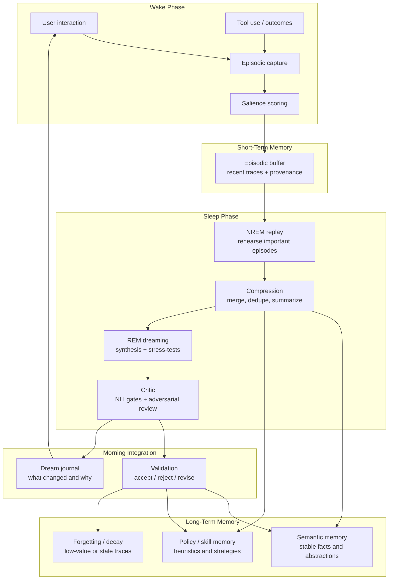
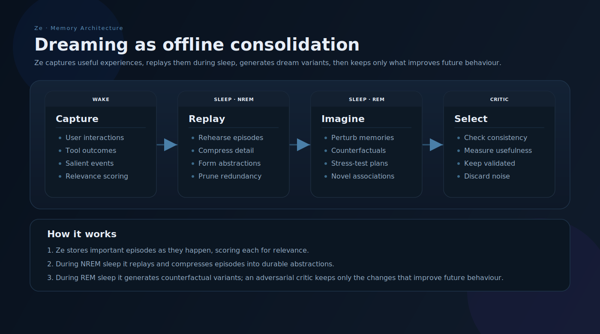

# Ze — Dreaming

Ze runs an offline **dream phase** when it is not in active use. The phase replays
recent experience, compresses it, tests abstractions, and promotes only validated
changes into stable memory. The point is not random generation — it is a controlled
learning loop that improves retention, abstraction, and robustness.

**Package:** `core/ze-memory/ze_memory/dream/`
**Architecture:** [specs/arch/dream-memory.md](../specs/arch/dream-memory.md)
**Implementation spec:** [specs/phases/78-dream-memory.md](../specs/phases/78-dream-memory.md)

---

## Overview





---

## How it works

1. **Wake** — Ze captures experiences with provenance. Every new episode is tagged
   asynchronously with `replay_score`, `source` (`ze_observed` or `user_asserted`), and
   a sensitive-entity flag. Tagging does not block the conversation write path.

2. **Sleep (NREM)** — The nightly job replays high-priority episodes, compresses old
   sessions, deduplicates facts, decays stale traces, and detects schema and policy
   clusters. No LLM calls in this phase.

3. **Dream (REM)** — For each cluster candidate, a generator synthesises insights,
   procedures, hindsight facts, or plan stress-tests. All outputs land in a staging
   buffer (`memory_dream_artifacts`) with `status=pending`.

4. **Critic** — Each staged artifact passes three cheap pre-gates (NLI groundedness,
   embedding novelty, retrievability) and two adversarial LLM critic calls. Both critics
   must pass.

5. **Morning integration** — Well-supported artifacts auto-promote to `memory_facts` or
   `memory_procedures` with full lineage. Borderline cases go to a review queue. Rejected
   artifacts trigger forgetting on their source episodes. A dream journal entry surfaces
   what changed.

Nothing synthetic writes directly to live memory. Every promoted fact carries
`provenance=synthesized`, `dream_run_id`, and `derived_from` lineage for rollback.

---

## What this achieves

- Better memory retention through targeted replay and decay.
- Better abstraction via schema and policy cluster synthesis.
- Better self-correction via hindsight relabeling and plan stress-tests.
- Lower risk of stale or duplicated memory through dedup and novelty gates.
- A visible dream journal that explains what changed and why.

---

## Phase split

| Sub-phase | Status | What ships |
|-----------|--------|------------|
| **78a** | Done | Sleep pass, wake hook, migration, dream journal API, retrieval weight enforcement |
| **78b** | Done | Dream synthesis, NLI gates, two-critic pipeline, auto-promotion, review REST API, confidence decay, `valid_until` expiry |

**NLI model (Phase 79, done):** `cross-encoder/nli-deberta-v3-small` loads as a shared
singleton in `ze_core/nli.py` via `NLIClient` — used for write-time contradiction, nightly dedup,
session-cached retrieval re-rank, and correlation grounding. `Gate1_NLI` in `gates.py`
imports from the same module (no second download).

### What ships across both sub-phases

- Nightly sleep pass: compresses sessions, deduplicates facts, decays stale episodes, detects schema and policy clusters.
- LLM synthesis (haiku): insights, procedures, hindsight facts, plan stress-tests.
- Full scoring pipeline: NLI groundedness gate + embedding novelty gate + retrievability gate + two adversarial LLM critic calls (sonnet). Both critics must pass.
- Auto-promotion with `valid_until`, `dream_run_id`, `derived_from` lineage.
- Per-run rollback: `POST /runs/{run_id}/rollback` bulk-contradicts promoted facts.
- Synthetic fact confidence decay: non-corroborated synthesized facts lose 0.03 confidence per run after 30 days; contradicted at < 0.25.
- `valid_until` hard expiry: synthesized facts past their 90-day window that have not been corroborated by a raw episode are contradicted on each morning integration.
- Morning briefing: "Ze dreamed — M insights promoted, K items for review."
- `needs_review` push notifications gated behind `review_notifications_enabled` config flag (disabled until React review page ships).

---

## Key tables

| Table | Purpose |
|-------|---------|
| `memory_episode_metadata` | Mutable dream fields for episodes (replay score, retrieval weight, source, sensitive flag) |
| `memory_dream_runs` | One row per nightly job execution |
| `memory_dream_artifacts` | Staging buffer for all synthetic outputs pre-promotion |
| `memory_dream_journal` | Per-run summary for morning briefing and user review |
| `memory_retrieval_cache` | Session-scoped NLI rerank order for facts/summaries (Phase 79; expired nightly by `DreamJob`) |

Source episode content in `memory_episodes` stays immutable. All dream-phase mutable
fields live on the metadata side table.

---

## Artifact types

| Type | Auto-promote? | Destination |
|------|---------------|-------------|
| `schema_candidate` | No (input to synthesis) | Staging only |
| `policy_candidate` | No (input to synthesis) | Staging only |
| `synthesized_insight` | Yes, if gates + support pass | `memory_facts` |
| `synthesized_procedure` | Yes, if gates + support pass | `memory_procedures` |
| `hindsight_fact` | Never — always `needs_review` | User decision |
| `plan_stress_test` | Yes, if gates + support pass | `memory_procedures` (risk heuristic) |

Counterfactual and perturbation artifact types are reserved in the enum but not invoked
until 78c.

---

## Configuration

```yaml
# config/config.yaml
dream:
  enabled: true
  cron: "0 3 * * *"
  max_replay_episodes: 100
  max_synthesis_per_run: 20
  max_stress_tests_per_goal: 2
  max_schema_candidates_per_run: 30
  session_archive_threshold_days: 7
  auto_promote_min_support: 3
  auto_promote_min_distinct_sessions: 2
  auto_promote_min_temporal_spread_days: 7
  auto_promote_max_user_asserted: 1
  nli_groundedness_threshold: 0.75
  novelty_similarity_threshold: 0.92
  decay_cycles: 5
  decay_rate: 0.1
  forgetting_weight_threshold: 0.1
  synthesis_model: "anthropic/claude-haiku-4-5"
  critic_model: "anthropic/claude-sonnet-4-6"
  synthetic_fact_valid_days: 90      # synthesized facts contradicted after this many days without corroboration
  job_timeout_seconds: 1800
  review_notifications_enabled: false  # enable when React review page ships
```

See [configuration.md](configuration.md) for the full key reference.

---

## REST API

```
GET  /api/v0/memory/dream/journal
GET  /api/v0/memory/dream/artifacts              # status=needs_review
GET  /api/v0/memory/dream/artifacts/{id}
POST /api/v0/memory/dream/artifacts/{id}/approve
POST /api/v0/memory/dream/artifacts/{id}/reject
POST /api/v0/memory/dream/artifacts/{id}/revise
POST /api/v0/memory/dream/runs/{run_id}/rollback
```

The React review page at `/memory/dream` (78b) lists `needs_review` artifacts with
source episode excerpts and approve/reject/revise actions.

---

## Safety model

- **Staging buffer** — no synthetic output touches live memory until all gates pass.
- **Provenance** — `provenance=synthesized` facts are hedged in retrieval context
  ("Ze inferred this from a pattern").
- **Source tagging** — episodes are classified `ze_observed` or `user_asserted` at write
  time. Classification uses three layers: (1) agent-name allowlist (email, calendar,
  workflow, reminders, news, prospecting, finance, goal, automation); (2) tool-result
  markers in the stored prompt/response; (3) response-phrase detection for research
  summaries. `user_asserted` episodes score lower and cap at 1 toward `support_count`.
- **Sensitive exclusion** — episodes linked to sensitive entities skip all dream passes.
- **Session contamination** — summaries that included synthetic facts are flagged
  `dream_influenced` and excluded from dream source selection until corroborated or
  rolled back.
- **Synthetic expiry** — synthesized facts past `valid_until` (default 90 days) that
  have never been corroborated by a raw episode are contradicted on the next morning
  integration run.
- **Rollback** — `POST /runs/{run_id}/rollback` bulk-contradicts all facts from a run
  and flags contaminated session summaries for re-summarisation.
- **Quality audit** — `GET /api/v0/memory/facts/quality` returns a diagnostic snapshot
  (provenance distribution, avg confidence, contradicted/unreviewed/expired counts) for
  assessing source pool health before trusting synthesis output.

---

## Research basis

Dreaming in Ze draws on both neuroscience and ML literature:

- Experience replay and generative replay for continual learning.
- Wake/sleep consolidated learning architectures.
- Constitutional AI-style critic filtering of synthetic outputs.
- Sleep consolidation research on replay ordering and context reinstatement.

Full bibliography and architectural rationale:
[specs/arch/dream-memory.md](../specs/arch/dream-memory.md#research-foundation).

---

## Related docs

| Doc | What it covers |
|-----|----------------|
| [memory.md](memory.md) | Base memory layers — facts, episodes, retrieval |
| [scheduled-jobs.md](scheduled-jobs.md) | Proactive job scheduler and nightly job pipeline |
| [specs/phases/79-nli-model.md](../specs/phases/79-nli-model.md) | NLI cross-encoder — shared singleton, contradiction, retrieval cache |
