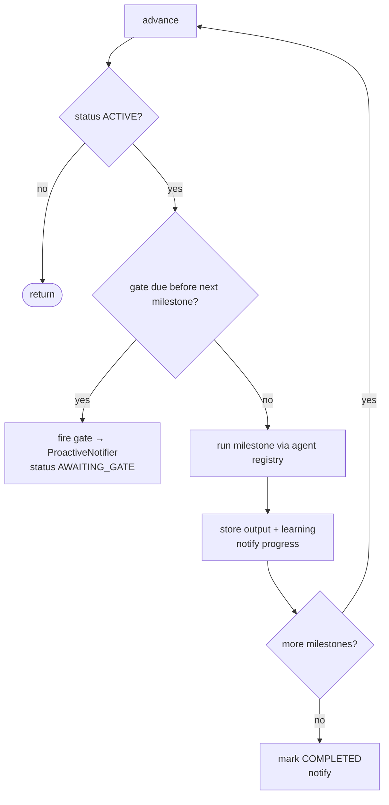

# Ze — Goals

Goals let Ze work on multi-week objectives autonomously — decomposing them into
milestones, executing work in the background, and pausing at **verification gates**
for your approval before continuing. A single workflow run handles one batch of
steps; a goal spans days or weeks with meaningful check-ins in between.

See the spec series for implementation detail: [28-goal-engine](../specs/phases/28-goal-engine.md) · [31-goal-engine-v2](../specs/phases/31-goal-engine-v2.md) · [32-goal-collaboration](../specs/phases/32-goal-collaboration.md) · [33-goal-suggestions](../specs/phases/33-goal-suggestions.md) · [34-stuck-goal-detection](../specs/phases/34-stuck-goal-detection.md) · [35-cross-goal-output-reuse](../specs/phases/35-cross-goal-output-reuse.md) · [36-cross-goal-learning-promotion](../specs/phases/36-cross-goal-learning-promotion.md). See [docs/architecture.md](architecture.md#goal-engine) for how goals connect to workflows and the scheduler.

---

## Goals vs workflows vs reminders

| Primitive | Time horizon | User involvement | Example |
|---|---|---|---|
| **Reminder** | Minutes to hours | Ze nudges you at the right time | "Remind me 15 min before the call" |
| **Workflow** | One run (minutes) | Confirm high-risk steps per action | "Every Monday, email me AI news" |
| **Goal** | Days to weeks | Approve at checkpoints (gates), not every action | "Run 15 discovery interviews in 6 weeks" |

Workflows execute a fixed step list in one session. Goals sit above them: Ze plans
milestones once (with gates between batches), then `GoalExecutor` advances work on a
schedule until the success condition is met or you stop.

---

## Starting a goal (conversational)

Describe the objective with a time horizon. The `goals` agent routes here when the
request sounds multi-week rather than one-shot:

> *"Over the next 6 weeks, find 10 charter operators in the Med, draft outreach, and track who responds."*

Ze will:

1. Create a `Goal` record (title, objective, success condition, time horizon).
2. Run `GoalPlanner` to produce milestones and verification gates.
3. Send the plan via the native app / WebSocket with **Start goal** / **Cancel** options.
4. On approval, set status to `ACTIVE` and begin the advance loop.

You can also manage goals conversationally:

| What to say | Action |
|---|---|
| *"List my goals"* | Active and awaiting-gate goals with one-line summaries |
| *"What's the status of goal X?"* | Milestone progress, pending gate, latest learnings |
| *"Steer my prospecting goal towards warm leads only"* | Re-plan remaining milestones with new instructions |
| *"Pause my prospecting goal"* | Stop advancing until you resume |
| *"Abandon the conference prep goal"* | Mark abandoned; no further work |

`GoalAgent` handles create / inspect / steer / pause / resume / abandon. It does **not**
execute milestones — that is `GoalExecutor`'s job.

**Steering** (`steer_goal` tool) enqueues a free-text instruction that is applied before the next milestone runs: Ze re-plans the remaining milestones around the instruction and continues. Steering only works while the goal is `ACTIVE`; if the goal is `AWAITING_GATE`, resolve the gate first.

### Goal overview

Ask Ze conversationally for a goals overview:

> *"What are my active goals?"*

Ze returns a summary of active and awaiting-gate goals with milestone progress and what comes next. Completed goals are listed at the bottom.

---

## Verification gates

Gates are the multi-step equivalent of the per-action capability gate. Ze batches
meaningful work, then surfaces a checkpoint message:

- What Ze has completed (summarised milestone outputs).
- What Ze plans next (milestones up to the next gate).

Options: **Proceed** · **Stop** · **Redirect**.

| Action | Effect |
|---|---|
| **Proceed** | Gate approved; execution resumes |
| **Stop** | Goal abandoned |
| **Redirect** | You send free-text instructions; Ze re-plans remaining milestones and continues |

Gate responses are handled conversationally — the user replies via the app or by
typing in the chat. Redirect instructions are sent as a follow-up message after
choosing to redirect.

Gate placement (enforced by the planner prompt):

- Before the first irreversible outreach action.
- After milestones that produce irreversible output (sent email, published post).
- Roughly every three milestones on long goals.
- At least one gate, even for short goals.

---

## How execution works

### Advance loop

`GoalExecutor.advance(goal_id)` is the core loop. It runs when:

- The scheduler fires `goal_advance_sweep` (every 15 minutes for all active goals).
- You approve a gate or finish a redirect.
- The initial plan is approved after creation.



Each milestone is dispatched through the normal agent registry (like workflow steps):
natural-language `description` + optional `agent_hint`. Completed milestones feed
gate context summaries; learnings are extracted and stored per milestone.

### Progress notifications

After each milestone completes, Ze pushes a short line via `ProactiveNotifier`
(WebSocket if connected, ntfy otherwise), e.g. *"✅ Draft target list done (2/8)."*
Gate checkpoints use a richer format (title, done list, planned list, options).

---

## On completion

When all milestones finish, `GoalExecutor` runs three things automatically:

1. **Retrospective** — `GoalPlanner.synthesize_retrospective()` produces a short narrative of what Ze accomplished and what was learned. Sent via `ProactiveNotifier` as the completion message.
2. **Procedure promotion** — reusable procedures extracted during the goal are submitted to `MemoryStore.propose_procedure()` so later goals can retrieve them. If a procedure is still provisional while the goal is active, Ze can reuse it inside the same goal before completion.
3. **Learning promotion** — generalizable facts extracted from the goal's `GoalLearning` records are submitted to `MemoryStore.propose_facts()` as `reviewed=False`. They enter the normal memory pipeline (dedup via nightly consolidation) and are visible at `GET /memory/facts`. Only facts that describe the user's preferences or patterns are promoted; goal-specific research findings are excluded.
4. **Retrospective stored** — the narrative is saved to `goals.retrospective_text` and becomes available to the weekly goal narrative job and future goal suggestion synthesis.

---

## Proactive goal features

### Weekly goal narrative (Sunday 6 PM UTC)

Ze pushes a one-paragraph update per active goal summarising what was completed that week, any pending gate, and what comes next. Driven by `GoalNarrativeJob` in `ze_automation/jobs/goal_narrative.py`.

### Weekly goal suggestions (Sunday 7 PM UTC)

Ze analyses recent memory facts, episodes, and retrospectives to propose one new goal. Sent via `ProactiveNotifier` with **Accept** / **Dismiss** options. Accepted suggestions pre-fill a goal creation flow. Driven by `GoalSuggestionJob` in `ze_automation/jobs/goal_suggestion.py`.

### Stuck goal detection (Tuesday 9 AM UTC)

Ze checks for goals that have had no milestone progress or gate resolution in a configurable window (default: 48 h for milestones, 72 h for gates). Stuck goals get a push notification with **Resume** / **Abandon** / **Redirect** options. Driven by `StuckGoalJob` in `ze_automation/jobs/stuck_goals.py`.

---

## Cross-goal awareness

### Output reuse

When planning a new goal (or replanning after a redirect), `GoalPlanner.plan()` receives a window of recently completed milestone outputs across all other goals. If the planner identifies genuine overlap, it sets a `reuse_hint` on the affected milestone. At execution time the agent sees the hint and can call `get_milestone_trace` to retrieve the prior output before re-running the work. The reuse decision is always advisory — the agent decides whether the prior output is fresh enough to use.

### Learning promotion

See [On completion](#on-completion) above. Generalizable learnings from completed goals flow into user memory, where they are available to all future agents — not just the goal engine.

### Procedure reuse within an active goal

Procedure extraction is not limited to goal completion. As Ze learns a repeatable method during an active goal, it should be able to surface that procedure back into later milestones and replans for the same goal.

The contract is:

1. Ze may extract a provisional procedure once a milestone cluster looks stable enough to generalise.
2. That procedure is available to later milestones in the same goal and to `GoalPlanner.replan_remaining()`.
3. On goal completion, any still-relevant procedure is promoted into `MemoryStore.propose_procedure()` so future goals can reuse it too.

This closes the gap between "Ze learned a procedure" and "Ze can actually use it again before the goal ends".

---

## Data model

```
goals
  id, title, objective, success_condition, status, type, time_horizon,
  learnings, retrospective_text, last_stuck_alert_at, ...

goal_milestones
  id, goal_id, sequence, title, description, intent, agent_hint,
  status, output, reuse_hint, completed_at, ...

goal_gates
  id, goal_id, after_sequence, status, context_summary, plan_summary,
  user_feedback, fired_at, resolved_at, ...

goal_learnings
  id, goal_id, content, source, created_at

goal_execution_traces
  id, goal_id, milestone_id, seq, tool_name, args, result,
  duration_ms, success, error, created_at

goal_suggestions
  id, title, objective, rationale, source_type, source_ref,
  status, suggested_at, resolved_at, created_goal_id
```

Statuses: `planning` → (approve) → `active` ↔ `awaiting_gate` / `paused` → `completed` | `abandoned`.

`reuse_hint` on milestones is set by the planner when a prior goal's output may be reusable; empty string means no hint.

---

## Configuration

Goal capabilities are declared on the `@agent` class in `ze_automation/agents/goals/agent.py`.
Intent capabilities default to `confirm` for create, update, and delete; read is autonomous.

The advance sweep cron is fixed in `ze_api/container.py` (`*/15 * * * *`, job id
`goal_advance_sweep`). Proactive job crons are configurable via `proactive.*` in
`config/config.yaml`. See [docs/scheduled-jobs.md](scheduled-jobs.md).

---

## Caveats

- Milestones run **sequentially** within a goal; the sweep processes one advance per goal per tick.
- Goals do not replace workflows — use workflows for recurring or one-shot automation.
- Success is not auto-detected; Ze marks complete when all milestones finish; you confirm at gates along the way.
- Steering only applies to remaining pending milestones; completed milestones are never re-run.
- Promoted facts from learning promotion enter memory as `reviewed=False` and go through the normal consolidation cycle before being treated as canonical.
- Procedures can be reused within the same goal once extracted; if you only see them at the end, the spec is incomplete.
