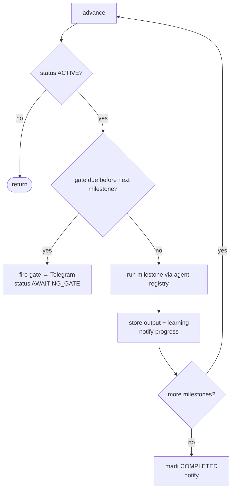

# Ze — Goals

Goals let Ze work on multi-week objectives autonomously — decomposing them into
milestones, executing work in the background, and pausing at **verification gates**
for your approval before continuing. A single workflow run handles one batch of
steps; a goal spans days or weeks with meaningful check-ins in between.

See [specs/28-goal-engine.md](../specs/28-goal-engine.md) for the full implementation
spec. See [docs/architecture.md](architecture.md#goal-engine) for how goals connect
to workflows, the scheduler, and Telegram.

---

## Goals vs workflows vs reminders

| Primitive | Time horizon | User involvement | Example |
|---|---|---|---|
| **Reminder** | Minutes to hours | Ze nudges you at the right time | "Remind me 15 min before the call" |
| **Workflow** | One run (minutes) | Confirm high-risk steps per action | "Every Monday, email me AI news" |
| **Goal** | Days to weeks | Approve at checkpoints (gates), not every action | "Run 15 discovery interviews in 6 weeks" |

Workflows execute a fixed step list in one session. Goals sit above them: Ze plans
milestones once (with gates between batches), then `GoalExecutor` advances work on a
schedule until the success condition is met or you stop.

---

## Starting a goal (conversational)

Describe the objective with a time horizon. The `goals` agent routes here when the
request sounds multi-week rather than one-shot:

> *"Over the next 6 weeks, find 10 charter operators in the Med, draft outreach, and track who responds."*

Ze will:

1. Create a `Goal` record (title, objective, success condition, time horizon).
2. Run `GoalPlanner` to produce milestones and verification gates.
3. Send the plan in Telegram with **Start goal** / **Cancel** buttons (`goal_plan:yes|no`).
4. On approval, set status to `ACTIVE` and begin the advance loop.

You can also manage goals conversationally:

| What to say | Action |
|---|---|
| *"List my goals"* | Active and awaiting-gate goals with one-line summaries |
| *"What's the status of goal X?"* | Milestone progress, pending gate, latest learnings |
| *"Pause my prospecting goal"* | Stop advancing until you resume |
| *"Abandon the conference prep goal"* | Mark abandoned; no further work |

`GoalAgent` handles create / inspect / pause / resume / abandon. It does **not**
execute milestones — that is `GoalExecutor`'s job.

---

## Verification gates

Gates are the multi-step equivalent of the per-action capability gate. Ze batches
meaningful work, then surfaces a checkpoint message:

- What Ze has completed (summarised milestone outputs).
- What Ze plans next (milestones up to the next gate).

Inline keyboard: **Proceed** · **Stop** · **Redirect**.

| Action | Effect |
|---|---|
| **Proceed** | Gate approved; execution resumes |
| **Stop** | Goal abandoned |
| **Redirect** | You send free-text instructions; Ze re-plans remaining milestones and continues |

Redirect uses Telegram `ForceReply` (same pattern as the Edit flow in capability
confirmations). Callback payloads use the `goal:` prefix (`goal:approve`, `goal:stop`,
`goal:redirect`) — separate from orchestration `confirm:` callbacks.

Gate placement (enforced by the planner prompt):

- Before the first irreversible outreach action.
- After milestones that produce irreversible output (sent email, published post).
- Roughly every three milestones on long goals.
- At least one gate, even for short goals.

---

## How execution works

### Advance loop

`GoalExecutor.advance(goal_id)` is the core loop. It runs when:

- The scheduler fires `goal_advance_sweep` (every 15 minutes for all active goals).
- You approve a gate or finish a redirect.
- The initial plan is approved after creation.



Each milestone is dispatched through the normal agent registry (like workflow steps):
natural-language `description` + optional `agent_hint`. Completed milestones feed
gate context summaries; learnings are extracted and stored per milestone.

### Progress notifications

After each milestone completes, Ze pushes a short line to Telegram, e.g.
*"✅ Draft target list done (2/8)."* Gate checkpoints use the richer format described
in the spec (title, done list, planned list, keyboard).

---

## Data model

```
goals
  id, title, objective, success_condition, status, type, time_horizon, learnings, ...

goal_milestones
  id, goal_id, sequence, title, description, intent, agent_hint, status, output, ...

goal_gates
  id, goal_id, after_sequence, status, context_summary, plan_summary, user_feedback, ...

goal_learnings
  id, goal_id, content, source, created_at
```

Statuses: `planning` → (approve) → `active` ↔ `awaiting_gate` / `paused` → `completed` | `abandoned`.

Migration: `migrations/versions/016_goals.py`.

---

## Configuration

Goals are enabled per agent in `config/config.yaml` under `agents.goals` and
`config/agents/goals.yaml` (if present). Intent capabilities default to `confirm` for
create, update, and delete; read is autonomous.

The advance sweep cron is fixed in `ze/container.py` (`*/15 * * * *`, job id
`goal_advance_sweep`). See [docs/scheduled-jobs.md](scheduled-jobs.md).

---

## Caveats

- Milestones run **sequentially** within a goal; the sweep processes one advance per goal per tick.
- Goals do not replace workflows — use workflows for recurring or one-shot automation.
- Success is not auto-detected; Ze marks complete when all milestones finish; you confirm at gates along the way.
- Prospecting-as-a-goal (reusing `ProspectingAgent` inside milestones) is planned but not yet wired.
