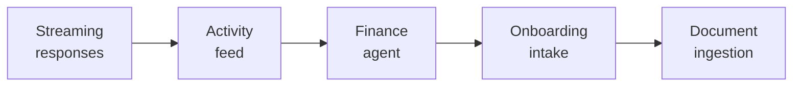

# Ze — Roadmap Brainstorm

> Generated via initial product discovery. Not a committed roadmap — a prioritised idea backlog to draw specs from.

## Opportunity framing

Ze has shipped the core "Jarvis chassis": autonomous goal execution, deep memory, proactive delivery, React web client. The next frontier is making Ze feel less like a capable tool you configure and more like a genuine extension of yourself — one that gets perceptibly smarter over time, operates across every domain of life, and reduces friction to near zero.

**Central assumption to keep testing:** does Ze save enough time and cognitive load that a user would miss it if it was gone?

---

## PM perspective

**PM1 · Finance & Legal agents**
`ze-finance` and `ze-legal` package stubs already exist. A finance agent that reads bank/card transactions, tracks spending against goals, and surfaces anomalies. A legal agent that reviews contracts, flags red-clause clauses, and drafts responses. High-anxiety, high-value tasks — Ze's confirmation-first posture is a natural fit.

**PM2 · Ze Score — weekly life dashboard**
A synthesised weekly signal derived from all Ze's domains: goal progress, spending vs. plan, calendar load, neglected contacts, habits. Not gamification — a factual Sunday-evening read on how aligned your week was to what you said you wanted. Differentiates Ze from any single-domain tool.

**PM3 · Integrations hub: webhooks + Zapier/Make**
Let Ze receive and send events from/to any tool — Linear, Notion, GitHub, Slack, bank APIs. Incoming webhooks trigger Ze agents. Outgoing actions complete Ze goals. Unlocks Ze as an orchestration layer across a person's entire digital life.

**PM4 · Mobile-first voice input**
A persistent press-and-speak button in the web app. Ze transcribes, routes, and acts. The app fades into the background; Ze becomes more like a presence than an app. The Jarvis interaction model.

**PM5 · Trusted partner mode**
Let a second authenticated user (partner, EA, collaborator) interact with Ze with scoped permissions — read goal state, send messages — but Ze always defers to the primary user for confirmations. Unlocks real delegation without breaking the single-user trust model.

---

## Designer perspective

**D1 · Onboarding as intake**
First-launch: Ze asks 5–7 targeted questions about what you're working toward, what drains you, who matters to you. No feature tour. Ze uses answers to seed memory, suggest a first goal, and calibrate persona defaults. First impression: "it already gets me."

**D2 · Ze activity feed**
A scrollable timeline showing everything Ze has done autonomously: milestone executed, briefing sent, contact noted, insight filed, reminder fired. Tappable for detail. Makes background work visible. Without this, Ze's autonomy is invisible and feels like nothing is happening.

**D3 · Goal map — visual milestone progress**
A goals screen showing each active goal as a card: milestone progress, current status, last action, next planned step. Tap to steer, approve a gate, or read the execution trace. The goal engine is Ze's strongest feature — it deserves a surface that makes complexity feel effortless.

**D4 · Proactive ambient surface**
A persistent "Ze's corner" in the app surfacing the most relevant thing right now: a gate awaiting approval, an insight to share, an upcoming reminder. Not a notification — an ambient presence that reduces the need to go looking for what Ze is doing.

**D5 · Confirmation UX as trust-building**
Rich confirmation cards with full context ("Ze wants to send this email to Ana — here's what it says and why"), swipe-to-approve gestures, audit trail of past decisions. Confirmations should reinforce that Ze respects your authority, not feel like interruptions.

---

## Engineer perspective

**E1 · Streaming responses over WebSocket**
Switch `graph.ainvoke()` to `astream_events` and stream tokens to the web client. Eliminates the "spinning for 30 seconds then dumping text" experience. Highest-impact UX change with no model cost increase. Prerequisite for voice feeling natural.

**E2 · Document and file ingestion**
Attach PDFs, images, or URLs in the app. Ze chunks, embeds, and stores in a per-user document store (pgvector). Any agent retrieves relevant chunks at turn time. Unlocks: contract review, research papers, meeting notes, personal knowledge bases.

**E3 · Local-model fallback (Ollama)**
Ollama adapter alongside OpenRouter. Route cheap, private tasks (fact extraction, consolidation, routing) to a local model; reserve OpenRouter for reasoning-heavy work. Cuts cost for high-frequency background jobs. Adds offline resilience.

**E4 · Browser extension for passive context capture**
A lightweight extension Ze queries for recent browsing context — current tab, recently visited pages, highlighted text. On-demand only, with explicit per-session consent. Unlocks: "summarise what I've been reading", research that starts from where the user already is.

**E5 · Async agent-to-agent delegation**
An async delegation layer: an agent spawns a sub-task that runs across multiple turns, reports back via the goal mechanism, and can be monitored independently. Enables genuinely parallel workstreams — Ze researching while the user is in a meeting.

---

## Top 5 priorities

| # | Idea | Why now | Key assumption |
|---|---|---|---|
| 1 | **Streaming responses** (E1) | Highest effort-to-impact ratio. Changes how Ze feels without changing what it does. Prerequisite for voice. | LangGraph `astream_events` + FastAPI WebSocket is straightforward to wire |
| 2 | **Ze activity feed** (D2) | Ze's background autonomy is its biggest differentiator — and currently invisible. Users don't trust what they can't see. | Users open the feed and feel satisfaction at what Ze has done, not anxiety |
| 3 | **Finance agent** (PM1) | Package stub exists. Finance is high-anxiety, high-frequency, no good autonomous tool exists. Confirm-first model is uniquely safe here. | Read-only bank data + spending pattern analysis is enough for v1 |
| 4 | **Onboarding intake** (D1) | Every new deploy starts cold. Good intake compresses time-to-useful from weeks to hours. Forces memory + persona systems to their best first impression. | Users answer 5–7 personal questions on first launch if the framing is right |
| 5 | **Document ingestion** (E2) | Unlocks legal + finance agents, supercharges research, moves Ze from "assistant I talk to" to "assistant that knows my stuff." | pgvector retrieval quality is sufficient for agents to find the right chunk reliably |

---

## Release arc

These five form a coherent sequence:

**Make Ze feel fast** → **make its work visible** → **expand into new life domains** → **reduce cold-start friction** → **give Ze eyes on your documents**.
