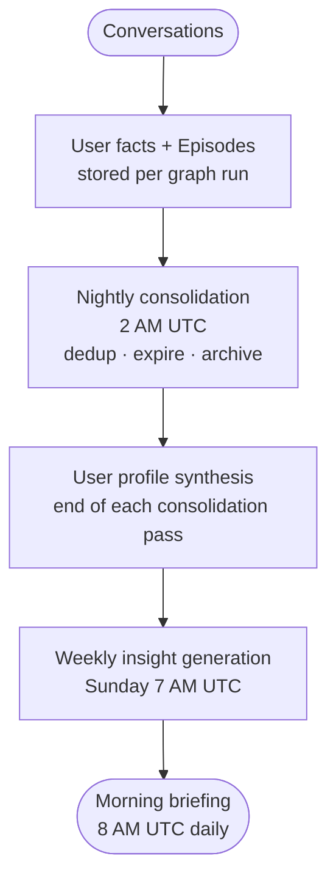

# Ze — Scheduled Jobs & Memory Lifecycle

Ze isn't only reactive. A set of background jobs run on a daily and weekly cadence
to keep memory clean, synthesise a portrait of the user, surface insights, and push
proactive messages — all without the user prompting anything.

This document explains what runs, when, and how each piece feeds into the next.

---

## The memory lifecycle

Every conversation leaves a trace. Over time those traces accumulate into something
richer:



---

## What happens during a conversation

**Facts** (`ze/memory/store.py`)

After each `execute_tool` or `draft_response` node, the `write_memory` graph node
fires (fire-and-forget). The agent may propose new user facts — short declarative
statements like "user prefers morning meetings" or "user is learning Portuguese".

Facts are never stored silently. Ze sends a Telegram message asking the user to
confirm, reject, or edit the proposed fact. Only `reviewed = true` facts enter the
long-term store.

**Episodes** (`ze/memory/store.py`)

A summary of the conversation turn (what was asked, what Ze did, what was decided)
is written automatically as an episode after every run. Episodes don't require user
approval.

**Memory injection**

On the _next_ conversation, `fetch_context` runs a pgvector semantic search over
both facts and episodes, injecting the top-k most relevant results into the agent's
system prompt as `memory_context`. The user profile (see below) is also injected
into every system prompt — not just similar facts, but a synthesised portrait.

---

## Nightly consolidation (2 AM UTC)

**Module:** `ze/memory/consolidator.py`  
**Config:** `memory.consolidation.*` in `config/config.yaml`

Three tasks run in sequence every night:

### 1. Fact deduplication

Near-duplicate facts dilute retrieval precision and waste token budget. The
consolidator scans all unreviewed facts, computes pairwise cosine similarity, and
merges candidates above the configured thresholds:

| Similarity | Action |
|---|---|
| > 0.95 (`merge_silent_threshold`) | Silent merge — keep the newer fact, mark the older `contradicted = true`. No LLM call. |
| 0.85–0.95 (`merge_llm_threshold`) | LLM merge — Haiku synthesises one value from both, inserts it as a new fact, marks both originals `contradicted = true`. |
| < 0.85 | No action — dissimilar enough to coexist. |

**Reviewed facts are never auto-merged.** A reviewed fact represents an explicit
user decision; touching it automatically would violate that contract.

### 2. Fact expiry

Three rules applied per run:

| Rule | Condition | Action |
|---|---|---|
| Grace delete | `expires_at` is set and has elapsed | Hard-delete |
| Contradicted cleanup | `contradicted = true` and older than `contradicted_ttl_days` (default: 30d) | Hard-delete |
| Stale unreviewed | `reviewed = false` and no activity for `unreviewed_ttl_days` (default: 90d) | Soft-expire: set `expires_at = NOW() + expiry_grace_days` |

Soft-expired facts appear in the morning briefing and in `GET /memory/digest` so the
user can save them before the grace period ends. Reviewed facts are **never** expired
automatically.

### 3. Episode archival

Raw episodes accumulate quickly. Episodes older than `episode_recency_days` (default:
14d) are candidates for archival. When a batch of at least `episode_min_archive_batch`
(default: 10) candidates exists, Haiku summarises them into a single archive row and
the originals are deleted. This keeps the episodes table lean without losing history.

### 4. Profile synthesis (end of every consolidation pass)

After dedup + expiry + archival, the consolidator calls `synthesise_profile()`. Haiku
reads all reviewed facts and the most recent episodes (up to `profile.episode_limit`,
default: 50) and produces a structured user portrait:

| Field | What it captures |
|---|---|
| `preferences` | Communication style, tool preferences, output format preferences |
| `habits` | Routines, recurring activities, work patterns |
| `topics` | Domains of interest, recurring subjects |
| `relationships` | People mentioned, their roles relative to the user |
| `goals` | Stated objectives, in-progress projects |

The profile is versioned (integer counter, incremented on every synthesis). The current
profile is available at `GET /memory/profile` and is injected into every agent's system
prompt. Agents don't reason about individual facts in isolation — they see the full
portrait.

Profile synthesis is skipped if fewer than `profile.min_facts` (default: 3) reviewed
facts exist.

---

## Weekly insights (Sunday 7 AM UTC)

**Module:** `ze/proactive/insights.py`  
**Config:** `proactive.insights.*` in `config/config.yaml`

Every Sunday Ze looks back over the past 7 days of facts and episodes and generates
1–3 short, conversational observations — things the user might not have consciously
noticed:

> *"I've noticed you've mentioned sleep problems four times this week — anything going on?"*
>
> *"Your last three research sessions all circled back to distributed systems. Looks like that's becoming a recurring thread."*
>
> *"You said you wanted to practise Portuguese more, but I haven't seen that come up in our conversations for a couple of weeks."*

Insight categories: `pattern` | `trend` | `goal` | `tension`.

The same category won't fire again within `category_cooldown_days` (default: 7d) to
avoid repetition. Insights are pushed directly to Telegram before the 8 AM morning
briefing, so they feel like a natural start to the week.

Insight generation is skipped if fewer than `min_evidence` (default: 3) facts +
episodes exist in the lookback window.

---

## Morning briefing (8 AM UTC daily)

**Module:** `ze/proactive/briefing.py`  
**Config:** `proactive.briefing.*` in `config/config.yaml`

A daily digest pushed to Telegram. No LLM call — it's a templated summary of stats:

- **Unreviewed facts** — facts Ze proposed that you haven't confirmed or rejected yet.
  If the count is at or above `unreviewed_nudge_threshold` (default: 5), the briefing
  includes a direct nudge to review them.
- **Upcoming workflows** — scheduled workflow runs in the next 24 hours.
- **Recent failures** — any workflow runs that failed in the past 24 hours.

The briefing is intentionally minimal. It surfaces what needs attention, not a summary
of everything Ze knows.

---

## Calendar sync and reminders (7:45 AM UTC daily)

**Module:** `ze/proactive/reminders.py`  
**Config:** `proactive.calendar.*` in `config/config.yaml`

Each morning `CalendarReminderScheduler` syncs Google Calendar events up to
`sync_days_ahead` (default: 7) days ahead. For each event, Haiku assesses the
appropriate reminder interval (e.g. 15 minutes before a video call vs. 1 hour before
a flight). APScheduler one-shot `DateTrigger` jobs are created accordingly.

When a reminder fires, Ze pushes the event title and time to Telegram. A startup
replay pass re-registers any reminders that were scheduled before the last restart
and haven't fired yet.

Calendar sync runs at 7:45 AM — before the 8 AM briefing — so upcoming events
with same-day reminders are captured.

---

## Workflow failure alerts (immediate)

**Module:** `ze/workflow/scheduler.py` + `ze/proactive/notifier.py`

When a scheduled workflow step fails, Ze pushes an alert immediately — no waiting
for the morning briefing. A `workflow_failure_cooldown_hours` (default: 1h) prevents
alert spam for repeatedly-failing workflows.

---

## Full schedule at a glance

| Time (UTC) | Job | Module |
|---|---|---|
| 7:00 AM Sun | Weekly insight generation | `ze/proactive/insights.py` |
| 7:45 AM daily | Calendar sync + reminder scheduling | `ze/proactive/reminders.py` |
| 8:00 AM daily | Morning briefing | `ze/proactive/briefing.py` |
| 2:00 AM daily | Memory consolidation + profile synthesis | `ze/memory/consolidator.py` |
| Immediate | Workflow failure alerts | `ze/proactive/notifier.py` |
| Immediate | Calendar event reminders (when they fire) | `ze/proactive/reminders.py` |

All scheduled jobs use APScheduler with Postgres as the job store, so jobs survive
process restarts. Cron expressions are configurable in `config/config.yaml`.

---

## Inspecting memory

| Endpoint | Description |
|---|---|
| `GET /memory/facts` | All stored facts (with review status, expiry) |
| `GET /memory/digest` | Unreviewed facts + upcoming expiries |
| `GET /memory/profile` | Current user profile (latest synthesis) |
| `POST /memory/consolidate` | Trigger a consolidation run manually |
| `POST /memory/facts/review` | Confirm, reject, or edit a proposed fact |

---

## Adjusting the schedule

All cron expressions and thresholds live in `config/config.yaml` under `memory.consolidation`,
`memory.profile`, `memory.insights`, and `proactive`. See
[docs/configuration.md](configuration.md) for the full reference.

To trigger a consolidation manually (e.g. after bulk-approving many facts):

```bash
curl -X POST https://ze-backend.fly.dev/memory/consolidate \
  -H "Authorization: Bearer $ZE_API_KEY"
```
