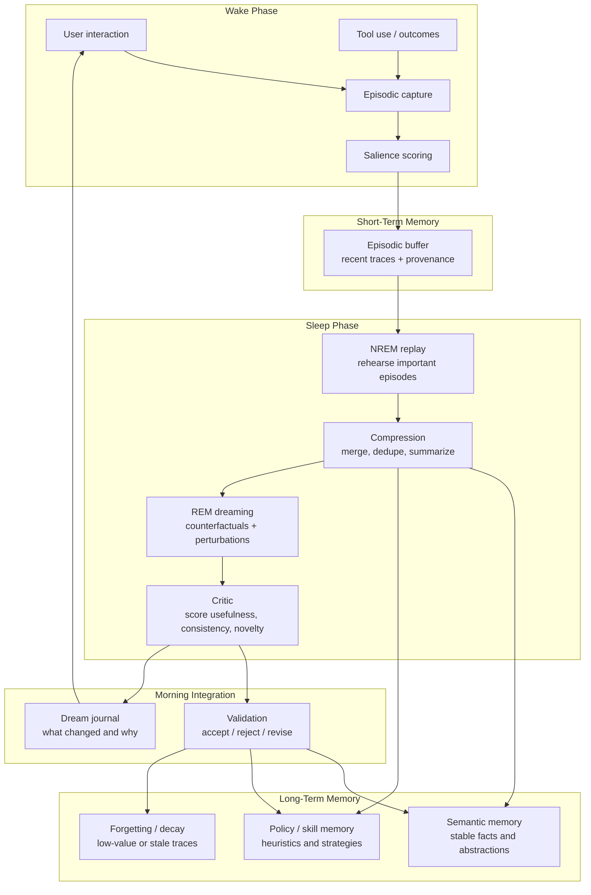

# Ze Dream Memory

Ze should have an offline dream phase that replays recent experience, compresses it, and tests variants before anything is promoted into stable memory. The point is not random generation. The point is a controlled learning loop that improves memory, abstraction, and robustness.

## How it works

- Wake captures fresh experience with provenance.
- Sleep replays the important episodes and compresses them.
- Dreaming generates novel variants and counterfactuals.
- A critic filters out weak, inconsistent, or low-value outputs.
- Morning integration promotes only validated changes into long-term memory.

## What this phase should achieve

- Better memory retention.
- Better abstraction and generalization.
- Better self-correction.
- Lower risk of stale or duplicated memory.
- A visible dream journal that explains what changed.

## Concepts involved

- `Experience replay` and `generative replay`: [Continual Learning with Deep Generative Replay](https://arxiv.org/abs/1705.08690)
- `Compressed replay`: [REMIND Your Neural Network to Prevent Catastrophic Forgetting](https://arxiv.org/abs/1910.02509)
- `Wake / sleep offline learning`: [Wake-Sleep Consolidated Learning](https://arxiv.org/abs/2401.08623)
- `Dream-like recombination`: [Learning cortical representations through perturbed and adversarial dreaming](https://arxiv.org/abs/2109.04261)
- `Sleep consolidation` and `targeted reactivation`: Björn Rasch et al., *Odor Cues During Slow-Wave Sleep Prompt Declarative Memory Consolidation*; Hong-Viet V. Ngo et al., *Auditory Closed-Loop Stimulation of the Sleep Slow Oscillation Enhances Memory*
- `Dream-linked memory processing`: Erin E. Wamsley et al., *Dreaming of a Learning Task Is Associated with Enhanced Sleep-Dependent Memory Consolidation*
- `Context reinstatement during sleep`: Eitan Schechtman et al., *Memory consolidation during sleep involves context reinstatement in humans*

## What we still need to decide

- Which memories are eligible for dreaming.
- How to score a good dream.
- What must stay in the current core, and what should be redesigned for scalability.
- What stays private to the system versus exposed in a user-facing dream journal.
