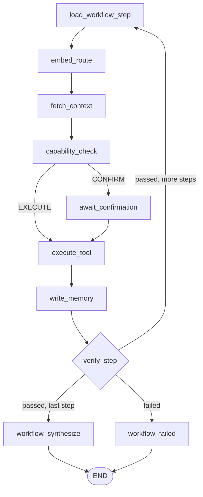

# Ze — Workflows

Workflows let Ze execute multi-step tasks automatically, either on a recurring
schedule or on demand. Each step is a natural-language instruction routed through
the normal orchestration graph — agents remain peers, none orchestrates another.

---

## Three modes

| Mode | Description |
|---|---|
| **Scheduled** | A named workflow with a cron expression. APScheduler fires it automatically; results are pushed to Telegram. |
| **On-demand** | A stored workflow triggered by the user: *"run my daily brief"* or *"trigger the research digest"*. |
| **Dynamic plan** | Ze generates a step list at runtime for a complex multi-step request, shows it for approval if any step is high-risk, then executes without storing it. |

All three modes share the same underlying execution path — a dedicated workflow
LangGraph compiled separately from the main conversation graph.

---

## Creating a workflow (conversational)

Just describe what you want in the chat. Ze's `WorkflowManagerAgent` handles
the lifecycle:

> *"Every Monday at 8 AM, search for the top AI news from the past week and email me a summary."*

Ze will:

1. Parse the description into an ordered list of steps.
2. Extract a cron expression from the schedule phrase.
3. Show you the plan for confirmation (all `manage` intent actions are `confirm` mode by default).
4. Store the workflow and schedule it.

You can also manage workflows conversationally:

| What to say | Action |
|---|---|
| *"Show me my workflows"* | List all stored workflows |
| *"Disable the Monday briefing"* | Pause a scheduled workflow |
| *"Delete the research digest"* | Remove a workflow permanently |
| *"Run the weekly summary now"* | Trigger on-demand, outside schedule |

---

## How execution works

### Step execution loop

For a workflow with N steps, the graph runs through the following loop for each step:



`load_workflow_step` resets per-step state and sets `prompt` to the step's task.
The graph then routes normally — `embed_route` picks the right agent, memory is
injected, and capability is enforced — exactly as if the user had typed the task.

### Step verification

Each step can optionally declare a `verify` criterion — a natural-language description
of what a successful output looks like:

```json
{
  "task": "Search for the top 5 AI developments this week",
  "agent_hint": "research",
  "verify": "Output contains at least 3 distinct AI developments with dates"
}
```

Verification runs three checks in order:

1. **Tool success** — any tool call that returned `success=False` fails the step immediately.
2. **Non-empty output** — an empty agent result fails the step.
3. **Criteria check** — if `verify` is set, Haiku evaluates the output against the
   criteria string. A Haiku failure (e.g. timeout) is logged as a warning but does
   not fail the step — the check is non-blocking.

### Synthesis

After all steps pass, `workflow_synthesize` calls Haiku to merge the step outputs
into a concise summary and pushes it via `ProactiveNotifier` (WebSocket or ntfy).
For scheduled workflows running unattended, this is the only message the user sees.

### Failure handling

If a step fails, `workflow_failed` records the failure in `workflow_executions`, sends
an immediate push notification (subject to `workflow_failure_cooldown_hours`), and stops.
Subsequent steps are not attempted.

---

## Dynamic plan mode

For complex one-off requests with sequential dependencies — *"research the best
standing desks under £500, create a comparison table, and email it to me"* — Ze
generates a plan at runtime rather than routing the message to a single agent:

1. `WorkflowPlanner` decomposes the message into an ordered step list.
2. If any step has `WRITE` access tools and the capability is `confirm`, the plan is
   shown for approval before execution starts.
3. The plan executes through the same workflow graph, but `workflow_id` is `None`
   in `workflow_executions` (dynamic plans are not stored).

The distinction between "this should be a dynamic plan" and "this should route to a
single agent" is made by the embedding router's gap threshold — if the request scores
near-equally across multiple agents, Haiku decomposes rather than picking one.

---

## Data model

```
workflows
  id           UUID
  name         TEXT  (unique)
  description  TEXT
  steps        JSONB (list of WorkflowStep)
  schedule     TEXT  (cron expression, NULL = on-demand only)
  enabled      BOOL
  last_run_at  TIMESTAMPTZ
  next_run_at  TIMESTAMPTZ

workflow_executions
  id           UUID
  workflow_id  UUID → workflows (NULL for dynamic plans)
  status       pending | running | completed | failed
  step_results JSONB (list of StepResult)
  error        TEXT
  started_at   TIMESTAMPTZ
  completed_at TIMESTAMPTZ
```

---

## Scheduling details

`WorkflowScheduler` wraps APScheduler with a Postgres job store. On startup it
loads all `enabled = true`, `schedule IS NOT NULL` workflows and registers
`CronTrigger` jobs. APScheduler itself holds no persistent state — the Postgres
records are the source of truth. On restart, all active jobs are re-registered
from the database.

Adding, disabling, or deleting a workflow updates both the `workflows` table and
the live APScheduler job registry atomically.

`next_run_at` is computed from the cron expression after each run and written to
Postgres, so the morning briefing can report upcoming scheduled jobs accurately.

---

## REST API

| Endpoint | Description |
|---|---|
| `GET /workflows` | List all workflows |
| `GET /workflows/{id}` | Get a specific workflow |
| `POST /workflows/{id}/trigger` | Run a workflow immediately |
| `PATCH /workflows/{id}` | Update enabled/disabled |
| `DELETE /workflows/{id}` | Delete a workflow |
| `GET /workflows/{id}/executions` | Execution history |

All endpoints require `Authorization: Bearer $ZE_API_KEY`.

---

## Caveats

- Steps execute **sequentially** — no parallelism within a workflow.
- Workflows cannot call each other.
- External webhook triggers are not supported — scheduling and on-demand are the
  only entry points.
- The user is not notified of step-by-step progress for scheduled runs, only the
  final synthesis (or failure alert).
