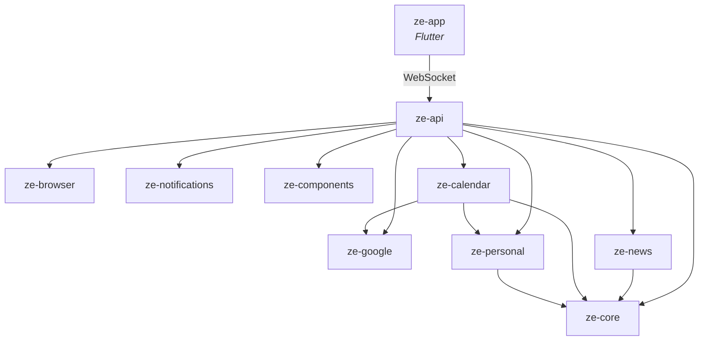

# packages/

Ze is a uv workspace monorepo. This directory contains all packages. Each has its own `README.md`, `pyproject.toml`, and test suite.

## Package index

| Package | Language | Description |
|---|---|---|
| [ze-core](ze-core/) | Python | Pure infrastructure — routing, memory, orchestration, telemetry, plugin ABC |
| [ze-personal](ze-personal/) | Python | Personal-assistant domain — goals, workflows, persona, contacts |
| [ze-google](ze-google/) | Python | Google OAuth2 credentials and service client factories |
| [ze-calendar](ze-calendar/) | Python | Calendar, reminders, and timezone domain |
| [ze-browser](ze-browser/) | Python | Playwright browser sidecar client |
| [ze-news](ze-news/) | Python | News fetching, RSS sources, personalised headlines |
| [ze-notifications](ze-notifications/) | Python | Push notification abstraction (ntfy) |
| [ze-components](ze-components/) | Python | Server-driven UI component descriptors for the Flutter client |
| [ze-api](ze-api/) | Python | Deployment unit — FastAPI, WebSocket, REST API, background jobs |
| [ze-app](ze-app/) | Flutter/Dart | Native client app (iOS / Android / macOS / web) |

## Dependency graph

Arrows point from dependent → dependency. `ze-core` and the leaf packages (`ze-browser`, `ze-notifications`, `ze-components`, `ze-google`) have no Ze dependencies.

## Architecture principles

- **`ze-core` is framework-only.** It knows nothing about personal assistants, goals, or users. If you're adding user-facing behaviour, it belongs in a domain package.
- **Domain packages extend via `ZePlugin`.** `ze-personal`, `ze-calendar`, and `ze-news` register agents and jobs through the `ZePlugin` ABC without `ze-core` depending on them.
- **`ze-api` is the only deployment unit.** It wires everything together in its container and is the only package that runs as a service.
- **`ze-app` is a separate runtime.** The Flutter client has no Python dependencies — it connects to `ze-api` over WebSocket and receives push notifications via ntfy.

See the [root README](../README.md) and [docs/](../docs/) for the full architecture guide.
