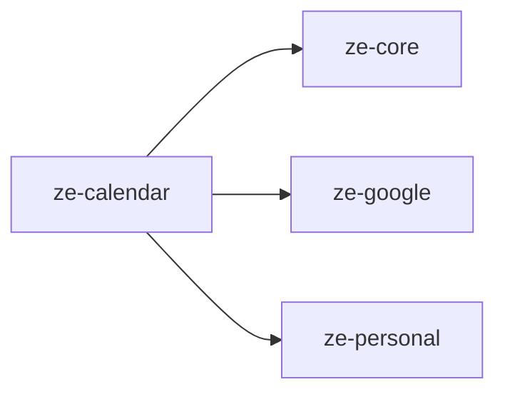

# ze-calendar

Calendar, reminders, and timezone domain for Ze. Provides the `CalendarAgent`, `RemindersAgent`, and all supporting infrastructure for Google Calendar integration and proactive reminder delivery.

## Responsibilities

| Module | What it provides |
|---|---|
| `agents/` | `CalendarAgent`, `RemindersAgent`, tools |
| `reminders/` | `ReminderStore`, `CalendarReminderService`, `CalendarReminderStore` |
| `jobs/` | `CalendarReminderJob` — fires reminders via `ProactiveScheduler` |
| `timezone/` | `TimezoneService`, `world_time` `@tool` |
| `plugin.py` | `CalendarPlugin(ZePlugin)` — registers agents and jobs |

## Dependencies



## Extension point

`CalendarPlugin` is registered in `ze-api`'s container and contributes:
- `CalendarAgent` and `RemindersAgent` to the agent registry
- `CalendarReminderJob` to `ProactiveScheduler`

```python
from ze_calendar.plugin import CalendarPlugin
```

## Testing

```bash
make test-calendar
# or
uv run pytest packages/ze-calendar/tests -q
```
