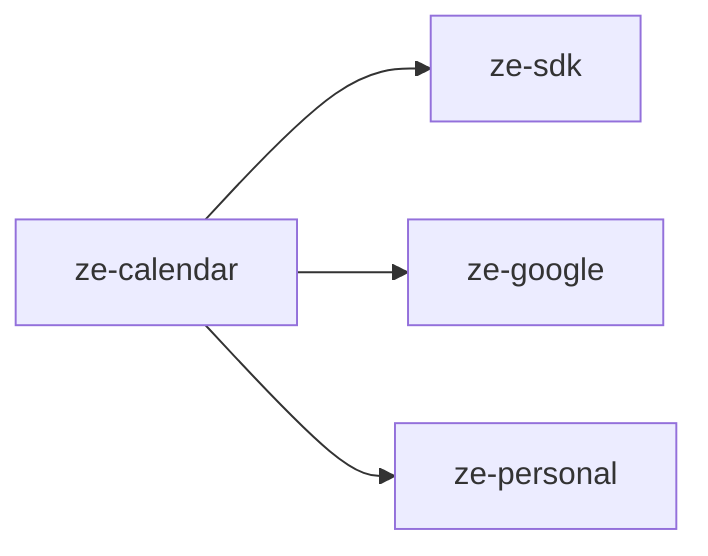

# ze-calendar

Calendar, reminders, and timezone domain for Ze. Provides the `CalendarAgent`, `RemindersAgent`, and all supporting infrastructure for Google Calendar integration and proactive reminder delivery.

## Role in Ze

Calendar is one of the most-used agent domains. Users ask about upcoming events, create reminders in natural language, and receive proactive nudges when reminders fire. Calendar events also feed contact extraction and correlation signal sources.

### Key features

- `CalendarAgent` — query and manage Google Calendar events
- `RemindersAgent` — natural-language time parsing, one-off and recurring reminders
- `CalendarReminderJob` — proactive delivery of due reminders via push or WebSocket
- `world_time` tool — timezone lookups for scheduling across regions
- Calendar signal source for the correlation engine

### Integration

Entry point `ze_calendar`. Depends on `ze-google` for Calendar API access and `ze-personal` for contact linking. Contributes two agents, the reminder job, REST store for reminders, data domains for reset, and `CalendarSignalSource`.

```python
from ze_calendar.plugin import CalendarPlugin
```

## Responsibilities

| Module | What it provides |
|---|---|
| `agents/` | `CalendarAgent`, `RemindersAgent`, tools |
| `reminders/` | `ReminderStore`, `CalendarReminderService`, `CalendarReminderStore` |
| `jobs/` | `CalendarReminderJob` — fires reminders via `ProactiveScheduler` |
| `timezone/` | `TimezoneService`, `world_time` `@tool` |
| `plugin.py` | `CalendarPlugin(ZePlugin)` — registers agents and jobs |

## Dependencies



## Testing

From the repo root:

```bash
make test-calendar
```

See [docs/testing.md](../../docs/testing.md).
