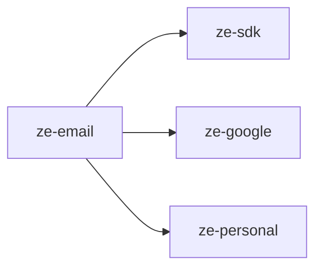

# ze-email

Gmail channel and email agent for Ze. Provides the `EmailAgent` and `GmailChannel` for reading and sending email via Google APIs.

## Role in Ze

Email is both a communication channel and an agent domain. Users ask Ze to search, read, draft, and send Gmail messages. The Gmail channel also feeds contact extraction — new correspondents are surfaced for the contacts consolidator in `ze-personal`.

### Key features

- `EmailAgent` — search inbox, read threads, draft and send messages
- `GmailChannel` — unified channel abstraction for outbound email via contact handles
- Email-aware memory retrieval policy

### Integration

Entry point `ze_email`. Requires `GoogleCredentials` from `ze-google` — when unconfigured, the plugin registers no agents or channels. Contributes `GmailChannel` to the channel registry, `EmailPolicy` memory policy, and declares `GoogleCredentials` via `integration_types()`.

```python
from ze_email.plugin import EmailPlugin
```

Run `make google-auth` once to obtain a refresh token.

## Responsibilities

| Module | What it provides |
|---|---|
| `agents/email/` | `EmailAgent`, email tools (search, send, draft) |
| `channel/gmail.py` | `GmailChannel` — `Channel` implementation for Gmail |
| `plugin.py` | `EmailPlugin(ZePlugin)` — registers agent and channel |

## Dependencies



## Testing

From the repo root:

```bash
make test-email
```

See [docs/testing.md](../../docs/testing.md).
