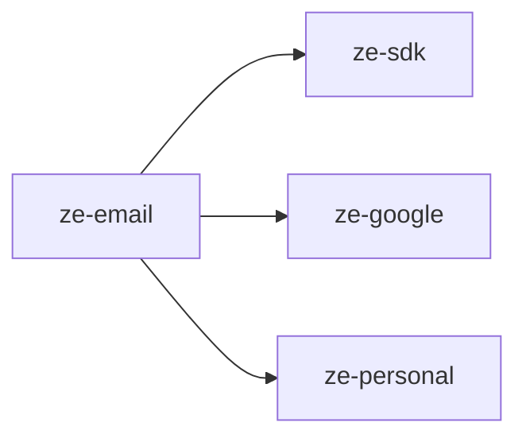

# ze-email

Gmail channel and email agent for Ze. Provides the `EmailAgent` and `GmailChannel` for reading and sending email via Google APIs.

## Responsibilities

| Module | What it provides |
|---|---|
| `agents/email/` | `EmailAgent`, email tools (search, send, draft) |
| `channel/gmail.py` | `GmailChannel` — `Channel` implementation for Gmail |
| `plugin.py` | `EmailPlugin(ZePlugin)` — registers agent and channel |

## Dependencies



## Extension point

`EmailPlugin` is discovered via entry point and contributes:
- `EmailAgent` to the agent registry (when Google credentials are configured)
- `GmailChannel` to the channel registry
- `EmailPolicy` memory retrieval policy

```python
from ze_email.plugin import EmailPlugin
```

Requires `GoogleCredentials` from `ze-google`. Run `make google-auth` once to obtain a refresh token.

## Testing

From the repo root:

```bash
make test-email
```

See [docs/testing.md](../../docs/testing.md).
