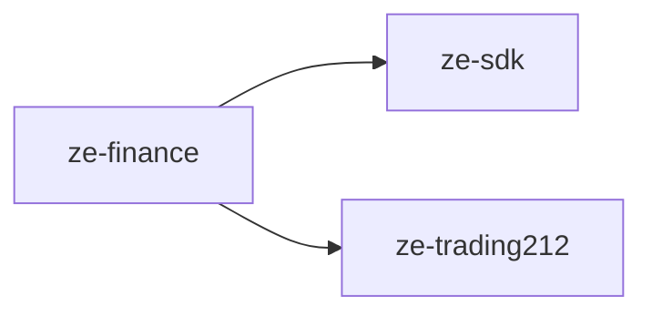

# ze-finance

Finance domain plugin for Ze — portfolio positions, bank transactions, spending summaries, and proactive P&L alerts.

## Role in Ze

Ze-finance gives Ze awareness of the user's financial life. It ingests investment data from Trading212 and bank transactions from CSV statements, stores them in normalised Postgres tables, and exposes them through the `FinanceAgent` and a daily snapshot job. All LLM calls in this plugin are pinned to Anthropic via OpenRouter — financial data never reaches another provider.

The plugin is designed as the substrate for a full factor-based risk engine (`ze-risk`, future). The domain types and protocol stubs are already defined under `risk/` and `models/` so the risk layer can import from `ze_finance.*` without restructuring.

### Key features

- `FinanceAgent` — conversational interface for portfolio and spending questions
- Trading212 integration — positions, P&L, order and dividend history
- CSV bank statement import with LLM-assisted column mapping inference (cached per source)
- Two-tier spending categorisation: keyword rules first, optional Anthropic haiku batch for unmatched descriptions
- Daily snapshot job — syncs all data sources, updates categories, emits signals
- `FinanceSignalSource` — P&L swing and large transaction signals into the Ze signal substrate
- Anthropic-pinned LLM calls — financial data never leaves the Anthropic provider

### Integration

Entry point `ze_finance`. Contributes `FinanceAgent`, `DailySnapshotJob`, and `FinanceSignalSource`. Migrations under `zfin` branch.

```python
from ze_finance.plugin import FinancePlugin
```

## Responsibilities

| Module | What it provides |
|---|---|
| `agents/finance/` | `FinanceAgent` and its `@tool` functions (`get_portfolio_summary`, `get_positions`, `get_spending_summary`, `get_recent_transactions`, `get_account_balances`) |
| `categoriser.py` | `CategoryInferrer` — keyword rules + optional Anthropic haiku batch for "Other" descriptions |
| `errors.py` | `FinanceError`, `ZeIntegrationError`, `FinanceParseError` |
| `jobs/snapshot.py` | `DailySnapshotJob` — syncs all data sources, runs categorisation, emits signals |
| `models/alpha.py` | `AlphaModel` Protocol stub (future `ze-risk` extension point) |
| `plugin.py` | `FinancePlugin(ZePlugin)` — registers agent, job, signal source, and data domains |
| `risk/types.py` | `FactorTaxonomy` enum — 12-factor taxonomy for the future risk engine |
| `risk/engine.py` | `RiskEngine` Protocol stub |
| `signals/finance.py` | `FinanceSignalSource` — emits `finance.pnl_swing` and `finance.large_transaction` signals |
| `source.py` | `DataSource` Protocol — implemented by all ingestion backends |
| `sources/trading212.py` | `Trading212DataSource` — maps Trading212 REST API responses to Ze domain types |
| `sources/csv.py` | `CsvDataSource` + `CsvSchemaInferrer` — parses bank CSV exports, infers column mapping via LLM on first import |
| `store.py` | `PortfolioStore`, `TransactionStore`, `CsvMappingStore` — Postgres-backed storage |
| `types.py` | Domain types: `Asset`, `Account`, `Position`, `Transaction`, `SpendingSummary`, `CsvMapping` |

## Dependencies



## Configuration

### `.env`

| Variable | Description |
|---|---|
| `TRADING212_API_KEY` | Trading212 REST API key (portfolio scope required) |
| `TRADING212_DEMO` | `true` to use the demo environment (default: `false`) |

### `config/config.yaml`

```yaml
finance:
  snapshot_schedule: "0 8 * * *"   # cron for the daily snapshot job
  large_transaction_threshold: 500  # nominal threshold (native currency, no FX conversion)
  llm_categorization: false         # opt-in LLM batch categorisation (Anthropic only)
```

## Testing

From the repo root:

```bash
make test-finance
```

See [docs/testing.md](../../docs/testing.md).
