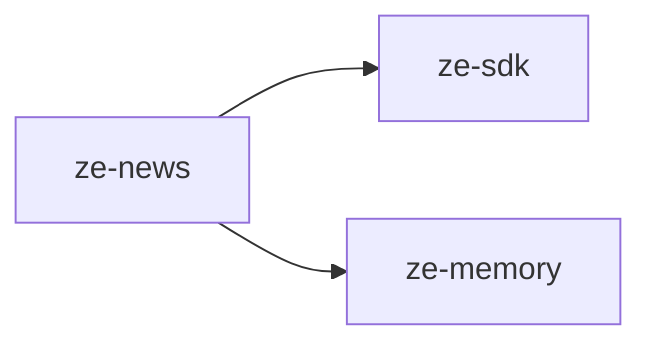

# ze-news

News fetching and personalised headlines for Ze. Fetches articles from curated RSS sources on a schedule, ranks them by the user's interest profile, and exposes them via the `NewsAgent`.

## Responsibilities

| Module | What it provides |
|---|---|
| `agents/` | `NewsAgent` — answers news queries using `get_headlines` and `search_news` tools |
| `sources/` | RSS source definitions and fetcher |
| `jobs/` | `NewsFetchJob` — periodic RSS fetch, stored and ranked |
| `store.py` | `NewsStore` — Postgres-backed article storage with pgvector ranking |
| `registry.py` | `SourceRegistry` — manages active RSS sources |
| `credibility.py` | Source credibility scoring |
| `plugin.py` | `NewsPlugin(ZePlugin)` — registers `NewsAgent` and `NewsFetchJob` |
| `types.py` | Domain types |

## Dependencies



## Extension point

`NewsPlugin` is registered in `ze-api`'s container and contributes:
- `NewsAgent` to the agent registry
- `NewsFetchJob` to `ProactiveScheduler`

```python
from ze_news.plugin import NewsPlugin
```

## Testing

From the repo root:

```bash
make test-news
```

See [docs/testing.md](../../docs/testing.md).
