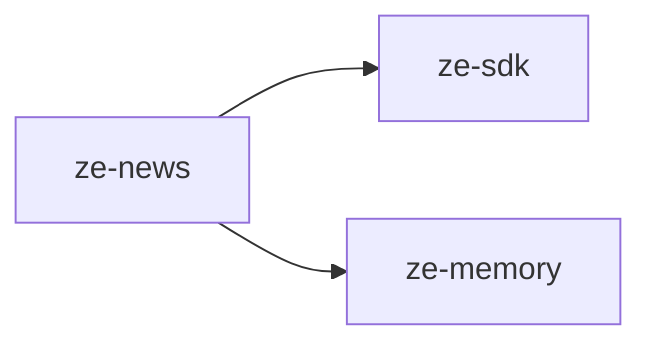

# ze-news

News fetching and personalised headlines for Ze. Fetches articles from curated RSS sources on a schedule, ranks them by the user's interest profile, and exposes them via the `NewsAgent`.

## Role in Ze

Ze keeps the user informed without them having to check feeds manually. RSS sources are fetched on a schedule, ranked by the user's memory profile and interest signals, and surfaced through the `NewsAgent` and the news page in `ze-web`.

### Key features

- Curated RSS ingestion with configurable sources and fetch schedule
- pgvector-ranked personalisation against the user's memory profile
- Source credibility scoring (optional LLM-assisted; optional local NLI headline check)
- Semantic story dedup (optional NLI + embedding clustering on fetch)
- `NewsAgent` — headline queries and article search
- News signal source for the correlation engine

### Integration

Entry point `ze_news`. Contributes `NewsAgent`, `NewsFetchJob`, `NewsOnboardingProvider` (source selection during setup), and `NewsSignalSource`. Article storage and ranking depend on `ze-memory` embeddings.

```python
from ze_news.plugin import NewsPlugin
```

## Responsibilities

| Module | What it provides |
|---|---|
| `agents/` | `NewsAgent` — answers news queries using `get_headlines` and `search_news` tools |
| `sources/` | RSS source definitions and fetcher |
| `jobs/` | `NewsFetchJob` — periodic RSS fetch, stored and ranked |
| `store.py` | `NewsStore` — Postgres-backed article storage with pgvector ranking |
| `registry.py` | `SourceRegistry` — manages active RSS sources |
| `credibility.py` | Source credibility scoring (heuristics, optional NLI, optional LLM) |
| `plugin.py` | `NewsPlugin(ZePlugin)` — registers `NewsAgent` and `NewsFetchJob` |
| `types.py` | Domain types |

## Dependencies



## Testing

From the repo root:

```bash
make test-news
```

See [docs/testing.md](../../docs/testing.md).
