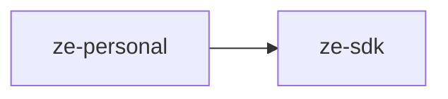

# ze-personal

Personal-assistant domain layer for Ze. Implements the user-facing features that make Ze feel like an assistant: goals, workflows, persona, and contacts. Contributes to the Ze graph via `ZePlugin`.

## Role in Ze

`ze-personal` is the largest domain plugin and the heart of what makes Ze a personal assistant rather than a generic chatbot. It owns long-running goals, multi-step workflows, the user's persona and dials, contact tracking, and the research and companion agents that handle most conversational turns.

### Key features

- **Goals** — autonomous multi-week goal execution with milestones, verification gates, and adaptive replanning
- **Workflows** — multi-step plans persisted in Postgres with a scheduling loop
- **Persona** — named profiles with TARS-style numeric dials that shape agent tone and behaviour
- **Contacts** — person tracking with extraction from email, calendar, and conversation
- **Proactive jobs** — morning briefing, weekly insights, goal suggestions, stuck-goal alerts, cost anomaly detection
- **Agents** — ResearchAgent, CompanionAgent, GoalAgent, WorkflowAgent

### Integration

Discovered via entry point `ze_personal`. `PersonalPlugin` is a dependency for most other plugins (email, calendar, prospecting). Contributes graph nodes for workflow execution and contact extraction, memory policies, onboarding provider, REST stores, data domains for reset, and the majority of proactive jobs.

```python
from ze_personal.plugin import PersonalPlugin
```

## Responsibilities

| Module | What it provides |
|---|---|
| `goals/` | `GoalStore`, `GoalPlanner`, `GoalExecutor`, milestone loop, verification gates, suggestion store |
| `workflow/` | `WorkflowStore`, planner, scheduler, types |
| `persona/` | `PostgresPersonaStore`, identity builder, profile synthesis, types |
| `contacts/` | `PersonStore`, `ContactChannelStore`, consolidator, extractors, tools |
| `graph/` | `workflow.py` execution nodes, `memory_hooks.py` contact extraction |
| `plugin.py` | `PersonalPlugin(ZePlugin)` — wires all domain services into the Ze graph |

## Dependencies



## Testing

From the repo root:

```bash
make test-personal
```

See [docs/testing.md](../../docs/testing.md).
