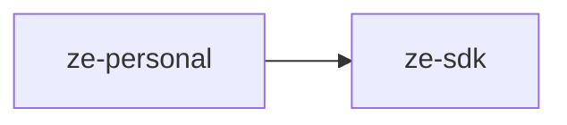

# ze-personal

Personal-assistant domain layer for Ze. Implements the user-facing features that make Ze feel like an assistant: goals, workflows, persona, and contacts. Contributes to the Ze graph via `ZePlugin`.

## Responsibilities

| Module | What it provides |
|---|---|
| `goals/` | `GoalStore`, `GoalPlanner`, `GoalExecutor`, milestone loop, verification gates, suggestion store |
| `workflow/` | `WorkflowStore`, planner, scheduler, types |
| `persona/` | `PostgresPersonaStore`, identity builder, profile synthesis, types |
| `contacts/` | `PersonStore`, `ContactChannelStore`, consolidator, extractors, tools |
| `graph/` | `workflow.py` execution nodes, `memory_hooks.py` contact extraction |
| `plugin.py` | `PersonalPlugin(ZePlugin)` — wires all domain services into the Ze graph |

## Dependencies



## Extension point

`PersonalPlugin` is registered in `ze-api`'s container and contributes:
- `GoalAgent` and `WorkflowAgent` to the agent registry
- Goal advance and workflow scheduling jobs to `ProactiveScheduler`
- Graph nodes for workflow execution and contact extraction

```python
from ze_personal.plugin import PersonalPlugin
```

## Testing

From the repo root:

```bash
make test-personal
```

See [docs/testing.md](../../docs/testing.md).
