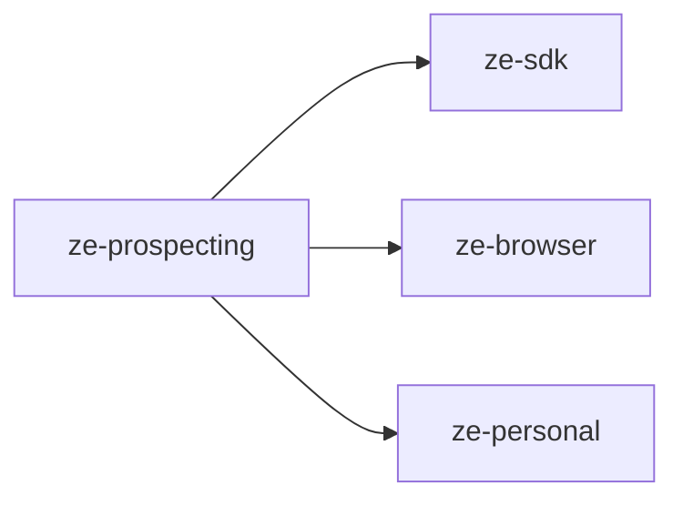

# ze-prospecting

Autonomous prospect research for Ze. Provides the `ProspectingAgent`, campaign store, browser-driven web research, and stale-campaign recovery.

## Responsibilities

| Module | What it provides |
|---|---|
| `agents/` | `ProspectingAgent`, research and outreach tools |
| `store.py` | `ProspectCampaignStore` — Postgres-backed campaign persistence |
| `jobs/campaigns.py` | `recover_stale_campaigns` — proactive recovery job |
| `types.py` | Campaign and prospecting settings types |
| `plugin.py` | `ProspectingPlugin(ZePlugin)` — registers agent, store, and job |

## Dependencies



## Extension point

`ProspectingPlugin` is discovered via entry point and contributes:
- `ProspectingAgent` to the agent registry
- `ProspectCampaignStore` as a REST data store
- Stale campaign recovery job to `ProactiveScheduler`

```python
from ze_prospecting.plugin import ProspectingPlugin
```

Requires the browser sidecar (`sidecar/browser/`) for autonomous web research.

## Configuration

Prospecting settings in `config/config.yaml` under the `prospecting` key: `max_iterations`, `max_loop_tokens`, `stale_timeout_minutes`, `browser_delay_ms`, `browser_max_text_chars`.

## Testing

From the repo root:

```bash
make test-prospecting
```

See [docs/testing.md](../../docs/testing.md).
