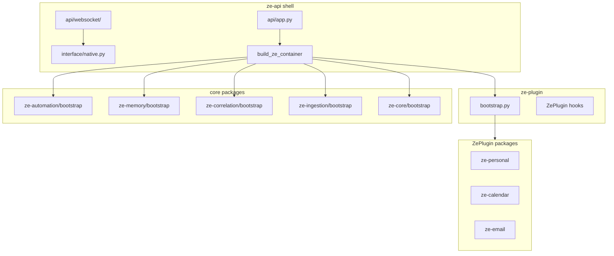

# Phase 76 — ze-api Shell Cleanup

> **Package:** `apps/ze-api/` (primary), `core/ze-plugin/`, `core/ze-automation/`, `core/ze-memory/`, `core/ze-correlation/`, `core/ze-ingestion/`, `core/ze-core/`
> **Phase:** 76
> **Status:** Done
> **Prerequisite:** Phase 74 (automation substrate), Phase 68 (ze-data), Phase 64 (plugin package extraction), Phase 09 (conversation module reorg)

---

## Implementation Status

| Feature | Status |
|---------|--------|
| Audit + spec | ✅ Done |
| Phase A — slim `container.py` | ✅ Done |
| Phase B — REST/WS boundary | ✅ Done |
| Phase C — bootstrap move | ✅ Done |
| Phase D — settings + tests | ✅ Done |

---

## Purpose

`ze-api` was the original monolith. Package extraction (phases 44–74) moved domain
logic into `core/` and `plugins/`, but **`apps/ze-api/ze_api/container.py` (~820 lines)
remains the application composition root** — it builds automation stacks, registers
proactive jobs, assembles ingestion pipelines, constructs correlation engines, defines
engine data-portability domains, and wires workflow executors.

That violates the stated architecture: **ze-api is a deployment shell** (HTTP/WebSocket
transport, settings, lifespan, migration meta-runner). Domain packages should own their
services, jobs, REST adapters, and bootstrap hooks.

This phase defines the target boundary and a phased migration plan.

---

## Responsibilities (after cleanup)

**ze-api owns:**

- FastAPI app factory and lifespan (`api/app.py`)
- WebSocket transport (`api/websocket/`, `api/ws.py`)
- `NativeAppInterface` — WS + ntfy delivery (`interface/native.py`)
- Auth (`api/dependencies.py` — `require_api_key`)
- Pydantic REST/WS DTOs for OpenAPI/codegen (`api/schemas.py`)
- Shell settings (`ZeApiSettings` subset of current `settings.py`)
- Migration meta-runner (`migrate.py`, `migrations/env.py`)
- Thin REST routes that delegate to package services (no raw SQL in routes)
- Composition entry: `build_ze_container(settings) → ZeContainer`

**ze-api does NOT own:**

- Proactive job registration for core packages
- Automation service graph construction
- Ingestion pipeline assembly
- Correlation engine construction
- Engine data-portability domain definitions
- Harness hook registration (tool cap, component collection)
- Plugin discovery / type-based DI (`bootstrap.py` today)
- Domain REST query logic (raw SQL on `user_facts`, `llm_cost_log`, etc.)

---

## Out of Scope

- Removing ze-api as the deployment unit (it stays the runnable app)
- Making automation or ingestion optional via config (they remain always-on core packages)
- Auto-generating all REST routes from OpenAPI in domain packages (phase B proposes a
  hook; full codegen is future work)
- Moving `migrate.py` out of ze-api (deployment entry point stays here)
- Changing the WebSocket frame protocol

---

## Current State Audit

### Size and hotspots

| Path | ~LOC | Role |
|------|------|------|
| `container.py` | 823 | Monolithic composition root |
| `bootstrap.py` | 357 | Plugin discovery, DI, agent bootstrap |
| `api/schemas.py` | 448 | Pydantic DTOs (keep) |
| `api/routes/*.py` | 1,350 | REST — mix of thin adapters and domain SQL |
| `api/websocket/*.py` | 720 | WS transport (mostly correct) |
| `settings.py` | 200 | Shell + integration config mixed |
| `migrate.py` | 216 | Meta-runner (keep) |

Total `ze_api/`: ~4,670 LOC. **~55% of ze-api test LOC** lives in misplaced packages
(`tests/orchestration/`, `tests/routing/`, `tests/agents/calendar/`, etc.).

### `container.py` responsibility map

| Block | Lines (approx) | Today | Target owner |
|-------|----------------|-------|--------------|
| Transport infra | 244–266 | ntfy, message/session stores, ConnectionManager, NativeAppInterface | **ze-api** |
| Automation services | 301–319 | GoalStore, GoalPlanner, GoalExecutor, WorkflowPlanner | **ze-automation** |
| Plugin discovery | 326–351 | `plugin_deps`, integrations, instantiate | **ze-plugin** |
| Hardcoded agent imports | 417–424 | `ze_automation.*`, `ze_ingestion.agent` | Owning packages |
| Engine data domains | 480–497 | Inline SQL export/delete for 9+ tables | **ze-core** + **ze-onboarding** |
| Ingestion pipeline | 502–543 | Full IngestionPipeline wiring | **ze-ingestion** |
| Workflow executor | 589–657 | `build_workflow_graph`, executor closure | **ze-automation** (+ graph from ze-personal) |
| Goal advance sweep | 659–671 | Cron every 15m | **ze-automation** |
| Automation proactive jobs | 673–754 | 5 jobs + config | **ze-automation** |
| Cost reconciliation cron | 756–763 | On WorkflowScheduler | **ze-core.telemetry** |
| Memory/session crons | 765–785 | Consolidation + session summary | **ze-memory** |
| Correlation push job | 787–806 | CorrelationJob schedule | **ze-correlation** |
| Plugin proactive jobs | 808–814 | `plugin.register_proactive_jobs()` | **Keep** (correct pattern) |
| Harness hooks | 435–440 | ToolCallCapHook, ComponentCollectionHook | **ze-agents** / **ze-components** |

### `bootstrap.py` (Phase C — done)

`ze_api/bootstrap.py` was deleted. Responsibilities moved as follows:

| Function | Location |
|----------|----------|
| `_load_plugin_classes`, `_topological_sort`, `_instantiate_plugins` | `ze_plugin/bootstrap.py` |
| `build_integrations` | `ze_plugin/bootstrap.py` |
| `_resolve`, `_resolve_annotation` | `ze_plugin/bootstrap.py` |
| `bootstrap_agents`, `validate_registry` | `ze_agents/bootstrap.py` |
| Agent module path lists | Test fixtures only (`apps/ze-api/tests/support/agent_modules.py`) |

**Duplication:** `ze-core/container.py` has a parallel agent-discovery path (`agents/` dir
scan). Production uses the plugin entry-point path. Consolidate on plugins.

### `api/` — transport vs domain leakage

**Correct (transport):** `app.py`, `dependencies.py`, `ws.py`, `websocket/*`,
`messages.py`, `routes/sessions.py`, `routes/health.py`, `routes/version.py`,
`routes/ws_schema.py`, `interface/native.py`.

**Thin adapters (OK, could use `rest_routes()` hook):** `goals.py`, `contacts.py`,
`reminders.py`, `news.py` — delegate to `container._plugin_stores`.

**Domain logic in shell (move):**

| Route / module | Issue | Target |
|----------------|-------|--------|
| `routes/memory.py` | Raw SQL on `user_facts`, `episodes`, `user_profile` | `ze-memory` service + thin route |
| `routes/costs.py` | Raw SQL on `llm_cost_log`; formatters used by WS `/costs`, `/status` | `ze-core.telemetry` query + format API |
| `routes/capabilities.py` | CapabilityGate read/write | `ze-core.capability` REST adapter |
| `routes/routing.py` | Routing log queries | `ze-core.routing` |
| `routes/workflows.py` | WorkflowStore CRUD + trigger | `ze-automation` REST module |
| `websocket/commands.py` | Imports `routes.costs` for summaries | Call domain formatters, not route modules |

**Acceptable thin wrappers:** `routes/data.py` (DataPortabilityService), `routes/ingest.py`
(ingestion pipeline), `routes/eval.py` (dev harness — consider `ze-eval`).

### `app.state` sprawl

`api/app.py` copies ~15 fields from `ZeContainer` onto `app.state` individually **and**
sets `app.state.container`. Routes use both patterns (`get_pool` vs
`request.app.state.container._plugin_stores`).

**Target:** `app.state.container` as single source of truth; `dependencies.py` provides
typed accessors only.

### Stale cross-package imports

Plugins still import `ze_api.data.assembler` (removed). Canonical:
`ze_data.portability.assembler.bulk_insert`.

Affected: `ze-personal`, `ze-calendar`, `ze-prospecting` `data_domains()`.

### ZePlugin hooks — what works vs what doesn't

**Works (plugins):** `agent_module_paths`, `register_proactive_jobs`, `rest_stores`,
`data_domains`, `signal_sources`, `channels`, graph hooks, `startup`/`shutdown`.

**Missing (core packages):** ze-automation, ze-memory, ze-correlation, ze-ingestion,
ze-core telemetry have **no registration hook** — all hardcoded in `container.py`.

---

## Target Architecture



### Composition entry (target)

```python
# ze_api/container.py — target ~150–200 lines

async def build_container(settings: Settings) -> ZeContainer:
    pool = await create_pool(settings)
    checkpointer_pool = await create_checkpointer_pool(settings)

    # 1. Shared infra (minimal — most moves to ze-core/bootstrap)
    shared = await build_engine_stack(pool, checkpointer_pool, settings)

    # 2. Core package bootstraps (services + jobs + data_domains + agent paths)
    automation = build_automation_stack(shared, settings)
    ingestion = build_ingestion_stack(shared, settings)
    correlation = build_correlation_stack(shared, settings)
    shared.dep_map.update(automation.deps | ingestion.deps | correlation.deps)

    # 3. Plugin discovery (ze-plugin)
    plugins = discover_and_instantiate_plugins(shared.dep_map, settings)

    # 4. Transport layer (ze-api only)
    transport = build_transport_layer(pool, settings, shared.notifier)

    # 5. Graph + agents
    graph = build_graph(shared.checkpointer, plugins)
    bootstrap_agents(deps=merge_deps(shared, automation, plugins), plugins=plugins)

    # 6. Container + plugin lifecycle
    container = ZeContainer(..., **transport, **shared, graph=graph, plugins=plugins)
    for plugin in plugins:
        await plugin.startup(container)

    # 7. Register jobs (packages own their jobs)
    automation.register_proactive_jobs(container.proactive_scheduler, settings)
    register_memory_jobs(container.proactive_scheduler, settings, shared)
    correlation.register_proactive_jobs(container.proactive_scheduler, settings)
    register_engine_jobs(container.proactive_scheduler, settings, shared)
    for plugin in plugins:
        plugin.register_proactive_jobs(container.proactive_scheduler, settings)

    await start_schedulers(container)
    return container
```

---

## Core Package Bootstrap Contract

Each non-plugin core package that contributes services, jobs, or agents exposes a
**bootstrap module** (not necessarily `ZePlugin`):

```python
# core/ze-automation/ze_automation/bootstrap.py

@dataclass
class AutomationStack:
    goal_store: PostgresGoalStore
    goal_planner: GoalPlanner
    goal_executor: GoalExecutor
    workflow_store: PostgresWorkflowStore
    workflow_planner: WorkflowPlanner
    workflow_scheduler: WorkflowScheduler
    deps: dict[type, Any]

def build_automation_stack(shared: EngineStack, settings: Settings) -> AutomationStack: ...

def register_proactive_jobs(
    scheduler: ProactiveScheduler,
    settings: Settings,
    stack: AutomationStack,
    *,
    notifier: ProactiveNotifier,
    push_log_store: PushLogStore,
) -> None: ...

def agent_module_paths() -> list[str]: ...

def data_domains(pool: asyncpg.Pool) -> list[DataDomain]: ...

async def configure_workflow_executor(
    stack: AutomationStack,
    shared: EngineStack,
    plugins: list[ZePlugin],
) -> None: ...
```

| Package | `build_*` | `register_proactive_jobs` | `agent_module_paths` | `data_domains` |
|---------|-----------|---------------------------|----------------------|----------------|
| ze-automation | services, workflow scheduler | goal narrative, suggestion, stuck, accountability, cost anomaly, goal sweep | goals + workflow agents | goals, workflows, accountability_anomalies |
| ze-memory | (uses shared memory_store) | consolidation, session summary | — | — (tables owned by ze-core legacy) |
| ze-correlation | engine + hypothesis store | correlation push job | — | — |
| ze-ingestion | pipeline + store | — | ingestion agent | ingested_content |
| ze-core | router, gate, telemetry, graph deps | cost reconciliation | — | telemetry, routing, capability, conversation tables |
| ze-onboarding | coordinator, reset | — | — | onboarding tables |

**Alternative considered:** `AutomationPlugin(ZePlugin)` always instantiated by ze-api
(not via entry points). Rejected for now — bootstrap modules are lighter and don't
require extending the plugin registry for non-optional core.

---

## Phase A — Slim `container.py` (highest impact)

**Goal:** `container.py` ≤ ~200 lines.

1. Create `ze_automation/bootstrap.py` — move lines 292–319, 417–424 (agents), 589–671,
   673–754 from container.
2. Create `ze_ingestion/bootstrap.py` — move pipeline assembly (502–543).
3. Create `ze_correlation/bootstrap.py` — move engine build (229–237) + job (787–806).
4. Create `ze_memory/bootstrap.py` — `register_memory_jobs()` for consolidation +
   session summary (765–785).
5. Create `ze_core/bootstrap.py` — `engine_data_domains()`, cost reconciliation cron,
   harness hook registration (or move hooks to package defaults).
6. Fix plugin `ze_api.data.assembler` → `ze_data.portability.assembler`.

**Acceptance:** No `ze_automation.jobs.*` imports in `container.py`. Job registration
only via `register_proactive_jobs()` calls.

---

## Phase B — REST/WS boundary

**Goal:** No raw SQL in `ze_api/api/routes/` except health/version.

1. **`ze-memory/admin.py`** (or `rest.py`) — fact list/review, profile digest, consolidation
   trigger. Routes become one-liner delegates.
2. **`ze-core/telemetry/rest.py`** — cost summaries (`_build_cost_summary`,
   `_build_status_summary`). WS `commands.py` imports from here, not `routes/costs.py`.
3. **`ze-core/capability/rest.py`** — capability override CRUD.
4. **`ze-core/routing/rest.py`** — routing log queries.
5. **`ze-automation/rest.py`** — workflow CRUD + trigger.
6. **Optional:** `ZePlugin.rest_routes() -> list[APIRouter]` to collapse goals/contacts/
   reminders/news into plugin-declared routers (reduces `app.py` router list).

**Acceptance:** `grep "FROM user_facts" apps/ze-api` returns zero matches.

---

## Phase C — Bootstrap move ✅ Done

**Goal (met):** `ze_api/bootstrap.py` deleted; plugin/agent bootstrap lives in package modules.

1. Moved plugin discovery, topological sort, `_resolve`, `build_integrations` →
   `ze_plugin/bootstrap.py`.
2. Move `bootstrap_agents` + `validate_registry` → `ze_agents/bootstrap.py`. ✅
3. `migrate.py` uses entry-point discovery (no hardcoded plugin list). ✅
4. `_DEFAULT_AGENT_MODULE_PATHS` removed from production; test lists live in
   `apps/ze-api/tests/support/agent_modules.py` only.

**Acceptance:** `ze-api` does not import `importlib.metadata.entry_points` directly.

---

## Phase D — Settings, state, tests

### Settings split

```python
# ze_api/settings.py — shell only
class ZeApiSettings(BaseSettings):
    ze_api_key: str
    cors_origins: str = "*"
    ntfy_*: ...
    log_*: ...
    auto_migrate: bool = False
    config_dir: Path
    database_url: str
    database_url_sync: str
    # delegates domain config to settings.config YAML + ZeIntegration
```

Integration credentials (Google, finance, prospecting) stay on `ZeIntegration.from_settings`.

### `app.state` consolidation

```python
# api/app.py lifespan — target
app.state.settings = settings
app.state.container = container
# Remove individual pool/graph/store copies
```

Update `dependencies.py` to read from `container` only.

### Test relocation

| From `apps/ze-api/tests/` | To |
|---------------------------|-----|
| `orchestration/test_nodes.py` | `core/ze-core/tests/` |
| `routing/test_*.py` | `core/ze-core/tests/routing/` |
| `agents/calendar/`, `agents/reminders/` | `plugins/ze-calendar/tests/` |
| `jobs/test_reminders.py` | `plugins/ze-calendar/tests/` |
| `components/test_hook.py` | `core/ze-components/tests/` |
| `api/test_memory_profile.py` | `core/ze-memory/tests/` |

**Keep in ze-api:** WS protocol, app lifespan, auth, migrate meta-runner, plugin wiring
smoke tests, OpenAPI schema tests.

---

## Module Location (target)

```
apps/ze-api/ze_api/
  api/                    # transport only
  interface/native.py
  container.py            # ~150–200 lines — composition entry
  settings.py             # shell settings
  migrate.py
  db.py                   # → consolidate with ze_core/db.py
  dependencies.py         # auth + container accessors

core/ze-plugin/ze_plugin/
  bootstrap.py            # NEW — plugin discovery + DI

core/ze-automation/ze_automation/
  bootstrap.py            # NEW — services + jobs + workflow executor

core/ze-memory/ze_memory/
  bootstrap.py            # NEW — proactive job registration
  admin.py                  # NEW (phase B) — REST service

core/ze-correlation/ze_correlation/
  bootstrap.py            # NEW

core/ze-ingestion/ze_ingestion/
  bootstrap.py            # NEW

core/ze-core/ze_core/
  bootstrap.py            # NEW — engine stack + data domains
```

---

## Invariants (do not break)

- Single WebSocket connection semantics (`ConnectionManager`)
- `plugin.register_proactive_jobs()` remains the plugin job seam
- `ZeContainer` extends `CoreContainer` for turn invocation
- Migration meta-runner stays in ze-api
- OpenAPI `operation_id` values unchanged (ze-client codegen)
- Plugin entry-point discovery unchanged for optional plugins

---

## Test Plan

| Area | Test |
|------|------|
| Phase A | `make test-api` — lifespan smoke; no regression in WS conformance |
| Phase A | Unit test per `bootstrap.py` — jobs registered when enabled |
| Phase B | Memory/cost REST tests move with service code |
| Phase C | `agents/test_plugin_discovery.py` moves to `ze-plugin/tests/` |
| Phase D | `app.state.container` — routes resolve deps without individual state fields |
| Integration | `make dev` + manual `/api/v0/version`, WS connect, proactive jobs fire |

---

## Open Questions

- [ ] **Workflow graph ownership:** `build_workflow_graph()` lives in `ze_personal.graph.workflow`
  but workflow execution is ze-automation. Move graph builder to ze-automation or expose
  via `PersonalPlugin.workflow_graph_builder()` hook?
- [ ] **Harness hooks:** register in `ze-agents` defaults at import time, or explicit
  `register_default_hooks()` called from ze-core bootstrap?
- [ ] **`ZeAutomationPlugin`:** revisit if bootstrap modules proliferate — a single
  always-on core plugin may be simpler than five bootstrap modules.
- [ ] **Eval route:** keep `routes/eval.py` in ze-api as dev-only, or move to `ze-eval` package?

---

## Related Specs

- [Phase 47 — Plugin Framework](47-plugin-framework.md) — `register_proactive_jobs`, schema readiness
- [Phase 74 — Automation Substrate](74-automation-substrate.md) — why automation left ze-personal
- [Phase 07 — API](07-api.md) — original API surface (transport layer)
- [Phase 73 — API Surface](73-api-surface.md) — `/api/v0/` conventions
- [core/09-conversation.md](../core/09-conversation.md) — conversation stores (recently moved out of ze-api)
- [docs/package-architecture.md](../../docs/package-architecture.md) — dependency rules
